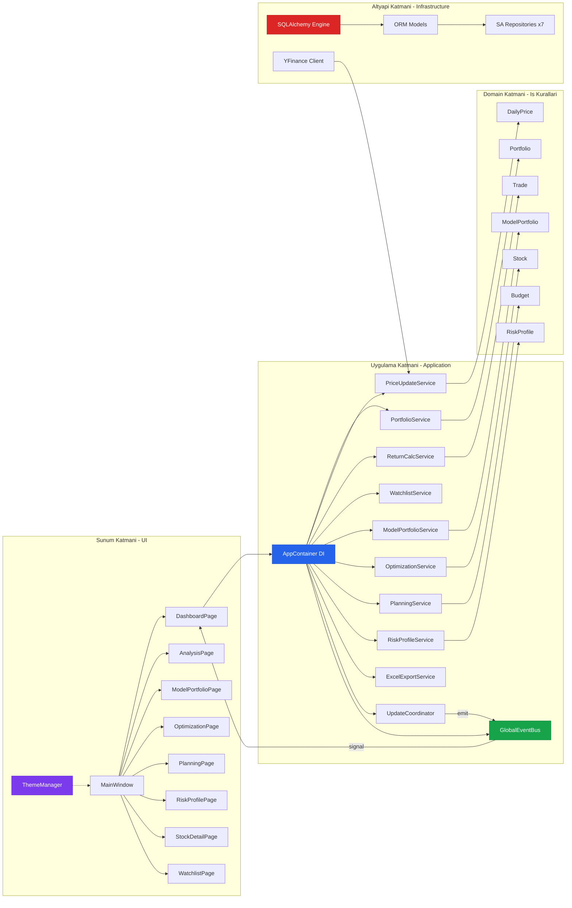
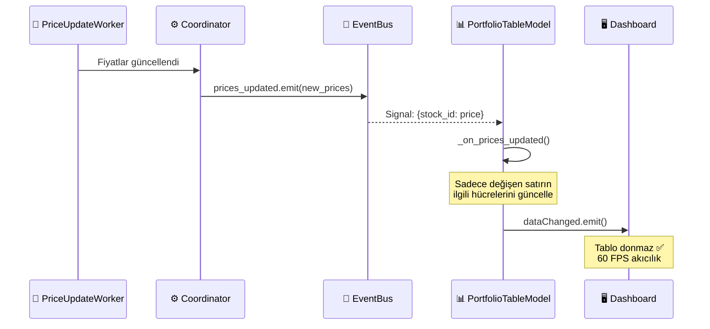
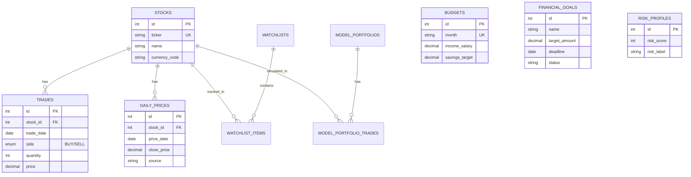
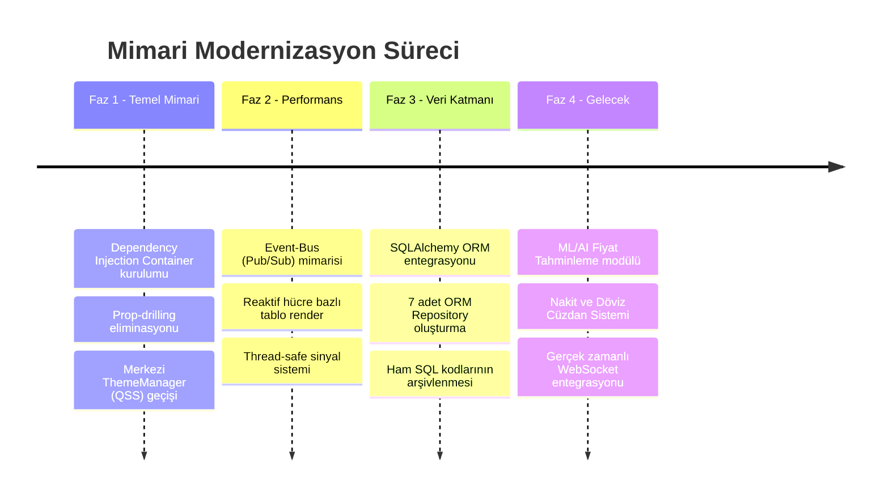

<p align="center">
  
</p>

<h1 align="center">📊 Portföy Simülasyonu</h1>

<p align="center">
  <strong>Profesyonel Borsa Portföy Yönetimi, Analiz ve Simülasyon Platformu</strong>
</p>

<p align="center">
  
  
  
  
  
  
  
</p>

<p align="center">
  <em>BIST (Borsa İstanbul) ve global piyasa hisselerini gerçek zamanlı takip eden, portföy performansını analiz eden,<br/>
  model portföy simülasyonları sunan ve finansal planlama araçları barındıran kapsamlı bir masaüstü uygulaması.</em>
</p>

---

## 📸 Ekran Görüntüleri

> **Not:** Aşağıdaki alanlara uygulamanın ekran görüntülerini ekleyin.

| Dashboard (Ana Sayfa) | Hisse Detay Sayfası |
|:---:|:---:|
| *`screenshots/dashboard.png`* | *`screenshots/stock_detail.png`* |

| Model Portföy Simülasyonu | Portföy Optimizasyonu |
|:---:|:---:|
| *`screenshots/model_portfolio.png`* | *`screenshots/optimization.png`* |

| Finansal Planlama | Risk Profili Analizi |
|:---:|:---:|
| *`screenshots/planning.png`* | *`screenshots/risk_profile.png`* |

---

## ✨ Öne Çıkan Özellikler

### 🏠 Dashboard (Ana Kontrol Paneli)
- **Gerçek zamanlı portföy özeti** — Toplam piyasa değeri, yatırılan sermaye, kâr/zarar durumu tek bakışta
- **Canlı fiyat güncelleme** — YFinance API üzerinden anlık borsa fiyatları çekme
- **Hücre bazlı reaktif tablo** — Sadece değişen fiyat hücresi güncellenir, tablonun tamamı yeniden çizilmez (Event-Bus Pub/Sub)
- **Renk kodlu performans göstergeleri** — Kârdaki hisseler yeşil, zarardakiler kırmızı bordür ile işaretlenir
- **Excel'e dışa aktarım** — Portföy verilerini detaylı `.xlsx` raporuna dönüştürme

### 📈 Hisse Detay Sayfası
- **Tekil hisse analizi** — Seçilen hissenin fiyat geçmişi, alım-satım işlemleri ve performans metrikleri
- **Geçmişe yönelik veri yönetimi** — Manuel backfill ile eksik tarihsel fiyat verilerini tamamlama
- **Getiri hesaplama** — Yatırım bazlı getiri oranı ve maliyet analizi

### 📊 Analiz Sayfası
- **Portföy genelinde performans analizi** — Toplam getiri, günlük/haftalık/aylık performans takibi
- **Karşılaştırmalı analiz** — Farklı dönemlerdeki portföy değişimlerini yan yana inceleme

### 🎯 Model Portföy Simülasyonu
- **Sanal portföy oluşturma** — Gerçek para riski olmadan farklı yatırım stratejilerini test etme
- **Başlangıç sermayesi belirleme** — İstenen miktarla simülasyon başlatma
- **İşlem geçmişi** — Simülasyon portföyüne sanal alım/satım girişi yapma
- **Performans karşılaştırması** — Model portföyün gerçek portföye göre durumunu ölçme

### ⚡ Portföy Optimizasyonu
- **Bilimsel ağırlık optimizasyonu** — Modern Portföy Teorisi (Markowitz) ile ideal hisse dağılımı hesaplama
- **Risk-getiri dengesi** — Scipy tabanlı matematiksel optimizasyon motoruyla en verimli portföy yapısını önerme

### 💰 Finansal Planlama
- **Aylık bütçe yönetimi** — Gelir/gider kalemlerini takip etme
- **Finansal hedefler** — Hedef tutara ulaşma sürecini izleme ve planlama
- **Tasarruf analizi** — Yatırıma ayrılabilecek fonları hesaplama

### 🛡️ Risk Profili
- **Kişiselleştirilmiş risk analizi** — Yaş, yatırım ufku ve piyasa tepkisi bazlı risk profilleme
- **Risk skoru** — Kategorize edilmiş risk seviyesi (Tutucu, Dengeli, Agresif vb.)

### 👁️ Watchlist (Takip Listesi)
- **Hisse takip listeleri** — İlgilendiğiniz hisseleri gruplandırma
- **Hızlı erişim** — Takip listesinden portföye geçiş kolaylığı

---

## 🏗️ Mimari Yapı (Clean Architecture)

Bu proje, endüstri standartlarında **Temiz Mimari (Clean Architecture)** ve **SOLID** prensipleriyle inşa edilmiştir. Katmanlar birbirinden tam bağımsızdır ve "tak-çıkar" mantığıyla çalışır.



### Katman Bağımsızlığı İlkesi

| Katman | Sorumluluk | Bağımlılık Yönü |
|--------|-----------|-----------------|
| **UI (Sunum)** | Kullanıcı arayüzü, sayfa yönetimi, tema | → Application |
| **Application** | İş akışları, servisler, DI konteyneri | → Domain |
| **Domain** | İş kuralları, modeller, interface tanımları | Hiçbir katmana bağımlı değil ✅ |
| **Infrastructure** | Veritabanı, API, dosya sistemi | → Domain (Interface uygular) |

> 💡 **Dependency Inversion:** Üst katmanlar alt katmanların somut sınıflarını değil, Domain katmanındaki **arayüzleri (Interface)** kullanır. Bu sayede veritabanı motoru (MySQL → SQLAlchemy geçişi gibi) değiştirildiğinde iş mantığı ve UI katmanında **tek satır bile değişmez**.

---

## 🔌 Kritik Altyapılar

### 1. 📦 Dependency Injection Konteyneri

Tüm bağımlılıklar merkezi `AppContainer` sınıfında yönetilir. Prop-drilling (parametre taşıma cehennemi) tamamen ortadan kaldırılmıştır.

```python
# src/application/container.py
class AppContainer:
    def __init__(self):
        self.event_bus = GlobalEventBus()
        self.conn_provider = SQLAlchemyEngineProvider(config)
        
        # Repository'ler (Tak-Çıkar Mantığı)
        self.portfolio_repo = SQLAlchemyPortfolioRepository(self.conn_provider)
        self.stock_repo = SQLAlchemyStockRepository(self.conn_provider)
        # ...
        
        # Servisler
        self.portfolio_service = PortfolioService(self.portfolio_repo, self.price_repo)
        # ...
```

### 2. 📡 Event-Bus (Pub/Sub Mimarisi)

UI bileşenleri ile arka plan servisleri arasında **asenkron, thread-safe** haberleşme sağlar. Fiyat güncellemeleri tüm tabloyu sıfırdan oluşturmak yerine **yalnızca değişen hücreleri** günceller.



### 3. 🎨 Merkezi Tema Motoru (ThemeManager)

Uygulama genelinde tutarlı görünüm sağlayan QSS tabanlı tema sistemi. Tüm stiller `dark_theme.qss` dosyasında merkezi olarak yönetilir.

```
src/ui/
├── theme_manager.py          # Singleton Tema Yöneticisi
└── styles/
    └── dark_theme.qss        # Tailwind Slate renk paleti (268 satır)
```

**Tema Özellikleri:**
- 🌙 **Tailwind Slate** renk paleti üzerine Dark Mode
- 🎯 Buton varyantları: `primary`, `success`, `danger`, `ghost`
- 📐 Tutarlı `border-radius`, `padding` ve `font-weight` değerleri
- 🔄 Hover, pressed, disabled ve focus durumları

### 4. 🗄️ SQLAlchemy ORM Katmanı

Ham SQL sorguları tamamen ortadan kaldırılmış, yerini tip-güvenli ve nesne odaklı veritabanı iletişimi almıştır.



**ORM Avantajları:**
- ✅ SQL Injection riski **sıfır** — Parametre binding otomatik
- ✅ Tip güvenliği — Python IDE'leri sütun adlarını otomatik tamamlar
- ✅ Veritabanı bağımsızlığı — MySQL, PostgreSQL veya SQLite'a tek satır değişiklikle geçiş
- ✅ Connection pooling — `pool_pre_ping` ile kopan bağlantılar otomatik yeniden kurulur

---

## 📁 Proje Yapısı

```
PortfoySimulasyonu/
│
├── 📄 app.py                          # Uygulama giriş noktası
├── 📄 requirements.txt                # Python bağımlılıkları
├── 📄 .env                            # Veritabanı bağlantı bilgileri (gizli)
├── 📄 build_nuitka.bat                # EXE derleme scripti
│
├── ⚙️ config/
│   └── settings_loader.py             # Ortam değişkenleri okuyucu
│
├── 🧠 src/domain/                     # İş Kuralları Katmanı
│   ├── models/
│   │   ├── portfolio.py               # Portföy domain modeli
│   │   ├── position.py                # Pozisyon modeli (Lot, Maliyet, Kâr/Zarar)
│   │   ├── trade.py                   # Alım/Satım işlemi modeli
│   │   ├── stock.py                   # Hisse senedi modeli
│   │   ├── daily_price.py             # Günlük fiyat modeli
│   │   ├── model_portfolio.py         # Model portföy ve simülasyon
│   │   ├── budget.py                  # Bütçe modeli
│   │   ├── financial_goal.py          # Finansal hedef modeli
│   │   ├── risk_profile.py            # Risk profili modeli
│   │   ├── optimization_result.py     # Optimizasyon sonucu
│   │   └── watchlist.py               # Takip listesi modeli
│   │
│   └── services_interfaces/           # Repository Arayüzleri (Sözleşmeler)
│       ├── i_portfolio_repo.py
│       ├── i_price_repo.py
│       ├── i_stock_repo.py
│       ├── i_watchlist_repo.py
│       ├── i_model_portfolio_repo.py
│       ├── i_planning_repo.py
│       ├── i_risk_profile_repo.py
│       └── i_market_data_client.py
│
├── ⚙️ src/application/                # Uygulama Servisleri Katmanı
│   ├── container.py                   # 📦 DI Konteyneri (Merkezi Bağımlılık Yönetimi)
│   ├── events/
│   │   └── event_bus.py               # 📡 Pub/Sub Event Bus (PyQt Sinyalleri)
│   └── services/
│       ├── portfolio_service.py       # Portföy iş mantığı
│       ├── price_update_service.py    # Fiyat güncelleme
│       ├── portfolio_update_coordinator.py  # Güncelleme orkestratörü
│       ├── return_calc_service.py     # Getiri hesaplama
│       ├── optimization_service.py    # Portföy optimizasyonu (Markowitz)
│       ├── model_portfolio_service.py # Model portföy yönetimi
│       ├── planning_service.py        # Finansal planlama
│       ├── risk_profile_service.py    # Risk profilleme
│       ├── watchlist_service.py       # Takip listesi yönetimi
│       ├── excel_export_service.py    # Excel dışa aktarım
│       ├── backfill_service.py        # Geçmiş veri tamamlama
│       └── portfolio_reset_service.py # Portföy sıfırlama
│
├── 🗄️ src/infrastructure/             # Altyapı Katmanı
│   ├── db/sqlalchemy/
│   │   ├── database_engine.py         # SQLAlchemy Engine & Session Factory
│   │   ├── orm_models.py             # Tablo Haritalandırma (Declarative Base)
│   │   └── repositories/             # ORM Tabanlı Repository Uygulamaları
│   │       ├── sa_portfolio_repository.py
│   │       ├── sa_stock_repository.py
│   │       ├── sa_price_repository.py
│   │       ├── sa_watchlist_repository.py
│   │       ├── sa_model_portfolio_repository.py
│   │       ├── sa_planning_repository.py
│   │       └── sa_risk_profile_repository.py
│   ├── market_data/
│   │   └── yfinance_client.py         # Yahoo Finance API entegrasyonu
│   └── logging/
│       └── logger_setup.py            # Merkezi loglama altyapısı
│
├── 🖥️ src/ui/                         # Sunum Katmanı (UI)
│   ├── main_window.py                 # Ana Pencere & Sayfa Navigasyonu
│   ├── theme_manager.py               # 🎨 Merkezi Tema Yöneticisi
│   ├── portfolio_table_model.py       # Reaktif Tablo Modeli (Event-Bus destekli)
│   ├── styles/
│   │   └── dark_theme.qss            # Tailwind Slate Dark Theme
│   └── pages/
│       ├── base_page.py               # Temel sayfa sınıfı
│       ├── dashboard_page.py          # Ana dashboard
│       ├── analysis_page.py           # Portföy analizi
│       ├── model_portfolio_page.py    # Model portföy simülasyonu
│       ├── optimization_page.py       # Portföy optimizasyonu
│       ├── planning_page.py           # Finansal planlama
│       ├── risk_profile_page.py       # Risk profili
│       ├── stock_detail_page.py       # Hisse detay
│       └── watchlist_page.py          # Takip listesi
│
├── 🧪 tests/                          # Unit Testler
│   ├── conftest.py
│   ├── application/
│   │   └── test_portfolio_service.py
│   └── domain/
│       ├── test_portfolio.py
│       └── test_trade.py
│
├── 📚 docs/                           # Proje Dokümantasyonu
├── 🎨 icons/                          # Uygulama ikonları
└── 📦 eskiKodlar.zip                  # Arşivlenmiş eski MySQL kodları
```

---

## 🚀 Kurulum

### Önkoşullar

| Araç | Minimum Sürüm | Açıklama |
|------|---------------|----------|
| **Python** | 3.10+ | Ana programlama dili |
| **MySQL** | 8.0+ | Veritabanı sunucusu |
| **pip** | 23.0+ | Paket yöneticisi |

### 1. Projeyi Klonlayın

```bash
git clone https://github.com/kullanici/PortfoySimulasyonu.git
cd PortfoySimulasyonu
```

### 2. Sanal Ortam Oluşturun (Önerilen)

```bash
python -m venv venv
# Windows
venv\Scripts\activate
# Linux/Mac
source venv/bin/activate
```

### 3. Bağımlılıkları Yükleyin

```bash
pip install -r requirements.txt
```

### 4. Veritabanı Yapılandırması

Proje kök dizininde `.env` dosyası oluşturun:

```env
DB_HOST=localhost
DB_PORT=3306
DB_USER=root
DB_PASSWORD=sifreniz
DB_NAME=portfoySim
```

MySQL'de gerekli tabloları oluşturun. SQLAlchemy ORM modelleri `src/infrastructure/db/sqlalchemy/orm_models.py` dosyasında tanımlıdır.

### 5. Uygulamayı Başlatın

```bash
python app.py
```

### 6. (Opsiyonel) EXE Olarak Derleme

Nuitka ile tek dosya masaüstü uygulaması oluşturmak için:

```bash
build_nuitka.bat
```

---

## 🧪 Testler

```bash
# Tüm testleri çalıştır
python -m pytest tests/ -v

# Belirli bir modülü test et
python -m pytest tests/domain/test_portfolio.py -v
```

**Mevcut Test Kapsamı:**
- ✅ `test_portfolio.py` — Portföy domain modelinin pozisyon hesaplama testleri
- ✅ `test_trade.py` — Alım/satım işlemi doğrulama testleri
- ✅ `test_portfolio_service.py` — Servis katmanı entegrasyon testleri

---

## 🛠️ Kullanılan Teknolojiler

| Kategori | Teknoloji | Kullanım Amacı |
|----------|----------|----------------|
| **Dil** | Python 3.10+ | Ana geliştirme dili |
| **UI Framework** | PyQt5 | Masaüstü kullanıcı arayüzü |
| **ORM** | SQLAlchemy 2.0 | Veritabanı iletişimi (Object-Relational Mapping) |
| **Veritabanı** | MySQL 8.0 | Kalıcı veri depolama |
| **Piyasa Verisi** | YFinance | Gerçek zamanlı ve tarihsel borsa verileri |
| **Veri Analizi** | Pandas, NumPy | Finansal hesaplamalar ve veri manipülasyonu |
| **Optimizasyon** | SciPy | Portföy ağırlık optimizasyonu (Markowitz) |
| **Excel** | OpenPyXL | Portföy raporlarını Excel formatına dışa aktarım |
| **Test** | Pytest, pytest-mock | Unit test ve mock altyapısı |
| **Derleme** | Nuitka | Tek dosya EXE oluşturma |

---

## 📐 Mimari Kararlar ve Tasarım Desenleri

| Desen | Uygulama | Faydası |
|-------|----------|--------|
| **Clean Architecture** | 4 katmanlı yapı (UI → App → Domain ← Infra) | Katman bağımsızlığı, test edilebilirlik |
| **Dependency Injection** | `AppContainer` merkezi konteyneri | Prop-drilling eliminasyonu, tek noktadan yönetim |
| **Repository Pattern** | `IPortfolioRepo` → `SQLAlchemyPortfolioRepo` | Veritabanı soyutlama, tak-çıkar değiştirilebilirlik |
| **Pub/Sub (Event-Bus)** | `GlobalEventBus` (PyQt Sinyalleri) | Asenkron UI güncellemesi, thread-safety |
| **Strategy Pattern** | `ThemeManager` + QSS dosyaları | Tema değiştirilebilirliği |
| **Coordinator Pattern** | `PortfolioUpdateCoordinator` | Karmaşık iş akışı orkestrasyonu |
| **Domain Model** | `Portfolio`, `Position`, `Trade` | İş kurallarının kod içinde yaşaması |

---

## 📈 Modernizasyon Yol Haritası

Proje, aşamalı bir mimari modernizasyon sürecinden geçirilmiştir:



---

## 🤝 Katkıda Bulunma

1. Bu depoyu fork edin
2. Feature branch oluşturun (`git checkout -b feature/yeni-ozellik`)
3. Değişikliklerinizi commit edin (`git commit -m 'feat: Yeni özellik eklendi'`)
4. Branch'i push edin (`git push origin feature/yeni-ozellik`)
5. Pull Request oluşturun

### Commit Mesajı Kuralları

```
feat:     Yeni özellik
fix:      Hata düzeltmesi
refactor: Kod iyileştirmesi
chore:    Bakım / temizlik
docs:     Dokümantasyon
test:     Test ekleme/güncelleme
```


<p align="center">
  <strong>Portföy Simülasyonu</strong> — Clean Architecture ile inşa edilmiş profesyonel finans platformu 🚀
</p>
