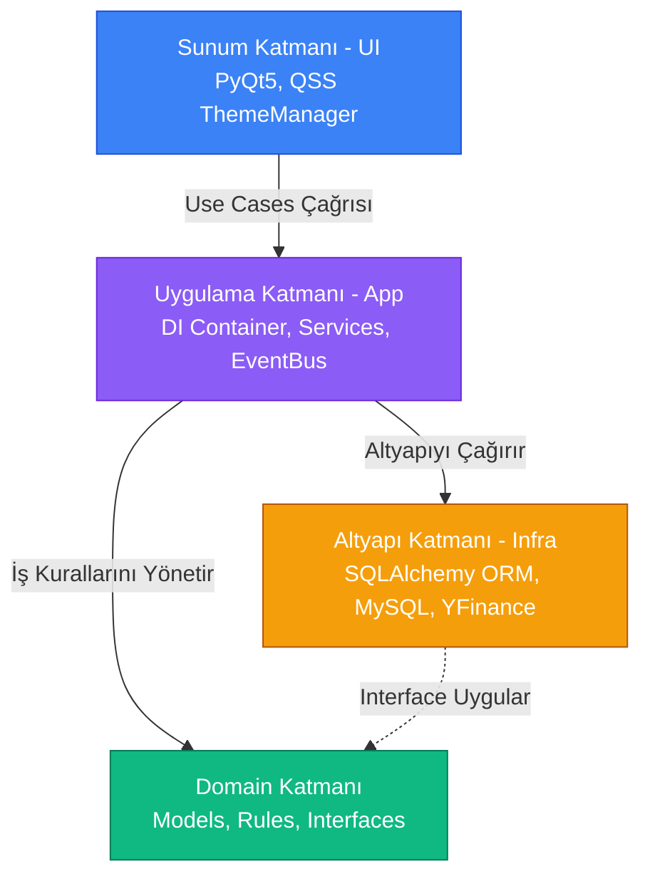
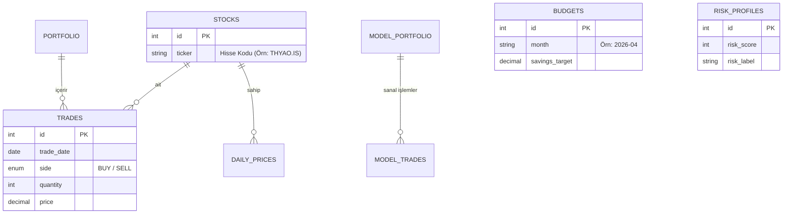

<p align="center">
  
</p>

<h1 align="center">📊 Portföy Simülasyonu</h1>

<p align="center">
  <strong>Profesyonel Borsa Portföy Yönetimi, Optimizasyon ve Simülasyon Laboratuvarı</strong>
</p>

<p align="center">
  
  
  
  
  
  
</p>

<p align="center">
  <em>Portföy Simülasyonu; BIST ve global hisse senetleri için gerçek zamanlı fiyat takibi, Markowitz modeli ile portföy optimizasyonu, risksiz strateji testleri (sanal portföy) ve kapsamlı finansal planlama sunan uçtan uca bir masaüstü yatırım platformudur.</em>
</p>

---

## 📑 İçindekiler
1. [Görsel Sunum ve Ekran Görüntüleri](#-görsel-sunum-ve-ekran-görüntüleri)
2. [Öne Çıkan Özellikler](#-öne-çıkan-özellikler)
3. [Mimari ve Sistem Tasarımı](#-mimari-ve-sistem-tasarımı)
4. [Kurulum ve Başlangıç](#-kurulum-ve-başlangıç)
5. [Kullanıcı Senaryoları (Hızlı Başlangıç)](#-kullanıcı-senaryoları-hızlı-başlangıç)
6. [Geliştirici Rehberi](#-geliştirici-rehberi)
7. [Testler ve Yol Haritası](#-testler-ve-yol-haritası)

---

## 📸 Görsel Sunum ve Ekran Görüntüleri

| Dashboard (Ana Panel) | Model Portföy Simülasyonu |
|:---:|:---:|
| > Portföy performansınızı gerçek zamanlı, hücre bazlı render mekanizması ile sıfır donma yaşayarak takip edin. | > Gerçek para harcamadan sanal bakiye ile yatırım stratejilerinizi test edin ve piyasa koşullarında ölçün. |
| *(Buraya dashboard ekran görüntüsü eklenecek: `docs/screenshots/dashboard.png`)* | *(Buraya model portföy ekran görüntüsü eklenecek: `docs/screenshots/model_portfolio.png`)* |

| Bilimsel Portföy Optimizasyonu | Finansal Planlama ve Risk Analizi |
|:---:|:---:|
| > Modern Portföy Teorisi (Markowitz) tabanlı SciPy optimizasyonu ile risk-getiri dengenizi maksimuma çıkarın. | > Hedeflerinizi belirleyin, aylık bütçenizi yönetin ve kişisel risk profilinize uygun yatırım kategorisi oluşturun. |
| *(Buraya optimizasyon ekran görüntüsü eklenecek: `docs/screenshots/optimization.png`)* | *(Buraya planlama ekran görüntüsü eklenecek: `docs/screenshots/planning.png`)* |

---

## 🎯 Öne Çıkan Özellikler

### 🚀 Gerçek Zamanlı Portföy Takibi
- **Event-Bus Mimarisi:** Fiyatlar YFinance API'den güncellendiğinde tüm ekran donmaz. Sadece değişen hisse hücresi (satır bazlı) reaktif olarak güncellenir (Pub/Sub pattern).
- **Detaylı Analitik:** Ağırlıklı ortalama maliyet, anlık kâr/zarar oranları, kur çevrimleri ve yatırılan sermaye analizleri.

### 🧠 Bilimsel Portföy Optimizasyonu
- **Markowitz Modern Portföy Teorisi:** Scipy kullanılarak portföydeki hisseler arasında geçmiş verilere göre maksimum getiriyi sağlayacak ideal ağırlık (weight) dağılımını hesaplar.
- **Efficient Frontier (Etkin Sınır):** Risk limitinize göre alınabilecek en yüksek kâr kombinasyonlarını önerir.

### 📈 Model Portföy & Simülasyon Laboratuvarı
- **Sanal Bakiye Yönetimi:** X miktar sanal başlangıç parası ile hayali bir sepet oluşturma.
- **Karşılaştırmalı Performans:** Model portföyünüzün zaman içindeki getirisini, gerçek portföyünüz ve endeks ile yan yana kıyaslama.

### 🛡️ Kapsamlı Finansal Planlama
- **Bütçe ve Tasarruf:** Gelir-gider tabloları üzerinden aylık yatırım yapılabilecek tutarın otomatik tespiti.
- **Risk Profilleme:** Yaş, piyasa tepkisi ve gelir durumuna dayalı dinamik risk anketi. Ankete göre portföyün agresif/defansif yapısını analiz etme.

---

## 🏗 Mimari ve Sistem Tasarımı

Uygulama, sürdürülebilirliği maksimize eden **Clean Architecture (Temiz Mimari)** ve **SOLID** prensipleriyle tasarlanmıştır.

### Katmanlı Mimari (Clean Architecture)



| Katman | Görev | Bağımlılık Yönü |
|---|---|---|
| **Domain** | Saf iş kuralları (Portfolio, Trade, Stock modelleri). `Interface` tanımları buradadır. | Hiçbir katmana bağımlı değildir. |
| **Application** | Servis sınıfları (`PortfolioService`), DI Konteyneri ve süreç orkestrasyonu. | Sadece `Domain` katmanına. |
| **Infrastructure** | Veritabanı işlemleri (SQLAlchemy Repositories) ve Dış API servisleri (YFinance). | `Domain` katmanındaki interfaceleri uygular. |
| **UI** | PyQt5 pencereleri, merkezi EventBus tetiklemeleri ve ThemeManager entegrasyonu. | Sadece `Application` katmanına. |

### Veritabanı Modeli (SQLAlchemy ORM)

Tablo yapısı tamamen `SQLAlchemy Declarative Base` ile oluşturulmuş tip-güvenli bir düzene sahiptir.



---

## 🚀 Kurulum ve Başlangıç

### Sistem Gereksinimleri
- **İşletim Sistemi:** Windows / macOS / Linux
- **Python:** Versiyon 3.10 veya üzeri
- **Veritabanı:** MySQL 8.0+

### Adım Adım Kurulum

**1. Depoyu İndirin:**
```bash
git clone https://github.com/kullanici/PortfoySimulasyonu.git
cd PortfoySimulasyonu
```

**2. Sanal Ortam Oluşturun (Önerilir):**
```bash
python -m venv venv
venv\Scripts\activate      # Windows
source venv/bin/activate   # macOS / Linux
```

**3. Bağımlılıkları Yükleyin:**
```bash
pip install -r requirements.txt
```

**4. Ortam Değişkenleri ve Veritabanı Ayarı:**
Kök dizinde bir `.env` dosyası oluşturun ve bilgilerinizi doldurun:
```ini
DB_HOST=localhost
DB_PORT=3306
DB_USER=root
DB_PASSWORD=gizli_sifreniz
DB_NAME=portfoySim
```
*Not: Uygulama ilk açılışta `orm_models.py` üzerinden gerekli tabloları otomatik olarak MySQL sunucunuzda yaratacaktır.*

**5. Uygulamayı Başlatın:**
```bash
python app.py
```

**(Opsiyonel) Taşınabilir EXE Derleme:**
Windows ortamında tek tıklamalı `.exe` elde etmek için:
```bash
build_nuitka.bat
```

---

## 🏃‍♂️ Kullanıcı Senaryoları (Hızlı Başlangıç)

Uygulamayı ilk açtığınızda neler yapmalısınız?

1. **İlk Hissenizi Ekleyin:** `Dashboard` (Ana Panel) sayfasından "İşlem Ekle" butonuna basın. Bir BIST hissesi (Örn: `TUPRS.IS`) veya Global bir hisse kodu girin, alış fiyatı ve miktar belirterek portföyünüze ekleyin.
2. **Geçmiş Veriyi İndirin:** `Hisse Detay` sayfasına giderek "Geçmiş Verileri Doldur (Backfill)" yapın. Böylece getiri hesaplamaları için gerekli veri tabanı oluşturulur.
3. **Simülasyona Başlayın:** `Model Portföy` sekmesine geçip "Sanal Portföy Oluştur" deyin. 100.000 TL sanal bakiye ile deneme alımları yapmaya başlayın.
4. **Risk Profilinizi Öğrenin:** `Risk Profili` ekranına giderek anketi çözün. Sistemin size önereceği hisse/nakit dengesini öğrenin.

---

## 🛠 Geliştirici Rehberi

### Yeni Bir Servis Eklemek
Clean Architecture kuralları gereği, veri tabanı ve arayüz asla birbirine direkt bağlanmaz.

1. `src/domain/services_interfaces` içine arayüzü yazın (Örn: `IMyService`).
2. `src/infrastructure/db/sqlalchemy/repositories` içine bu arayüzü uygulayan Repository dosyasını yazın.
3. `src/application/container.py` içerisindeki `AppContainer` sınıfında bu servisin instance'ını (Dependency Injection) oluşturun.

### Olay Döngüsü (Event Bus) Kullanımı
Ekran dondurmadan arka planda güncelleme yapmak için Qt sinyallerini kullanan `GlobalEventBus` kullanın:
```python
# Arka plan servisinde
container.event_bus.prices_updated.emit({"THYAO.IS": 320.50})

# UI (Sunum) tarafında dinleme
container.event_bus.prices_updated.connect(self._tabloyu_guncelle)
```

### Tema Yönetimi (QSS)
Görsel değişiklikler için koda dokunmayın. `src/ui/styles/` dizinindeki ilgili klasöre gidin:
- `base/`: Temel buton/tablo davranışları.
- `themes/`: Renk paleti (Dark, Light).
- `features/`: Sayfalara özel CSS kuralları (Örn: Risk sayfası fontları).

---

## 🧪 Testler ve Yol Haritası

Mevcut test süitini çalıştırmak için projenin kök dizininde pytest komutunu verin:
```bash
python -m pytest tests/ -v
```
*(Mevcut testler; portföy getiri hesaplamaları, alış/satış domain objesi validasyonları ve servis entegrasyon testlerini kapsar.)*

### Yakın Gelecek Yol Haritası (Roadmap)
- [ ] ML/AI tabanlı (HisseTahmin Entegrasyonu) hisse fiyatı yön tahminleme sekmesi.
- [ ] Nakit, USD ve EUR döviz cüzdanlarının entegrasyonu.


---

## 📜 Lisans & İletişim

Bu yazılım kapalı kaynak ve lisanslı bir mimaridir.  
Herhangi bir soru, destek veya katkı süreci için iletişime geçiniz.

<p align="center">
  <sub>Yüksek performanslı ve ölçeklenebilir kodlama mimarisi ile inşa edilmiştir </sub>
</p>
