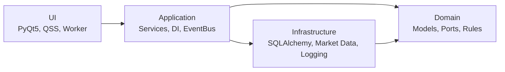

# Portföy Simülasyonu

<p align="center">
  
</p>

<p align="center">
  BIST ve global hisseler için portföy takibi, fiyat veri sağlığı, model portföy simülasyonu, Markowitz optimizasyonu ve AI destekli analiz sunan PyQt5 masaüstü uygulaması.
</p>

<p align="center">
  
  
  
  
  
</p>

---

## İçindekiler

- [Proje Özeti](#proje-özeti)
- [Öne Çıkan Özellikler](#öne-çıkan-özellikler)
- [Mimari](#mimari)
- [Kurulum](#kurulum)
- [Ortam Değişkenleri](#ortam-değişkenleri)
- [Çalıştırma](#çalıştırma)
- [Test Komutları](#test-komutları)
- [Build](#build)
- [Proje Yapısı](#proje-yapısı)
- [Kalite Kuralları](#kalite-kuralları)
- [Katkı ve Commit Notları](#katkı-ve-commit-notları)
- [Bilinen Uyarılar](#bilinen-uyarılar)

## Proje Özeti

Portföy Simülasyonu, yatırım kayıtlarını ve piyasa verilerini tek masaüstü uygulamasında birleştirir. Uygulama gerçek portföy işlemlerini takip eder, günlük fiyat verisi eksiklerini analiz eder, geçmiş performans raporları üretir ve sanal/model portföylerle strateji denemeyi sağlar.

Uygulama kişisel kullanım ve geliştirme denemeleri için tasarlanmıştır. Gerçek yatırım tavsiyesi vermez; hesaplamalar ve analizler karar destek aracı olarak değerlendirilmelidir.

## Öne Çıkan Özellikler

- **Portföy takibi:** Alış/satış işlemleri, açık pozisyonlar, maliyet, ağırlık ve kar/zarar hesapları.
- **Fiyat veri sağlığı:** Eksik günlük fiyatları, hafta sonlarını, bilinen tatilleri ve tatil adayı günleri ayrıştıran analiz ekranı.
- **Model portföy:** Gerçek para kullanmadan sanal portföy oluşturma ve performans izleme.
- **Tarihsel simülasyon:** İşlem geçmişinden günlük pozisyon ve portföy snapshot üretimi.
- **Markowitz optimizasyonu:** Risk-getiri dengesine göre ağırlık önerileri; piyasa verisi provider sınırı üzerinden alınır.
- **Excel raporlama:** Günlük özet ve detay satırlarıyla geçmiş portföy raporu üretimi.
- **Risk profili ve finansal planlama:** Kullanıcı anketi, bütçe ve hedef odaklı planlama ekranları.
- **AI destekli analiz:** AI Core/Gemini entegrasyonu ile ek analiz ve sohbet akışları.
- **Tema sistemi:** QSS tabanlı koyu/açık tema ve modüler stil dosyaları.

## Mimari

Proje Clean Architecture prensipleriyle ayrılmıştır:


```mermaid
flowchart LR
    UI["UI\nPyQt5, QSS, Worker"] --> APP["Application\nServices, DI, EventBus"]
    APP --> DOMAIN["Domain\nModels, Ports, Rules"]
    INFRA["Infrastructure\nSQLAlchemy, Market Data, Logging"] --> DOMAIN
    APP --> INFRA
```

Katmanların temel sorumlulukları:

| Katman | Sorumluluk |
| --- | --- |
| `src/domain` | Saf domain modelleri, port arayüzleri ve iş kuralları |
| `src/application` | Use case servisleri, simülasyon, optimizasyon, raporlama ve DI container |
| `src/infrastructure` | SQLAlchemy repository, piyasa verisi, logging ve dış kaynak adaptörleri |
| `src/ui` | PyQt5 sayfaları, paneller, widget'lar, tema yöneticisi ve worker akışları |

Son refactor çalışmalarıyla:

- `SettingsPage` ince bir tab orchestrator yapısına indirildi; reset, görünüm ve fiyat verisi yönetimi ayrı panellere taşındı.
- `HistorySimulationService.simulate_history()` public API korunarak state, günlük pozisyon builder ve snapshot builder sınıflarıyla sadeleştirildi.
- `OptimizationService` doğrudan canlı piyasa verisi çağırmak yerine provider/policy sınırı üzerinden çalışır.

Detaylı mimari notlar için `docs/wiki/architecture.md` dosyasına bakılabilir.

## Kurulum

### Gereksinimler

- Python 3.11 önerilir.
- MySQL 8.0 veya uyumlu bir MySQL sunucusu gerekir.
- Windows üzerinde geliştirme için mevcut doğrulanmış ortam:

```powershell
C:\Users\ysfygc\anaconda3\envs\Fintech\python.exe
```

### Depoyu hazırlama

```powershell
git clone https://github.com/Yusufygc/PortfoySimulasyonu.git
cd PortfoySimulasyonu
```

Yeni bir ortamla çalışılacaksa:

```powershell
python -m venv .venv
.\.venv\Scripts\activate
python -m pip install --upgrade pip
python -m pip install -r requirements.txt
```

Mevcut Fintech conda ortamı kullanılacaksa:

```powershell
C:\Users\ysfygc\anaconda3\envs\Fintech\python.exe -m pip install -r requirements.txt
```

## Ortam Değişkenleri

Gerçek `.env` değerleri repoya yazılmamalıdır. Başlangıç için örnek dosyayı kopyalayın:

```powershell
Copy-Item .env.example .env
```

`.env.example` içinde beklenen anahtarlar:

```ini
DB_HOST=localhost
DB_PORT=3306
DB_USER=portfoy_user
DB_PASSWORD=change-me
DB_NAME=portfoySim
POOL_NAME=portfoy_pool
POOL_SIZE=5
GEMINI_API_KEY=change-me
AI_CORE_API_URL=http://localhost:8000
TCMB_DEPOSIT_RATE_FALLBACK=45.0
```

Notlar:

- `DB_PORT` ve `POOL_SIZE` sayısal olmalıdır.
- `GEMINI_API_KEY` ve `AI_CORE_API_URL` AI ekranı için kullanılır.
- `TCMB_DEPOSIT_RATE_FALLBACK`, mevduat benchmark verisi canlı kaynaktan alınamadığında manuel fallback olarak kullanılır.

## Çalıştırma

Uygulamayı başlatmak için:

```powershell
C:\Users\ysfygc\anaconda3\envs\Fintech\python.exe app.py
```

Genel Python ortamında:

```powershell
python app.py
```

İlk çalıştırmada SQLAlchemy ORM modeli gerekli tabloları veritabanında oluşturur. MySQL bağlantı bilgileri `.env` üzerinden okunur.

## Test Komutları

Tam test suite:

```powershell
C:\Users\ysfygc\anaconda3\envs\Fintech\python.exe -m pytest tests
```

Hedefli testler:

```powershell
C:\Users\ysfygc\anaconda3\envs\Fintech\python.exe -m pytest tests/domain tests/application
C:\Users\ysfygc\anaconda3\envs\Fintech\python.exe -m pytest tests/ui
C:\Users\ysfygc\anaconda3\envs\Fintech\python.exe -m pytest tests/infrastructure
```

Önemli regresyon alanları:

- Excel append/dedup davranışı: `tests/application/test_excel_report_builder.py`
- Tarihsel simülasyon: `tests/application/test_history_simulation_service.py`
- Ayarlar sayfası panelleri: `tests/ui/pages/test_settings_page.py`
- Ortam doğrulama: `tests/infrastructure/test_settings_loader.py`

## Build

Windows üzerinde tek dosya `.exe` üretmek için:

```powershell
.\build_nuitka.bat
```

Build script Nuitka kullanır ve uygulama ikonunu `icons/portfoy-simulasyonu.ico` dosyasından alır.

## Proje Yapısı

```text
.
├── app.py
├── config/
│   └── settings_loader.py
├── icons/
│   ├── portfoy-simulasyonu.svg
│   ├── portfoy-simulasyonu.png
│   └── portfoy-simulasyonu.ico
├── src/
│   ├── application/
│   ├── domain/
│   ├── infrastructure/
│   └── ui/
├── tests/
│   ├── application/
│   ├── domain/
│   ├── infrastructure/
│   └── ui/
├── .env.example
├── requirements.txt
└── build_nuitka.bat
```

## Kalite Kuralları

Ana kural kaynağı `RULES.md` dosyasıdır. Özet:

- Büyük sınıf veya uzun fonksiyon eşiği aşıldığında yeni davranış eklemeden önce refactor yapılır.
- UI page sınıfları layout ve wiring ile sınırlı tutulur; alt davranışlar panel/component sınıflarına taşınır.
- Application servisleri dış API/client çağrılarını adapter veya provider interface üzerinden yapar.
- Gerçek `.env` değerleri dokümana, loga veya commit'e yazılmaz.
- Production bug fix önce kırmızı testle kanıtlanır, sonra fix ve tam test koşumu ile kapatılır.
- Refactor sonrası minimum kabul komutu:

```powershell
C:\Users\ysfygc\anaconda3\envs\Fintech\python.exe -m pytest tests
```

## Katkı ve Commit Notları

Commit mesajları Türkçe yazılır. Önerilen başlık fiilleri:

- `ekle:` yeni özellik, dosya veya sayfa
- `güncelle:` mevcut davranış veya dokümantasyon geliştirme
- `düzelt:` hata giderme
- `refaktör:` davranış değiştirmeden yapı sadeleştirme
- `test:` test ekleme veya güncelleme
- `yapılandır:` config, ortam veya build değişiklikleri
- `belge:` yalnız dokümantasyon değişiklikleri

Örnek:

```text
refaktör: SettingsPage sayfasını orchestrator yap

Ayarlar sayfası başlık, tab wiring ve geriye dönük proxy yüzeylerle sınırlı
ince bir sayfa haline getirildi.
```

## Bilinen Uyarılar

- `google.generativeai` paketi için deprecation uyarısı görülebilir. `google.genai` geçişi bilinen teknik borçtur.
- AI Core bağlantısı ayrı servis gerektirir; `AI_CORE_API_URL` erişilemezse AI ekranında bağlantı hatası alınabilir.
- README içindeki komutlar Windows PowerShell öncelikli yazılmıştır; Linux/macOS ortamlarında sanal ortam aktivasyon komutları farklıdır.

## Lisans ve Kullanım Notu

Bu proje kişisel portföy takibi ve geliştirme çalışmaları için hazırlanmıştır. Finansal analiz çıktıları yatırım tavsiyesi değildir.
