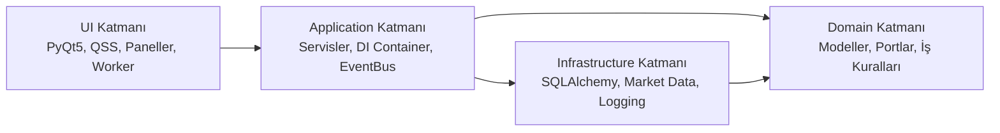
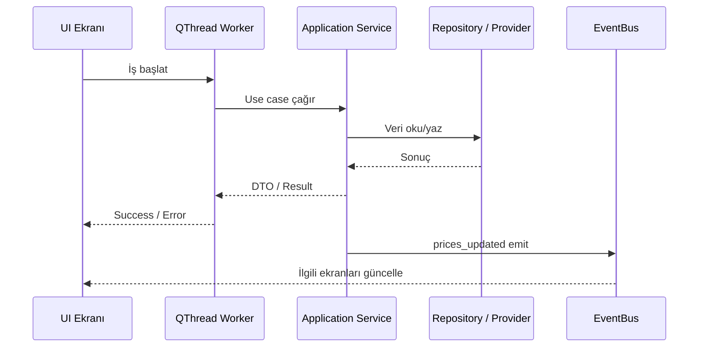

# Portföy Simülasyonu

<p align="center">
  
</p>

<h3 align="center">Portföy takibi, veri sağlığı, strateji simülasyonu, optimizasyon ve AI destekli analiz için kurumsal seviyede masaüstü yatırım platformu</h3>

<p align="center">
  
  
  
  
  
  
</p>

---

## Yönetici Özeti

Portföy Simülasyonu, bireysel ve ekip bazlı yatırım takip süreçlerini tek bir masaüstü uygulamada birleştiren kapsamlı bir finansal karar destek platformudur. Uygulama; portföy işlemlerinin kayıt altına alınması, günlük fiyat verilerinin izlenmesi, eksik veri sağlığının denetlenmesi, model portföylerle strateji denemesi, Markowitz tabanlı optimizasyon, Excel raporlama ve AI destekli analiz akışlarını aynı ürün deneyimi içinde sunar.

Bu proje yalnızca bir portföy tablosu değildir. Temel hedef, yatırım verisini operasyonel olarak yönetilebilir, denetlenebilir ve analiz edilebilir hale getirmektir. Bir şirket içi demo, yatırım takip aracı, finansal analiz laboratuvarı veya teknik değerlendirme projesi olarak kullanılabilecek olgunlukta tasarlanmıştır.

Uygulama, finansal kararları otomatikleştirme iddiasında bulunmaz. Üretilen analizler, tahminler, optimizasyon çıktıları ve AI yorumları karar destek amacı taşır. Son yatırım kararı kullanıcıya aittir.

## İş Değeri

Finansal portföy yönetiminde en büyük operasyonel sorunlardan biri, işlem kayıtları, piyasa verisi, analiz çıktıları ve strateji denemelerinin farklı araçlarda dağınık kalmasıdır. Portföy Simülasyonu bu dağınıklığı azaltmak için tek ekranda çalışan, yerel veritabanı destekli ve test edilebilir bir masaüstü çözüm sunar.

| Değer Alanı | Sağlanan Katkı |
| --- | --- |
| Veri bütünlüğü | İşlem geçmişi, fiyat kayıtları ve portföy metrikleri tutarlı domain modelleriyle yönetilir. |
| Operasyonel hız | Portföy, model portföy, fiyat sağlığı, analiz ve rapor ekranları aynı uygulamada bulunur. |
| Karar desteği | Risk, getiri, benchmark, optimizasyon ve AI yorumları bir arada değerlendirilir. |
| Strateji testi | Gerçek para kullanmadan model portföy ve tarihsel simülasyon akışlarıyla yatırım fikirleri denenebilir. |
| Denetlenebilirlik | Excel raporları, test suite ve modüler servis yapısı teknik inceleme için izlenebilirlik sağlar. |
| Geliştirilebilirlik | Clean Architecture, DI container, port/provider sınırları ve kalite kapıları yeni özellik eklemeyi kontrollü hale getirir. |

Kurumsal değerlendirme açısından ürünün güçlü yanı, finansal domain mantığını PyQt UI kodundan ayırmasıdır. Bu sayede uygulama yalnızca çalışan bir demo değil, sürdürülebilirliği ve test edilebilirliği düşünülmüş bir yazılım mimarisi sunar.

## Hedef Kullanıcılar

Portföy Simülasyonu farklı kullanım senaryolarına uyarlanabilecek bir temel ürün altyapısıdır.

| Kullanıcı Profili | Kullanım Amacı |
| --- | --- |
| Bireysel yatırımcı | Kendi işlem geçmişini, pozisyon maliyetlerini ve portföy performansını takip etmek. |
| Finansal analiz ekibi | Model portföy, benchmark ve optimizasyon sonuçlarını tek uygulama üzerinden değerlendirmek. |
| Portföy takip operasyonu | Günlük fiyat verisi eksiklerini, tatil adaylarını ve veri kalitesi durumunu izlemek. |
| Eğitim ve demo ortamları | Modern portföy teorisi, risk profili, simülasyon ve yatırım verisi yönetimini göstermek. |
| Yazılım değerlendirme ekibi | Clean Architecture, PyQt, SQLAlchemy, test ve refactor olgunluğunu incelemek. |

Bu kullanım profilleri, uygulamanın hem ürün hem de teknik vitrin olarak değerlendirilebilmesini sağlar.

## Ürün Modülleri

### Dashboard ve Portföy Takibi

Dashboard, portföyün operasyonel merkezidir. Kullanıcı açık pozisyonları, maliyetleri, ağırlıkları ve kar/zarar durumunu bu ekrandan takip eder. Portföy hesaplamaları işlem geçmişine dayanır; türev değerler domain modelinde yeniden hesaplanır. Böylece pozisyon değeri, ortalama maliyet ve gerçekleşmemiş kar/zarar gibi kritik metrikler doğrudan iş kurallarından üretilir.

Öne çıkan yetenekler:

- Alış ve satış işlemlerinin kayıt altına alınması.
- Açık pozisyonların maliyet ve piyasa değeriyle izlenmesi.
- Portföy ağırlığı, günlük fiyat etkisi ve toplam performans görünümü.
- EventBus üzerinden fiyat güncellemesi sonrası ilgili UI alanlarının yenilenmesi.

### Fiyat Verisi Yönetimi

Fiyat verisi finansal analizlerin güvenilirliğini belirleyen temel girdidir. Uygulama, kayıtlı hisselerin günlük fiyat verisini denetleyen özel bir fiyat veri sağlığı ekranı içerir.

Bu modül:

- Eksik fiyat günlerini listeler.
- Hafta sonlarını işlem günü beklentisinden ayırır.
- Bilinen tatil günleri ile tatil adayı günleri farklı şekilde değerlendirir.
- Toplu eksik gün tamamlama ve seçili hisse güncelleme akışları sunar.
- Fiyat güncellemesi sonrası EventBus ile diğer ekranların güncel veri almasını sağlar.

Bu yaklaşım, analiz sonuçlarının hangi veri kalitesi koşullarında üretildiğini görünür kılar.

### Model Portföy ve Strateji Simülasyonu

Model portföy modülü, gerçek portföyden bağımsız sanal yatırım stratejileri oluşturmak için tasarlanmıştır. Kullanıcı farklı ağırlıklar, hisseler ve yatırım kararlarıyla senaryo denemesi yapabilir.

Kurumsal açıdan bu modül, yatırım komitesi veya analiz ekibinin fikirleri gerçek portföye taşımadan önce kontrollü bir ortamda sınamasına yardımcı olur.

### Tarihsel Simülasyon

Tarihsel simülasyon servisi işlem geçmişini gün gün yeniden oynatır ve her gün için portföy snapshot üretir. Bu akış, ters tarih aralığı, hafta sonu, veri olmayan iş günü, aynı gün çoklu trade sıralaması ve son fiyat olmayan günlerde carry-forward davranışı gibi durumları testlerle kapsar.

Güncel yapı şu şekilde modülerleştirilmiştir:

- `SimulationState`: portföy, trade cursor, son kapanışlar ve baz değerleri taşır.
- `HistoryPositionBuilder`: günlük açık pozisyon satırlarını üretir.
- `HistorySnapshotBuilder`: günlük/kümülatif kar-zarar ve getiri metriklerini hesaplar.
- `HistorySimulationService`: public API'yi koruyarak akışı koordine eder.

Bu ayrım, uzun ve karmaşık simülasyon mantığını daha test edilebilir parçalara böler.

### Analiz ve Benchmark

Analiz katmanı portföy getirisini, benchmark karşılaştırmalarını, risk metriklerini ve kaynak çözümleme akışlarını içerir. Piyasa verisi sağlayıcıları ve fallback kaynaklar infrastructure katmanında tutulur. Bu sayede analiz servisleri dış veri kaynağı ayrıntılarına gömülmeden çalışabilir.

Benchmark ve fallback yaklaşımı:

- Hisse fiyatları için YFinance tabanlı veri istemcileri.
- Altın, döviz veya mevduat gibi benchmark alanlarında provider/fallback yaklaşımı.
- TCMB mevduat fallback değeri için `.env` üzerinden kontrollü yapılandırma.

### Markowitz Optimizasyon Motoru

Optimizasyon modülü modern portföy teorisi yaklaşımıyla portföy ağırlıkları üretir. SciPy optimizasyonu ve scikit-learn Ledoit-Wolf kovaryans tahmini kullanılarak risk-getiri dengesi hesaplanır.

Güncel yapı:

- `OptimizationService` doğrudan `yfinance` çağırmaz.
- Piyasa verisi `OptimizationMarketDataProvider` sınırı üzerinden alınır.
- Risk-free rate, işlem günü sayısı ve maksimum ağırlık gibi finansal sabitler policy nesnesiyle yönetilir.
- Servis canlı veri bağımlılığı olmadan mock provider ile test edilebilir.

Bu mimari, optimizasyon motorunu farklı piyasa veri kaynaklarına uyarlanabilir hale getirir.

### Risk Profili ve Finansal Planlama

Risk profili modülü kullanıcının davranışsal ve finansal tercihlerini puanlayarak yatırım profili üretir. Finansal planlama modülü bütçe, hedef ve tasarruf odağında çalışır. Bu ekranlar, portföy yönetimini yalnız performans takibinden çıkarıp kişisel veya ekip bazlı planlama sürecine bağlar.

### Excel Raporlama

Excel raporlama katmanı geçmiş portföy verisini dışa aktarır. Günlük detaylar ve özet satırlarıyla portföy performansı raporlanabilir. Append modunda tarih kolonlarının normalize edilmesiyle Timestamp/date karışımı kaynaklı duplicate günlük toplam üretimi engellenmiştir.

Raporlama yaklaşımı:

- `openpyxl` tabanlı biçimlendirilmiş çıktı.
- Günlük detay ve portföy özeti ayrımı.
- Append modunda aynı tarih tekrar geldiğinde son kayıt kazanacak şekilde dedup mantığı.
- Tarih normalizasyonu için ortak helper kullanımı.

### AI Destekli Analiz ve Sohbet

AI sayfası, analiz sonucunu kullanıcıya daha anlaşılır biçimde sunmak için ayrı sol ve sağ panel bileşenleriyle çalışır. AI model yanıtları doğrudan yatırım emri gibi değil, yön beklentisi, güven seviyesi, açıklama ve XAI faktörleri üzerinden aktarılır.

AI deneyimi:

- Ticker bazlı analiz başlatma.
- Model görünümü, tahmin kartı, performans kartı ve XAI faktör kartları.
- Analiz bağlamını sohbet paneline aktarma.
- Kullanıcıya sade cevap, log tarafında daha ayrıntılı hata bilgisi.
- Yatırım tavsiyesi vermeyen karar destek dili.

AI Core entegrasyonu `AI_CORE_API_URL` ile yapılandırılır. Gemini tarafında güncel `google.genai` istemcisi kullanılır.

### Ayarlar ve Yönetim Ekranı

Ayarlar sayfası refactor edilerek üç panel sorumluluğuna ayrılmıştır:

- `ResetPanel`: sistem sıfırlama ve onay akışı.
- `AppearancePanel`: tema kartları, tema seçimi ve seçim yenileme.
- `PriceDataPanel`: fiyat sağlığı UI'ı, worker çağrıları, tablo doldurma, rapor formatlama ve event bus publish.

Ana `SettingsPage` artık başlık, tab layout ve geriye dönük proxy yüzeyleriyle sınırlı ince bir orchestrator olarak çalışır.

### Karşılaştırma Laboratuvarı (Comparison Lab)

Karşılaştırma Laboratuvarı, Plotly kütüphanesini temel alan, çoklu varlık ve model portföyleri grafiksel olarak kıyaslama imkanı sunan bağımsız bir araştırma modülüdür. 

Öne çıkan yetenekler:
- Portföyünüzün XU100, Altın, Döviz gibi benchmarklarla veya kendi yarattığınız sanal Model Portföylerle grafiksel (Line chart, Bar chart) kıyaslanması.
- Bağımsız veri katmanı (`ComparisonService`) ile UI'ı kilitlemeden asenkron veri birleştirme.
- AI (Gemini) entegrasyonu sayesinde üretilen Plotly grafiklerinin JSON şablonlarının okunarak "Görselin Sözele Çevrilmesi" (Multimodal hissi veren veri okuma) yeteneği.

### Kurumsal Aksiyonlar ve İzleme (Watchlist)

Bu modül, sadece fiyata değil varlıkların yapısal değişikliklerine odaklanır:
- **Temettü (Dividend) ve Bölünmeler:** Hisse senedinin bedelli veya bedelsiz bölünmesi durumunda, yatırımcının geçmiş işlemlerinin, lot sayısının ve ortalama maliyetinin sistem tarafından matematiksel olarak düzeltilmesi.
- **İzleme Listesi (Watchlist):** Henüz portföye alınmamış ancak fiyat düşüşü beklenen hisselerin hedef fiyatlarla birlikte radar (Watchlist) ekranında tutulup arka planda fiyat sağlık denetiminden geçirilmesi.

## Teknik Mimari

Proje Clean Architecture prensipleriyle yapılandırılmıştır. Bağımlılık yönü domain kurallarını UI ve infrastructure ayrıntılarından koruyacak şekilde tasarlanmıştır.


```mermaid
flowchart LR
    UI["UI Katmanı\nPyQt5, QSS, Paneller, Worker"] --> APP["Application Katmanı\nServisler, DI Container, EventBus"]
    APP --> DOMAIN["Domain Katmanı\nModeller, Portlar, İş Kuralları"]
    INFRA["Infrastructure Katmanı\nSQLAlchemy, Market Data, Logging"] --> DOMAIN
    APP --> INFRA
```

| Katman | Sorumluluk | Örnekler |
| --- | --- | --- |
| Domain | Saf iş modelleri ve port arayüzleri | `Portfolio`, `Trade`, `Position`, repository portları |
| Application | Use case orkestrasyonu ve hesaplama servisleri | analiz, optimizasyon, simülasyon, raporlama |
| Infrastructure | Veritabanı, dış veri kaynakları, logging | SQLAlchemy repository, YFinance, benchmark provider |
| UI | Kullanıcı arayüzü ve etkileşim akışları | PyQt sayfaları, paneller, QSS, worker |

### Dependency Injection ve Container

`AppContainer`, repository ve servis bağımlılıklarını tek noktada bağlar. UI katmanı servisleri doğrudan üretmek yerine container üzerinden alır. Bu yaklaşım testlerde mock repository veya provider kullanımını kolaylaştırır.

### EventBus ve Worker Yapısı

PyQt uygulamalarında uzun süren işlemler ana thread'i kilitlememelidir. Bu nedenle uygulama arka plan işleri için worker yapısı ve thread-safe event bus yaklaşımı kullanır.


```mermaid
sequenceDiagram
    participant UI as UI Ekranı
    participant Worker as QThread Worker
    participant Service as Application Service
    participant Repo as Repository / Provider
    participant Bus as EventBus

    UI->>Worker: İş başlat
    Worker->>Service: Use case çağır
    Service->>Repo: Veri oku/yaz
    Repo-->>Service: Sonuç
    Service-->>Worker: DTO / Result
    Worker-->>UI: Success / Error
    Service->>Bus: prices_updated emit
    Bus-->>UI: İlgili ekranları güncelle
```

### UI Modülerliği

Yeni kalite kapılarına göre UI page sınıfları yalnız layout ve wiring sorumluluğu taşımalıdır. Tablo doldurma, rapor formatlama, worker orchestration ve tema kartı gibi davranışlar panel veya component sınıflarına taşınır. `SettingsPage` refactor'ı bu yaklaşımın uygulanmış örneğidir.

## Veri ve Entegrasyonlar

| Alan | Teknoloji / Kaynak | Açıklama |
| --- | --- | --- |
| Veritabanı | MySQL 8.0+ | İşlem, hisse, fiyat, risk profili ve model portföy verileri |
| ORM | SQLAlchemy | Declarative model ve repository implementasyonları |
| Piyasa verisi | YFinance | Hisse fiyatları ve geçmiş veri akışları |
| Benchmark/fallback | Provider yapısı | Mevduat ve benzeri kaynaklar için kontrollü fallback |
| AI | AI Core / Gemini | Analiz yorumlama ve sohbet akışı |
| Raporlama | openpyxl | Excel dışa aktarımı ve biçimlendirme |
| Analitik | NumPy, pandas, SciPy, scikit-learn | Optimizasyon, metrik ve veri işleme |

Ortam değişkenleri `.env` dosyasından okunur. Gerçek değerler repoya yazılmaz; örnek anahtarlar `.env.example` içinde tutulur.

```ini
DB_HOST=localhost
DB_PORT=3306
DB_USER=portfoy_user
DB_PASSWORD=change-me
DB_NAME=portfoySim
POOL_NAME=portfoy_pool
POOL_SIZE=5
DB_POOL_RECYCLE_SECONDS=3600
DB_POOL_PRE_PING=true
GEMINI_API_KEY=change-me
AI_CORE_API_URL=http://localhost:8000
EVDS_API_KEY=
TCMB_DEPOSIT_RATE_FALLBACK=45.0
LOG_DIR=logs
LOG_LEVEL=INFO
LOG_CONSOLE_LEVEL=DEBUG
LOG_FILE_LEVEL=INFO
```

`DB_PORT`, `POOL_SIZE`, `DB_POOL_RECYCLE_SECONDS`, `DB_POOL_PRE_PING`, `AI_CORE_API_URL` ve `TCMB_DEPOSIT_RATE_FALLBACK` parse hataları sessiz geçmez. Kritik ortam değerleri eksik veya geçersiz olduğunda açık hata üretilir.

## Kalite ve Güvenilirlik

Bu proje yalnızca çalışır özelliklere değil, sürdürülebilir geliştirme disiplinine de odaklanır.

### Test Olgunluğu ve Pytest Stratejisi

Test suite; domain, application, infrastructure ve UI katmanlarını dış API bağımlılıkları olmadan test etmeyi hedefler.

| Test Alanı | Kapsam | Pytest Stratejisi |
| --- | --- | --- |
| `tests/domain` | Domain modelleri, trade ve portföy hesap kuralları | Veritabanı veya dış sistem mocklanmaz. Saf matematiksel hesaplamalar test edilir. |
| `tests/application` | Analiz, optimizasyon, simülasyon ve servis davranışları | `pytest-mock` (mocker) ile YFinance ve veritabanı Repoları mocklanır. API Limitsiz çalışır. |
| `tests/infrastructure` | ORM şeması, repository ve ayar yükleyici kontrolleri | Test veritabanı (SQLite In-Memory) veya Docker MySQL ile entegrasyon. |
| `tests/ui` | PyQt sayfaları, AI panelleri ve QSS | `pytest-qt` eklentisi kullanılarak widget davranışları ve EventBus tetiklemeleri denenir. |

Ayrıca projenin `conftest.py` dosyasında, her testin tekrar tekrar portföy yaratmasını engelleyen "Ortak Fixture (Shared Fixture)" modelleri kurgulanmıştır.

Son doğrulama komutu:

```powershell
C:\Users\ysfygc\anaconda3\envs\Fintech\python.exe -m pytest tests
```

Beklenen durum: testler geçer; dış servis gerektiren kontroller mock veya fallback akışlarıyla izole edilir.

### Bağımlılık Yönetimi

`requirements.txt` doğrudan kullanılan paketler için pinli tutulur. Bu yaklaşım test ortamının tekrarlanabilirliğini artırır ve üretim benzeri doğrulamalarda sürüm kayması riskini azaltır.

Öne çıkan bağımlılıklar:

- `PyQt5`
- `PyQtWebEngine`
- `SQLAlchemy`
- `mysql-connector-python`
- `numpy`
- `pandas`
- `scipy`
- `scikit-learn`
- `yfinance`
- `openpyxl`
- `pytest`

### Refactor Güvenlik Kapıları

Ana kural kaynağı `RULES.md` dosyasıdır. Uygulanan temel prensipler:

- Sınıf 300 satır veya 20 metod eşiğini aşarsa yeni özellikten önce panel/helper/service ayrımı yapılır.
- Fonksiyon 50 satır, 5 parametre veya yüksek karmaşıklık eşiğini aşarsa küçük helper'lara bölünür.
- Application servisleri doğrudan dış API çağırmak yerine adapter/provider sınırları kullanır.
- Broad `except Exception` ancak log, kullanıcıya anlamlı sonuç ve test ile kabul edilir.
- Production bug fix önce kırmızı testle kanıtlanır, sonra fix ve tam test koşumu ile kapanır.

### Loglama ve Hata Yönetimi

Worker işleri job id ve thread bilgisiyle loglanır. AI Core, market data ve export akışlarında kullanıcıya sade hata mesajı, log tarafına daha ayrıntılı kök neden aktarımı hedeflenir. Hassas `.env` değerleri loga veya dokümana yazılmaz.

## Kurulum ve Çalıştırma

### Gereksinimler

- Python 3.11
- MySQL 8.0 veya uyumlu MySQL sunucusu
- Windows PowerShell önerilir
- Proje bağımlılıkları için `requirements.txt`

Doğrulanmış geliştirme ortamı:

```powershell
C:\Users\ysfygc\anaconda3\envs\Fintech\python.exe
```

### Depoyu Alma

```powershell
git clone https://github.com/Yusufygc/PortfoySimulasyonu.git
cd PortfoySimulasyonu
```

### Ortam Hazırlama

Mevcut Fintech conda ortamı ile:

```powershell
C:\Users\ysfygc\anaconda3\envs\Fintech\python.exe -m pip install -r requirements.txt
```

Yeni sanal ortam ile:

```powershell
python -m venv .venv
.\.venv\Scripts\activate
python -m pip install --upgrade pip
python -m pip install -r requirements.txt
```

### `.env` Dosyası

```powershell
Copy-Item .env.example .env
```

Sonra `.env` dosyasındaki veritabanı ve AI ayarları yerel ortama göre düzenlenir. Gerçek sırlar repoya eklenmemelidir.

### Uygulamayı Başlatma

```powershell
C:\Users\ysfygc\anaconda3\envs\Fintech\python.exe app.py
```

Alternatif:

```powershell
python app.py
```

İlk çalıştırmada SQLAlchemy modelleri gerekli tabloları oluşturabilir. MySQL bağlantısının hazır olması gerekir.

## Test ve Build

### Tam Test Suite

```powershell
C:\Users\ysfygc\anaconda3\envs\Fintech\python.exe -m pytest tests
```

### Hedefli Testler

```powershell
C:\Users\ysfygc\anaconda3\envs\Fintech\python.exe -m pytest tests/domain tests/application
C:\Users\ysfygc\anaconda3\envs\Fintech\python.exe -m pytest tests/ui
C:\Users\ysfygc\anaconda3\envs\Fintech\python.exe -m pytest tests/infrastructure
```

### Kritik Regresyon Alanları

```powershell
C:\Users\ysfygc\anaconda3\envs\Fintech\python.exe -m pytest tests/application/test_excel_report_builder.py
C:\Users\ysfygc\anaconda3\envs\Fintech\python.exe -m pytest tests/application/test_history_simulation_service.py
C:\Users\ysfygc\anaconda3\envs\Fintech\python.exe -m pytest tests/application/test_optimization_service.py
C:\Users\ysfygc\anaconda3\envs\Fintech\python.exe -m pytest tests/ui/pages/test_settings_page.py
```

### Windows EXE Build (Nuitka)

Python tabanlı kütüphaneleri (PyQt5, SciPy vb.) bağımsız bir masaüstü uygulamasına (.exe) çevirmek için Nuitka paketleyicisi kullanılır. PyInstaller yerine Nuitka'nın tercih edilme sebebi kaynak kodların C diline derlenerek (transpile) güvenlik ve nispi performans artışı sağlamasıdır.

```powershell
.\build_nuitka.bat
```

Build script; uygulama ikonunu `icons/icon.ico` dosyasından alır, plugin'leri aktif eder ve `dist/` dizini altında son derlenmiş versiyonu çıkartır. Bilimsel kütüphanelerin paketlenmesi oldukça uzun sürebilir.

Build script `requirements.txt` ve `requirements-build.txt` dosyalarındaki pinli sürümleri kullanır. `scripts/build_preflight.py` önce Python sürümü, pinli dependency formatı, Nuitka kurulumu, ikon, `.env.example`, pytest marker'ları ve `dist/.env` guard kontrollerini çalıştırır. Gerçek `.env` dosyası exe içine gömülmez; dağıtılan uygulama kendi bulunduğu dizindeki kullanıcıya özel `.env` dosyasını runtime sırasında okur.

Aktif ortamda build bağımlılığı kontrolü:

```powershell
python scripts/build_preflight.py
python -m nuitka --version
```

`nuitka` import edilemiyorsa bu release blocker'dır; `python -m pip install -r requirements-build.txt` ile build ortamı hazırlanmalıdır.

### Veritabanı Bakımı ve Scriptler

Sistem, bozuk trade'leri (eksik nakit veya sıfır lot altına düşme durumu) engellemek için Event-Sourcing tabanlı korumalara sahiptir. Ancak manuel müdahaleler sonrasında veritabanı sağlığını doğrulamak ve bakım yapmak için özel scriptler mevcuttur:

- `DbIntegrityService`: Veritabanındaki tüm işlemleri baştan sona simüle eder ve portföy kuralına aykırı (negatif nakit vs.) durumları tespit edip UI'da raporlar.
- `scripts/purge_stock.py`: İsim değiştirmiş veya delist olmuş hisseleri (Watchlist ve Model Portföy dahil) tüm veritabanından kalıcı olarak siler.
- `scripts/clean_db_prices.py`: Eksik veya 0 değerli fiyat geçmişlerini temizleyerek YFinance'in tekrar düzgün indirmesini tetikler.

## Proje Yapısı

| Yol | Açıklama |
| --- | --- |
| `app.py` | Uygulama giriş noktası |
| `config/settings_loader.py` | `.env` okuma ve kritik ayar doğrulama |
| `src/domain` | Domain modelleri ve port arayüzleri |
| `src/application` | Use case servisleri, DI container, simülasyon, analiz, raporlama |
| `src/infrastructure` | SQLAlchemy, market data provider, logging |
| `src/ui` | PyQt5 sayfaları, paneller, widget'lar ve QSS stilleri |
| `tests` | Domain, application, infrastructure ve UI testleri |
| `icons` | Uygulama ve README ikonları |
| `RULES.md` | Kalite, refactor, test ve commit kuralları |
| `docs/wiki` | Mimari notlar ve değişiklik günlüğü |

## Şirket İçi Demo ve Satış Mesajı

Portföy Simülasyonu, finansal yazılım geliştirme yetkinliğini göstermek için güçlü bir demo ürünüdür. Bir şirkete sunulduğunda üç farklı değer katmanı aynı anda gösterilebilir:

1. **Ürün değeri:** Kullanıcı portföyünü takip eder, fiyat verisi sorunlarını görür, model portföylerle strateji dener ve rapor alır.
2. **Analitik değer:** Optimizasyon, benchmark, risk profili ve AI açıklamaları karar destek akışını güçlendirir.
3. **Mühendislik değeri:** Clean Architecture, test suite, provider sınırları, refactor kapıları ve pinli bağımlılıklar sürdürülebilir geliştirme olgunluğunu gösterir.

Bu yapı, ürünü yalnızca son kullanıcı aracı olarak değil, kurumsal PoC, teknik demo, yatırım analizi laboratuvarı veya ileri seviye portföy yönetimi prototipi olarak da konumlandırır.

## Geliştirme Potansiyeli

Mevcut mimari yeni yetenekler için genişlemeye uygundur:

- Farklı piyasa veri sağlayıcılarının provider interface üzerinden eklenmesi.
- AI Core tarafında yeni model veya açıklanabilirlik metriklerinin bağlanması.
- Kurumsal kullanıcı yönetimi ve rol bazlı yetkilendirme.
- REST API veya web tabanlı yönetim paneli.
- Daha kapsamlı benchmark kaynakları ve risk metrikleri.
- Otomatik rapor zamanlama ve dışa aktarım entegrasyonları.

Bu maddeler mevcut ürünün bugünkü iddiası değil, mimarinin destekleyebileceği genişleme alanlarıdır.

## Bilinen Teknik Borçlar

- AI Core bağlantısı harici servis gerektirir. `AI_CORE_API_URL` erişilemezse AI ekranı ilgili bağlantı hatasını gösterebilir.
- README komutları Windows PowerShell önceliklidir. Linux/macOS ortamlarında sanal ortam aktivasyonu ve servis kurulum adımları uyarlanmalıdır.
- Finansal veri kaynakları dış servis davranışına bağlıdır; upstream kesinti veya veri boşluğu durumunda fallback ve hata mesajı akışları devreye girer.

## Yatırım Tavsiyesi Uyarısı

Portföy Simülasyonu bir karar destek ve analiz uygulamasıdır. Uygulama içindeki optimizasyon, AI yorumları, model portföy çıktıları, benchmark karşılaştırmaları ve raporlar yatırım tavsiyesi değildir. Finansal kararlar kullanıcı sorumluluğundadır.

## Kısa Sonuç

Portföy Simülasyonu, masaüstü finans uygulaması olarak ürünleşebilir bir deneyim ile teknik olarak denetlenebilir bir mimariyi bir araya getirir. Portföy takibi, veri sağlığı, simülasyon, optimizasyon, raporlama ve AI analiz modülleri aynı platformda çalışır. Bu yönüyle proje; şirket içi demo, teknik değerlendirme, ürün prototipi veya yatırım analizi laboratuvarı olarak güçlü bir sunum zemini sağlar.
