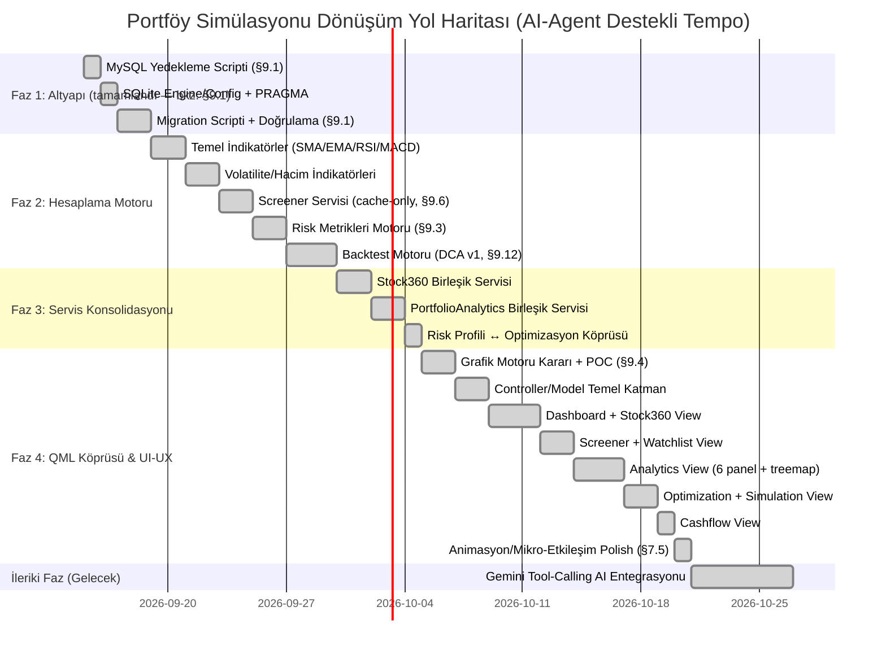

# Portföy Simülasyonu — Modernizasyon, Mimari Dönüşüm ve Güçlendirme Planı

> **Hedef:** Mevcut Clean Architecture backend emeğini koruyarak; veritabanı, hesaplama motorları, veri sağlayıcılar ve yapay zeka entegrasyonundaki pürüzleri gidermek, gereksiz şişkinlikleri budamak ve sıfırdan tasarlanacak **QML (Qt Quick)** arayüzü için sağlam, modern bir servis altyapısı hazırlamak.

---

## 📋 İÇİNDEKİLER

1. [Yönetici Özeti ve Temel İlkeler](#1-yönetici-özeti-ve-temel-ilkeler)
2. [Veritabanı Dönüşümü: MySQL 8.0 ➔ SQLite](#2-veritabanı-dönüşümü-mysql-80--sqlite)
3. [Finansal Hesaplama ve Analiz Motoru (Özel NumPy/Pandas İmplementasyonu)](#3-finansal-hesaplama-ve-analiz-motoru-özel-numpypandas-implementasyonu)
4. [Veri Sağlayıcıları ve Scraping Altyapısının Sağlamlaştırılması](#4-veri-sağlayıcıları-ve-scraping-altyapısının-sağlamlaştırılması)
5. [Modül Konsolidasyonu ve Sadeleştirme (De-bloating)](#5-modül-konsolidasyonu-ve-sadeleştirme-de-bloating)
6. [Yapay Zeka (Gemini AI) Karar Destek Mimarisi (Faz 5)](#6-yapay-zeka-gemini-ai-karar-destek-mimarisi-faz-5--📐-tasarım-tamamlandı-uygulama-başlıyor)
7. [QML (Qt Quick) UI-UX Sıfırdan Tasarım ve Entegrasyon Mimarisi](#7-qml-qt-quick-ui-ux-sıfırdan-tasarım-ve-entegrasyon-mimarisi)
8. [Fazlandırılmış Uygulama Yol Haritası (Milestones)](#8-fazlandırılmış-uygulama-yol-haritası-milestones)
9. [Tespit Edilen Boşluklar ve Riskler (Analiz)](#9-tespit-edilen-boşluklar-ve-riskler-analiz)

---

## 1. Yönetici Özeti ve Temel İlkeler

### 1.1 Temel Amaç
Mevcut projenin domain mantığı, event-sourcing portföy hesaplama mimarisi, kurumsal aksiyon yönetimi (temettü, bedelli/bedelsiz sermaye artırımı) ve test kurgusu korunacak; sistemi hantallaştıran MySQL bağımlılığı, dağınık sayfalar, kırılgan scraper'lar ve yetersiz kalan indikatör hesaplamaları modernize edilecektir.

### 1.2 Mimari İlkeler
* **Clean Architecture Korunacak:** Bağımlılıklar dıştan içe akmaya devam edecek (`Domain` ➔ `Application` ➔ `Infrastructure` ➔ `UI`).
* **Sıfır Kurulum & Taşınabilirlik:** Uygulama harici bir veritabanı sunucusu veya mikroservis gerektirmeden tek tıkla (`.exe`) çalışabilir olacak.
* **Vektörize & Hızlı Hesaplama:** Döngü bazlı hesaplamalar yerine özel NumPy/Pandas vektörize fonksiyonlarla (bkz. §9.2/§9.3) yüksek performanslı veri işleme.
* **QML Hazır Backend:** Tüm servis çıktıları, QML tarafında tüketilebilecek `QObject`, `Q_PROPERTY`, `QAbstractTableModel` ve temiz JSON/Dict yapılarına uygun sunulacak.

---

## 2. Veritabanı Dönüşümü: MySQL 8.0 ➔ SQLite

### 2.1 Gerekçe
* Mevcut yapıda MySQL 8.0 sunucu zorunluluğu (`localhost:3306`, root şifresi, arka plan daemon'ı), kişisel bir masaüstü portföy uygulaması için gereksiz sürtünme ve dağıtım zorluğu yaratmaktadır.
* SQLite, tek bir dosya (`data/portfolio.db`) üzerinden sıfır konfigürasyonla çalışır, tam ACID garantisi sunar ve taşınabilirdir.

### 2.2 Yapılacak Değişiklikler
1. **DB Yapılandırması (`src/infrastructure/db/db_config.py`):**
   * `MySQLConfig` yerine `SQLiteConfig` (veya çoklu veritabanı destekleyen `DatabaseConfig`) yapısı kurulacak.
   * Dosya yolu varsayılan olarak `data/portfolio.db` olacak.
2. **SQLAlchemy Engine & Session (`src/infrastructure/db/sqlalchemy/database_engine.py`):**
   * Connection URL: `sqlite:///{db_path}` olarak güncellenecek.
   * SQLite performans ve eşzamanlılık optimizasyonları eklenecek:
     - `PRAGMA journal_mode = WAL;` (Write-Ahead Logging ile hızlı okuma/yazma)
     - `PRAGMA synchronous = NORMAL;`
     - `PRAGMA foreign_keys = ON;` (İlişkisel bütünlük denetimi)
     - `check_same_thread = False` (Worker thread'lerde güvenli oturum kullanımı)
3. **Repository Uyumluluğu:**
   * Mevcut SQLAlchemy repository sınıfları ORM tabanlı olduğu için şema düzeyinde büyük bir değişiklik gerekmeyecek, dialect farkları (tarih/zaman fonksiyonları vb.) normalize edilecek.

---

## 3. Finansal Hesaplama ve Analiz Motoru (Özel NumPy/Pandas İmplementasyonu)

> **Not (2026-09-11, bkz. §9.2 / §9.3):** `pandas-ta`, `ta`, `quantstats`, `empyrical` gibi harici kütüphaneler bakımsızlık/bağımlılık riski nedeniyle kullanılmayacak. Aşağıdaki tüm indikatör ve metrikler `src/application/services/analysis/` altında özel, test edilebilir NumPy/Pandas fonksiyonları olarak yazılacak.

### 3.1 Teknik Analiz & Piyasa Tarayıcısı (Screener) — ✅ v1 indikatör seti tamamlandı
* **Mevcut Durum (2026-09-11 öncesi):** Yalnızca SMA50 ve SMA200 (Golden/Death Cross) hesaplayan elle yazılmış bir döngü var.
* **Tamamlandı:** `src/application/services/analysis/technical/indicators.py` altında özel vektörize fonksiyonlarla BIST hisseleri için analiz motoru kuruldu (v1 kapsamı):
  * **Trend Göstergeleri:** EMA (20, 50, 200), SMA. ✅
  * **Momentum & Osilatörler:** RSI (14) ✅, MACD (12, 26, 9) ✅, Stochastic ✅, CCI ✅.
  * **Volatilite & Kanal:** Bollinger Bantları (20, 2) ✅, ATR (Average True Range) ✅.
  * **Hacim Analizi:** VWAP (Hacim Ağırlıklı Ortalama Fiyat) ✅, OBV (On-Balance Volume) ✅.
  * *v1 kapsamı dışı (ayrı alt-faz, bkz. §9.2):* Supertrend, ADX, Ichimoku Cloud, Keltner Kanalları — çok adımlı/karmaşık hesaplama gerektirdiklerinden temel set stabilize olduktan sonra değerlendirilecek.
  * **Önemli not (bkz. §9.10):** ATR/Stochastic/CCI/VWAP/OBV için gereken High/Low/Volume verisi DB'de yoktu — `daily_prices` şeması genişletildi (`open_price`/`high_price`/`low_price`/`volume`, nullable) ve 120 hisse için tarihsel OHLCV verisi backfill edildi. Detay için bkz. §9.10.
* **BIST Çoklu Sinyal Tarayıcısı (Screener Service) — ✅ Tamamlandı:**
  * `src/application/services/analysis/technical/screener.py` (saf filtre/snapshot mantığı) + `screener_service.py` (DB orkestrasyonu, `container.screener_service` olarak DI'ya bağlı):
    - *Filtre 1:* `RSI < 30` (Aşırı Satım) + `Fiyat > EMA200` ✅
    - *Filtre 2:* `MACD Kesişimi (Bullish)` + `Hacim > 20 Günlük Ortalama` ✅
    - *Filtre 3:* `Bollinger Alt Bandına Değenler` ✅
  * **Zorunlu bağımlılık (bkz. §9.6):** Screener yalnızca yerel DB (`price_repo`) üzerinden çalışır; canlı YFinance çağrısı yapmaz. **Gerçek veriyle doğrulandı:** 164 hisse, 1.55 saniyede tarandı, 8 eşleşme bulundu — "saniyeler içinde tarama" hedefi karşılandı.

### 3.2 Profesyonel Portföy & Risk Metrikleri — ✅ Tamamlandı
* **Bulgu (2026-09-11):** `src/application/services/analysis/risk_metrics.py` zaten mevcuttu — `Sharpe`, `Beta`, `Alpha`, `Max Drawdown`, `Volatilite` özel (saf Python, `Dict[date, Decimal]` seri girdili) fonksiyonlarla önceden yazılmıştı; ancak **hiç test kapsamı yoktu**. Bu turda hem eksik metrikler eklendi hem de dosyanın tamamı için ilk kez test dosyası açıldı.
* **Tamamlandı:** Aynı dosyada, aynı çağrı sözleşmesiyle (Dict[date, Decimal] seri, Optional[float] dönüş) eklenenler:
  * **Risk/Getiri Oranları:** Sharpe ✅ (mevcuttu), Sortino ✅, Calmar ✅, Omega ✅.
  * **Risk Metrikleri:** Max Drawdown ✅ (mevcuttu), Volatilite ✅ (mevcuttu), VaR (%95/%99, parametrik confidence) ✅, CVaR/Expected Shortfall ✅.
  * **Piyasa Korelasyonu:** Beta ✅ (mevcuttu), Alpha ✅ (mevcuttu), R-Squared ✅, Tracking Error ✅.
  * **Dönemsellik Analizi:** `compute_monthly_returns_matrix` — Yıl→Ay→getiri% haritası (ham veri, çizim QML tarafında) ✅.
  * *Kapsam dışı bırakıldı:* Drawdown Süresi (Recovery Period) — ayrı bir zaman-serisi analizi gerektiriyor, AnalyticsView (§7.3) geliştirilirken ihtiyaç netleşince eklenecek.
* 29 yeni test (`tests/application/services/analysis/test_risk_metrics.py`) — hem yeni fonksiyonlar hem mevcut `compute_max_drawdown_pct`/`compute_daily_return_vector` için ilk kez kapsam sağlandı.

### 3.3 Gelişmiş Backtest ve Simülasyon Motoru — v1 (DCA) ✅ Tamamlandı
* Portföy için *"Geçmişte her ay X TL ekleseydim"*, *"Her çeyrekte Markowitz ile yeniden dengeleseydim (rebalancing)"*, *"Stop-loss / Take-profit uygulasaydım"* senaryolarını çalıştıran hızlı simülasyon motoru.
* **Karar (2026-09-11, bkz. §9.12):** v1 kapsamı sadece **DCA (Düzenli Katkı)** senaryosuna daraltıldı. `src/application/services/simulation/dca_backtest.py` (saf) + `dca_backtest_service.py` (DB orkestrasyonu, `container.dca_backtest_service`). Gerçek veriyle doğrulandı (ADEL+FROTO.IS, 2024-2026, 30 aylık katkı, 30.000 TL yatırım → 26.684 TL, %-11.05).
* *v1 kapsamı dışı (ertelendi, bkz. §9.12):* Markowitz ile periyodik rebalancing (OptimizationService şu an sadece canlı portföyü optimize ediyor, tarihsel nokta desteği için refactor gerekiyor), Stop-loss/Take-profit.

---

## 4. Veri Sağlayıcıları ve Scraping Altyapısının Sağlamlaştırılması

### 4.1 Çok Katmanlı Piyasa Verisi (Market Data Pipeline)
* **Birincil Kaynak:** YFinance & TradingView Datafeed.
* **Yedek / Tamamlayıcı Kaynaklar:** İş Yatırım, TCMB EVDS (TÜFE / Enflasyon, Politika Faizi, Dolar/TL kurları).
* **Hata Toleransı (Resilience):**
  - Rate-limit ve timeout durumlarında otomatik retry ve exponential backoff.
  - Seans saatleri kontrolü (`bist_market_session_service.py`): Seans kapalıyken veya tatillerde gereksiz API sorgularını durdurma.

### 4.2 Kalıcı Yerel Önbellekleme (Structured SQLite Caching)
* KAP Ortaklık Yapısı ve İş Yatırım Mali Tablo verileri dosya bazlı JSON yerine doğrudan SQLite içindeki `cached_financial_statements` ve `cached_shareholders` tablolarında saklanacak.
* Veri güncelliği TTL (Time-to-Live) ile yönetilecek (örn. Bilanço dönemleri için 30 gün, fiyatlar için günlük). Ağ bağlantısı olmadığında tamamen offline çalışabilecek.

---

## 5. Modül Konsolidasyonu ve Sadeleştirme (De-bloating)

Arayüzdeki karmaşayı gidermek ve backend servislerini sadeleştirmek için 4 ana birleştirme yapılacaktır:

```
┌─────────────────────────────────────────────────────────────────────────┐
│                       MODÜL KONSOLİDASYONU                              │
├───────────────────────────────┬─────────────────────────────────────────┤
│ ESKİ AYRIK YAPI               │ YENİ BİRLEŞİK SERVİS / DOMAIN           │
├───────────────────────────────┼─────────────────────────────────────────┤
│ • FinancialsPage              │                                         │
│ • ShareholdersPage            │ ──► Stock360Service                     │
│ • StockDetailPage             │     (Fiyat, Bilanço, KAP, Oranlar, TA)  │
├───────────────────────────────┼─────────────────────────────────────────┤
│ • AnalysisPage                │ ──► PortfolioAnalyticsService           │
│ • ComparisonPage              │     (6 Grafik Paneli + Risk Metrikleri) │
├───────────────────────────────┼─────────────────────────────────────────┤
│ • RiskProfilePage (İzole)     │ ──► OptimizationService Entegrasyonu    │
│ • OptimizationPage            │     (Anket puanı ➔ Max Ağırlık Sınırı)  │
├───────────────────────────────┼─────────────────────────────────────────┤
│ • Budget & Kişisel Faturalar  │ ──► Portföy Nakit Akış Servisi          │
│                               │     (Temettü, Sermaye Ekleme/Çekme)     │
└───────────────────────────────┴─────────────────────────────────────────┘
```

### 5.1 "Stock 360" (Hisse 360) Birleşik Servisi — ✅ Tamamlandı
* `Stock360Service` (`src/application/services/analysis/stock_360_service.py`) tek bir hisse kodu (`ticker`) için 4 boyutu tek servis altında toplar; mevcut `FinancialAnalysisService`/`ShareholderAnalysisService`'i sarmalayan bir facade'dir, altlarını değiştirmez:
  1. **Genel Bakış (`get_overview`):** Son fiyat, günlük değişim %, hacim, 52 haftalık aralık — sadece lokal `price_repo` (canlı API çağrısı yok, Screener §9.6 önkoşuluyla aynı prensip). Piyasa değeri kalemi bilerek `StockOverview`'a alınmadı; bu veri zaten `_market_val.market_cap` altında Temel Finansallar boyutunda mevcut (bkz. madde 2), tekrar hesaplamak yerine oraya referans veriliyor.
  2. **Temel Finansallar (`get_financials`):** Mevcut `FinancialAnalysisService.analyze()`'ye ince bir delege — Bilanço/Gelir Tablosu/Nakit Akımı ve Çarpanlar (F/K, PD/DD, FD/FAVÖK, Net Borç/FAVÖK) zaten `metrics.py`/`valuation.py` içinde hesaplı çıkıyordu, burada yeniden yazılmadı.
  3. **Ortaklık Yapısı (`get_shareholders`):** Mevcut `ShareholderAnalysisService.get_history()`'ye delege (KAP pay sahipliği + tarihçe, TTL cache aynen korunuyor).
  4. **Teknik Seviyeler (`get_technical_levels`):** RSI14/MACD/SMA50/SMA200/EMA20 (`indicators.py`, mevcut) + yeni `support_resistance.py` (saf fraktal pivot: ortalanmış rolling min/max ile yerel tepe/dip tespiti, güncel fiyata en yakın destek/direnç).
* `get_snapshot(ticker)`: 4 boyutu birleştiren tek çağrı (ileride §6.2 Gemini tool-calling için de kullanılabilir) — Finansallar/Ortaklık dış API'ye gittiğinden birbirinden **izole** edilir (`financials_error`/`shareholders_error` alanları), biri hata verirse diğerleri etkilenmez.
* DI: `container.stock_360_service` (bkz. `container_parts/services.py`).
* **Doğrulama:** 17 yeni test (`test_stock_360_service.py` 11 + `test_support_resistance.py` 6) — mock repo/servis ile orkestrasyon + hata izolasyonu; ardından gerçek MySQL verisiyle duman testi: `ADEL` için Genel Bakış/Teknik (destek=32.3, direnç=33.16)/Finansallar (12 çeyrek, gerçek İş Yatırım çağrısı)/Ortaklık (233 KAP snapshot, gerçek KAP çağrısı) uçtan uca çalıştı; tam suite **879 passed, 4 xfailed** (öncekine göre +17, regresyon yok).

### 5.2 "Portföy Analiz ve Kıyaslama Laboratuvarı" Birleşik Servisi — ✅ Tamamlandı
* `PortfolioAnalyticsService` (`src/application/services/analysis/portfolio_analytics_service.py`), `AnalysisService` ve `ComparisonService`'i tek servis altında toplayan bir facade (Stock360Service ile aynı desen, bkz. §5.1) — altlarını değiştirmez, `AnalysisPage`/`ComparisonPage` hâlâ `container.analysis_service` ile çalışır, regresyon riski sıfır:
  * Mevcut `AnalysisService` metodları (`get_overview`, `get_comparison_view`, `get_allocation_risk_view`, vb.) 1:1 delege edilir.
  * **Yeni `get_chart_panels()`:** `ComparisonService`'in saf pandas hesaplarını (`align_financial_series`/`calculate_drawdowns`/`calculate_periodic_returns`/`calculate_risk_return_metrics`) `get_comparison_view()`'in ürettiği seri/benchmark/karşılaştırma verisine uygulayıp tek bir `ChartPanelsDTO` döner (6 panelin ham verisi).
  * **Yeni `get_extended_risk_metrics()`:** Faz 2 b4'te eklenip hiçbir UI'ya bağlanmamış `risk_metrics.py` fonksiyonlarını (Sortino/Calmar/Omega/VaR%95/CVaR%95/R²/Tracking Error/Aylık Getiri Isı Haritası) portföy serisine uygular; mevcut Sharpe/Beta/Alpha ile birleştirip `ExtendedRiskMetricsDTO` döner.
  * Bulunan/düzeltilen ayrıntı: seri birleştirme için `pd.Series` index'i düz `date` değil `pd.Timestamp` olmalı — `ComparisonService.calculate_periodic_returns()` `resample()` çağırdığından `DatetimeIndex` gerektirir (mevcut `comparison_series_builder.py` ile aynı desen kullanıldı).
* DI: `container.portfolio_analytics_service`.
* **Doğrulama:** 8 yeni test (mock `AnalysisService` + gerçek `ComparisonViewDTO`/risk_metrics hesapları); gerçek portföy verisiyle duman testi (`dashboard` kaynağı + `bist100` benchmark) — 8 sütunlu hizalanmış seri, drawdown/periyodik getiri/risk-getiri panelleri ve tam risk metrik seti (beta=0.19, R²=0.10, tracking error=%23.1) uçtan uca çalıştı; tam suite **887 passed, 4 xfailed** (öncekine göre +8, regresyon yok).
* Karşılaştırma Laboratuvarı'ndaki 6 temel grafik panelinin tamamı eksiksiz korunmuştur:
  1. **Ana Performans & Kümülatif Getiri Grafiği:** Çoklu varlık kıyaslama (Normal % Getiri, Normalize Baz 100 ve Rasyo Modları: XU100, Gram Altın, USD/TRY, Politika Faizi/Mevduat, TÜFE Enflasyon).
  2. **Dönem Sonu Getiri Özeti Tablosu:** Seçilen tarih aralığında başlangıç değeri, dönem sonu değeri ve net getiri tablosu.
  3. **Maksimum Değer Kaybı (Drawdown & Underwater) Grafiği:** Varlıkların tarihsel zirvelerden düşüş derinlikleri ve toparlanma periyotları.
  4. **Dönemsel (Aylık/Çeyreklik) Getiri Karşılaştırma Grafiği:** Varlıkların aylık bazda yan yana bar karşılaştırması.
  5. **Risk / Getiri Dağılımı (Saçılım / Scatter) Grafiği:** Yıllıklandırılmış oynaklık (volatilite) ile yıllık getiri ilişkisi matrisi.
  6. **Treemap Getiri Katkı & Büyüklük Haritası:** Varlık ağırlıkları ve getiri katkısının alan bazlı renkli ısı haritası.
  7. **Ek Risk/Performans Metrikleri (özel `risk_metrics.py`):** Sharpe, Sortino, Calmar, Beta, Alpha, VaR (%95), Aylık Getiri Isı Haritası.

### 5.3 Risk Profili ve Markowitz Optimizasyon Köprüsü — ✅ Tamamlandı
* `RiskOptimizationBridgeService` (`src/application/services/planning/risk_optimization_bridge_service.py`), kayıtlı risk anketi sonucunu (`RiskProfileService.get_current_profile()`) `OptimizationService`'in Markowitz optimizasyonuna bağlar:
  * `MAX_SINGLE_WEIGHT_BY_LABEL`: 5 risk etiketi → tek-hisse ağırlık üst sınırı. Plan spesifikasyonundaki iki uç nokta esas alındı — *Muhafazakar* %10, *Agresif* %35 — ara etiketler (`ÇOK_MUHAFAZAKAR` %8, `DENGELİ` %20, `BÜYÜME_ODAKLI` %28) mevcut `PROFILE_INFO`'daki artan `max_volatility` sıralamasıyla tutarlı ara değerler olarak eklendi.
  * **Kapsam sınırı (bilinçli):** `OptimizationService` yalnızca portföydeki mevcut hisseler arasında ağırlık dağıtır — nakit/tahvil/fon gibi ayrı bir varlık sınıfı modellemez (CLAUDE.md: "SciPy minimize + Ledoit-Wolf → per-hisse ağırlık limiti kısıtı" tek mekanik kısıt). Bu nedenle "min %30 nakit/tahvil" gibi varlık sınıfı kısıtları mekanik olarak uygulanmadı; `equity_ceiling_pct` alanı (`PROFILE_INFO[label]["allocation"]["Hisse"]`) bilgilendirici bir tavan olarak sonuca eklendi.
  * `optimize_dashboard_portfolio_with_risk_profile()` / `optimize_model_portfolio_with_risk_profile()`: kayıtlı profil yoksa `DENGELİ` varsayılanı uygulanır (`used_default_profile` alanıyla işaretlenir).
  * **Yan bulgu + düzeltme:** `OptimizationService` öncesinde politika (`OptimizationPolicy`) sadece constructor'da (DI singleton) sabitleniyordu — köprünün DI'daki paylaşımlı `optimization_service`'i her çağrıda kalıcı olarak mutasyona uğratmadan farklı bir tek-hisse limiti uygulayabilmesi için `optimize_dashboard_portfolio()`/`optimize_model_portfolio()`/`_optimize()`'a opsiyonel `policy` parametresi eklendi (verilmezse mevcut davranış birebir korunur); ayrıca dışarıdan salt-okunur erişim için `OptimizationService.policy` property'si eklendi.
* DI: `container.risk_optimization_bridge_service`.
* **Doğrulama:** 17 yeni test (8 `test_risk_optimization_bridge_service.py` + 3 per-call policy override `test_optimization_service.py`'ye eklendi + 6 mevcut dosyanın devamı); gerçek kullanıcı risk profiliyle (`BÜYÜME_ODAKLI`) duman testi — 7 pozisyonluk gerçek dashboard portföyü %28 tek-hisse limitiyle optimize edildi (Sharpe -1.03 → 0.02), DI singleton'ın varsayılan politikası (`max_single_weight=0.40`) çağrı sonrası değişmeden kaldığı doğrulandı; tam suite **899 passed, 4 xfailed** (öncekine göre +17, regresyon yok).
* Bu adımla **Faz 3 (Servis Konsolidasyonu) tamamlandı** — bkz. Gantt c1/c2/c3.

---

## 6. Yapay Zeka (Gemini AI) Karar Destek Mimarisi [Faz 5 — ✅ Tamamlandı]

> ✅ **Durum Notu (2026-09-12):** Faz 5 (e1.1-e1.4) tamamlandı. Gerçek Gemini API ile uçtan uca doğrulandı — plan'ın orijinal örnek senaryosu (§6.2) gerçek portföy verisiyle, model kendi kararıyla 3 aracı zincirleyerek çalıştı (bkz. §6.2.6, e1.4). `ai_page`'e (mock sol panel + gerçek düz-sohbet sağ panel) hiç dokunulmadı — yeni "AI Danışman" tamamen ayrı, 9. bir QML görünümü.

### 6.1 İlk Etapta Yapılacak Temizlik
* `MockAIAnalysisProvider` içindeki `random.uniform()` ile rastgele hedef fiyat, RMSE ve SHAP üreten sahte kodlar ile harici `localhost:8000` bağımlılığı devreden çıkarılacak ve kod tabanından temizlenecektir.
* **Karar (2026-09-11, revize — bkz. §9.5):** İlk karar `ai_page`'in tamamen silinmesiydi, ancak kod incelemesinde `ai_page`'in **iki ayrı, birbirinden bağımsız parçadan** oluştuğu görüldü:
  * **Sol panel (`ModelPanel`)** → `MockAIAnalysisProvider` (sahte rastgele veri) + `AICoreFastAPIClient` (`localhost:8000`) — bu gerçekten "mock/sahte" kısım, temizlik hedefi buydu.
  * **Sağ panel (`ChatbotPanel`)** → `GeminiChatProvider` — **gerçek, çalışan** Gemini SDK entegrasyonu (google-genai, gerçek API key ile canlı sohbet). Mock değil, `localhost:8000`'e bağımlı değil.
  * Bu ayrım fark edilmeden `ai_page` tamamen silinirse, çalışan Gemini chatbot özelliği de kaybedilirdi — bu, temizlik hedefinin kapsamı dışında bir kayıp olurdu.
  * **Güncel karar (2026-09-11):** Faz 1 kapsamı **sadece veritabanı** ile sınırlı tutulacak; `ai_page`/mock/Gemini chatbot konusuna **hiç dokunulmayacak** — mevcut haliyle (mock sol panel + gerçek sağ panel) çalışır kalacak. Bu konudaki nihai karar (sol paneli izole edip silme mi, tamamen §6.2 Gemini faz'ına mı devretme) Faz 1 (Aşama 1) kapsamından çıkarıldı; Faz 2/3 ilerledikçe veya §6.2 başlarken yeniden ele alınacak.

### 6.2 Gemini Tool-Calling (Function Calling) Mimarisi — ✅ Tamamlandı (2026-09-12)
* Gemini API, doğrudan projedeki matematiksel servislere erişebilen bir **Yatırım & Portföy Danışmanı** olarak kurgulanacaktır:
  ```
  [Kullanıcı Sorusu]
         │
         ▼
  [Gemini LLM] ──(Fonksiyon Çağrısı)──► [PortfolioAnalyticsService]
         ▲                               [RiskOptimizationBridgeService]
         │                               [Stock360Service]
         └────────(Hesaplama Sonucu)──────────────┘
  ```
* **Örnek Senaryo:** Kullanıcı *"Portföyümün riskini düşürmek için hangi hisseyi ne kadar satmalıyım?"* dediğinde; LLM arka plandaki `RiskOptimizationBridgeService`'i (d5'te kurulmuştu) çalıştıracak, çıkan ağırlıkları yorumlayacak ve kullanıcıya Türkçe, rasyonel bir rapor sunacaktır.

#### 6.2.1 Karar: `ai_page` ile İlişki (2026-09-12)
Kullanıcı ile netleştirildi: **mevcut `ai_page`'e (mock sol `ModelPanel` + gerçek Gemini `ChatbotPanel`) hiç dokunulmayacak.** Yeni tool-calling özelliği tamamen **ayrı, yeni bir 9. QML görünümü** (`AiAdvisorView.qml` + `ai_advisor_controller.py`) olarak eklenecek. Bu, sıfır regresyon riski taşır (mevcut `GeminiChatProvider`/`AiChatService`/`ai_page` HİÇ değiştirilmez) ve mock temizliği sorusunu (silinsin mi, kalsın mı) bilinçli olarak bu fazın dışında bırakır — ileride ayrı bir küçük adım olarak ele alınabilir.

#### 6.2.2 Mevcut Altyapı Envanteri (kod incelemesiyle doğrulandı)
* `src/infrastructure/ai/gemini_chat_provider.py` — `GeminiChatProvider(IAIChatProvider)`, `google-genai` SDK (`google.genai`), model `gemini-3-flash-preview`, tek metod `generate(system_prompt, turns) -> str`. **Tool-calling YOK** (`GenerateContentConfig` sadece `system_instruction`+`safety_settings` alıyor, `tools=` parametresi hiç kullanılmıyor). API anahtarı `GEMINI_API_KEY` env değişkeninden (`config/settings_loader.py::AISettings.gemini_api_key`).
* `src/application/services/ai/ai_chat_service.py` — `AiChatService.generate(messages: List[ChatMessage]) -> str`, `_MAX_HISTORY=20`, `SYSTEM_PROMPT` sabiti + `safety_guard.wrap_user_message()`. Senkron, UI `Worker`/`QThreadPool` içinde çağrılıyor (streaming yok).
* `src/domain/models/ai_analysis.py` — `ChatMessage(role: MessageRole, content: str, display_content, timestamp)`, `MessageRole = USER|AI|SYSTEM`.
* `container_parts/ai.py::build_ai()` — `AiSet(ai_analysis_service, ai_chat_service, chat_history_repo)`.
* **Sonuç:** Yeni özellik, bu sınıfların HİÇBİRİNİ değiştirmeden, yanlarına ekleme yaparak inşa edilecek (Stock360Service/PortfolioAnalyticsService'teki "facade, mevcut davranışı değiştirme" ilkesiyle birebir aynı).

#### 6.2.3 Yeni Bileşenler (additive, henüz yazılmadı)
| Katman | Yeni Dosya | Sorumluluk |
|---|---|---|
| Application | `src/application/services/ai/advisor_tools.py` | Gemini'ye açılacak salt-okunur araç fonksiyonları (aşağıda) — JSON-serileştirilebilir dict döner |
| Application | `src/application/services/ai/ai_advisor_service.py` | Araç kayıt defteri (isim → callable + JSON şema) + `RiskOptimizationBridgeService`/`PortfolioAnalyticsService`/`Stock360Service`'e delege |
| Infrastructure | `src/infrastructure/ai/gemini_advisor_chat_provider.py` | Fonksiyon-çağırma DÖNGÜSÜ (aşağıda) — `GeminiChatProvider`'dan TAMAMEN ayrı yeni sınıf, mevcut sınıf değişmez |
| Domain | `src/domain/ports/services/i_ai_tool.py` (opsiyonel) | Araç sözleşmesi (`name`, `description`, `parameters_schema`, `__call__`) — basit bir `NamedTuple`/`dataclass` de yeterli olabilir, ayrı port şart değil |
| UI (QML) | `src/ui_qml/controllers/ai_advisor_controller.py` + `src/ui_qml/qml/views/AiAdvisorView.qml` | 9. görünüm — sohbet balonu listesi + input + "kullanılan araçlar" rozetleri |

**v1 araç listesi (dar ama gerçek dilim — plan §6.2'nin tek örnek senaryosunu ve en yakın 2 komşusunu kapsar):**
1. `get_portfolio_overview()` → `PortfolioAnalyticsService.get_overview(filter_state)` (Dashboard varsayılan filtre, `DashboardController._build_filter_state()` ile aynı desen) — toplam değer, dönem getirisi, benchmark farkı, en büyük pozisyon.
2. `get_allocation_and_risk()` → `PortfolioAnalyticsService.get_allocation_risk_view()` — ağırlık dağılımı, volatilite, yoğunlaşma etiketi, Sharpe.
3. `suggest_optimization(risk_label: str | None)` → `RiskOptimizationBridgeService.optimize_dashboard_portfolio_with_risk_profile(risk_label_override=risk_label)` — **plan'ın örnek senaryosunun birebir karşılığı**; mevcut/optimal/min-risk metrikleri + hisse bazlı EKLE/AZALT/TUT önerileri (d5'te zaten hazır DTO'lar, yeniden hesaplanmadı).
4. `get_stock_overview(ticker: str)` → `Stock360Service.get_overview(ticker)` + `get_technical_levels(ticker)` — tek hisse için özet+teknik seviyeler.

Her araç **salt okunur**dur — hiçbiri işlem/emir/para hareketi YÜRÜTMEZ (öneri üretir, uygulama kullanıcının kendi elindedir; `RiskProfileService`'in "Bu sonuç yatırım tavsiyesi değil" ilkesiyle tutarlı). Yeni bir mutasyon aracı (`addDeposit` gibi) bu kayıt defterine ASLA eklenmeyecek — mimari bir sınır, sadece bir prompt kuralı değil.

#### 6.2.4 Fonksiyon-Çağırma Döngüsü (google-genai SDK mekaniği)
```python
tools = [types.Tool(function_declarations=[...])]  # advisor_tools.py'deki 4 araçtan üretilir
config = types.GenerateContentConfig(system_instruction=ADVISOR_SYSTEM_PROMPT, tools=tools)
chat = client.chats.create(model=_MODEL_NAME, config=config, history=history)
response = chat.send_message(user_text)

for _ in range(_MAX_TOOL_ROUNDS):  # sonsuz döngü koruması, örn. 4
    function_calls = [p.function_call for p in response.candidates[0].content.parts if p.function_call]
    if not function_calls:
        break
    responses = [
        types.Part.from_function_response(name=fc.name, response=tool_registry.call(fc.name, dict(fc.args)))
        for fc in function_calls
    ]
    response = chat.send_message(responses)

return response.text, tool_registry.calls_made  # UI'da "kullanılan araçlar" rozetleri için
```
`tool_registry.call()` bilinmeyen bir araç adı gelirse hata döndürür (modele "bu araç yok" bilgisi gider, exception fırlatıp sohbeti çökertmez).

#### 6.2.5 Test Stratejisi (gerçek Gemini API çağrıları deterministik değildir)
* **Birim testler (otomatik suite'in parçası, deterministik):** `advisor_tools.py`'deki 4 fonksiyon mock container ile (diğer tüm controller testleriyle aynı desen); fonksiyon-çağırma DÖNGÜSÜ sahte/mock bir Gemini `chat` nesnesiyle (`function_call` → tool sonucu → son metin senaryosu scriptlenir) — gerçek API'ye hiç gidilmez.
* **Gerçek API duman testi (otomatik suite'in DIŞINDA, manuel/opsiyonel):** `GEMINI_API_KEY` ortam değişkeni varsa çalışan, yoksa atlanan tek bir manuel script — uçtan uca gerçek bir soru sorup gerçek bir fonksiyon çağrısı tetiklendiğini doğrular. Bu, session boyunca kullanılan "gerçek veriyle duman testi" ilkesinin bu özel durumdaki (ücretli/gecikmeli/deterministik-olmayan dış API) karşılığıdır.

#### 6.2.6 Uygulama Adımları
* **e1.1 — ✅ Tamamlandı (2026-09-12):** `advisor_tools.py` (4 salt-okunur araç: `get_portfolio_overview`, `get_allocation_and_risk`, `suggest_optimization`, `get_stock_overview` — `ToolSpec` dataclass: ad/açıklama/JSON-Schema/handler) + `ai_advisor_service.py` (`AiAdvisorService` — isimle dispatch, bilinmeyen araç/handler hatası exception fırlatmadan `{"error": ...}` döner). Saf Python, Gemini SDK'sız. `container_parts/ai.py::AiSet`'e `ai_advisor_service` alanı eklendi (`build_ai()` artık `portfolio_analytics_service`/`risk_optimization_bridge_service`/`stock_360_service`'i de alıyor) — mevcut `ai_chat_service`/`ai_page` HİÇ değiştirilmedi.
  * **Doğrulama:** 24 yeni test (advisor_tools 17 + AiAdvisorService 7, mock servislerle) + gerçek portföy verisiyle SALT OKUMA duman testi — `get_portfolio_overview` (Ana Portföy, 602.568,77₺, %-13.88 getiri), `get_allocation_and_risk` (7 gerçek pozisyon), `suggest_optimization` (BÜYÜME_ODAKLI kayıtlı profil + AGRESIF override ikisi de doğru çalıştı, öneriler mantıklı), `get_stock_overview` (PSGYO.IS gerçek fiyat+teknik veri, bilinmeyen ticker'da düzgün hata) uçtan uca doğrulandı. Tam suite: **1207 passed, 4 xfailed** (öncekine göre +24, regresyon yok — `test_event_bus.py`'deki `build_ai` imza değişikliğine bağlı 1 test güncellendi).
* **e1.2 — ✅ Tamamlandı (2026-09-12):** `src/domain/models/ai_tool.py` (`ToolDeclaration` — handler'sız, saf metadata; Clean Architecture'ın infrastructure→application bağımlılığını önlemek için domain'e eklendi, plan §6.2.3'teki "opsiyonel" not karara bağlandı) + `AiAdvisorService.tool_declarations` (yeni property, `ToolSpec`'ten handler'sız görünüm üretir) + `src/infrastructure/ai/gemini_advisor_chat_provider.py` (`GeminiAdvisorChatProvider` — `GeminiChatProvider`'dan TAMAMEN ayrı yeni sınıf, mevcut sınıf hiç değişmedi; fonksiyon-çağırma döngüsü, `_MAX_TOOL_ROUNDS=4` sonsuz-döngü koruması, `AdvisorChatResult(text, tool_calls)` — UI'da "kullanılan araçlar" rozetleri için).
  * **Doğrulama:** 13 yeni test — 12'si `GeminiAdvisorChatProvider` için TAMAMEN SAHTE bir `google.genai`/`types` SDK'sıyla (gerçek API'ye hiç gidilmedi): tek/çoklu/eş-zamanlı fonksiyon çağrısı senaryoları, sonsuz-döngü koruması (model sürekli araç çağırsa bile `_MAX_TOOL_ROUNDS`'da duruyor), araç bildirimlerinin `FunctionDeclaration`'a doğru çevrildiği, SDK hatasının `RuntimeError`'a sarıldığı; 1'i `AiAdvisorService.tool_declarations`'ın handler içermeyen doğru görünümü ürettiği. Tam suite: **1220 passed, 4 xfailed** (öncekine göre +13, regresyon yok). Gerçek `GEMINI_API_KEY` ile uçtan uca doğrulama bilinçli olarak **e1.4'e bırakıldı** (bu adımın kapsamı sahte-client testleriyle sınırlıydı).
* **e1.3 — ✅ Tamamlandı (2026-09-12):** `ai_advisor_controller.py` (`AiAdvisorController` — mesaj listesi + yükleniyor/hata durumu; GERÇEK bir ağ çağrısı olduğundan diğer QML controller'ların aksine mevcut `ChatbotPanel`'in kullandığı aynı `Worker`/`QThreadPool` deseniyle arka planda çalıştırılıyor, UI thread'i bloklanmıyor) + `AiAdvisorView.qml` (sohbet balonları — kullanıcı sağda/mavi, asistan solda/koyu; her asistan mesajının altında "🔧 kullanılan araçlar" etiketi) + `Main.qml`'e 9. üst düğme ("AI Danışman") + `main.py` wiring. `container_parts/ai.py`'ye dokunulmadı (servis zaten e1.1'de hazırdı).
  * **Doğrulama:** 14 yeni test (controller 9 — `GeminiAdvisorChatProvider.generate()` mock'landı, gerçek thread yerine `worker.run()` senkron çağrıldı — + QML yükleme 5, boş/dolu durum) + gerçek `AppContainer`/gerçek portföy verisiyle `grabWindow()` görsel doğrulama (`provider.generate()` sahte yanıtla değiştirildi — **GERÇEK Gemini API'sine bilinçli olarak gidilmedi**, bu e1.4'ün kapsamı): sohbet balonları, hizalama, araç rozetleri, giriş çubuğu doğru render edildi. Tam suite: **1234 passed, 4 xfailed** (öncekine göre +14, regresyon yok).
* **e1.4 — ✅ Tamamlandı (2026-09-12):** Gerçek `GEMINI_API_KEY` (`.env`'de mevcut) ile otomatik suite'in DIŞINDA, manuel iki uçtan uca duman scripti çalıştırıldı (bkz. plan §6.2.5 test stratejisi — gerçek API çağrıları deterministik olmadığından bu senaryolar automated suite'e eklenmedi):
  1. *"Portföyümün toplam değeri ve dönem getirisi nedir?"* → model doğru şekilde `get_portfolio_overview()` aracını çağırdı, gerçek veriyle (602.568,77 TL, %-13,88) doğru Türkçe yanıt üretti.
  2. **Plan'ın orijinal örnek senaryosu** (§6.2) — *"Portföyümün riskini düşürmek için hangi hisseyi ne kadar satmalıyım?"* → model OTONOM olarak **3 aracı sırayla** çağırdı (`get_portfolio_overview` → `get_allocation_and_risk` → `suggest_optimization(risk_label="MUHAFAZAKAR")`, kendi seçtiği risk etiketiyle), sonucu yorumlayıp somut yüzdelik satış/alış önerileri içeren rasyonel bir Türkçe rapor üretti ve "yatırım tavsiyesi değildir" uyarısını doğal olarak ekledi. Bu, plan'ın 2026-09-11'de tasarlanan vizyonunun birebir çalıştığının kanıtıdır.
  * Hem birim testler (sahte SDK, e1.1-e1.3) hem gerçek API doğrulaması geçti — **Faz 5 (Gemini Tool-Calling AI Entegrasyonu, e1.1-e1.4) tamamlandı.**

---

## 7. QML (Qt Quick) UI-UX Sıfırdan Tasarım ve Entegrasyon Mimarisi

Mevcut PySide6 QtWidgets arayüzü yerine, modern fintech standartlarında (Robinhood, TradingView benzeri), GPU hızlandırmalı ve akıcı bir **QML (Qt Quick)** arayüzü sıfırdan inşa edilecektir.

### 7.1 Dizin ve Dosya Mimarisi (`src/ui_qml/`)

PySide6 ile QML'in en performanslı ve temiz çalıştığı **"Thin QML + Python Controller/Model"** mimarisi uygulanacaktır:

```
src/ui_qml/
├── main.py                          # QQmlApplicationEngine başlatıcı & rootContext binding
├── controllers/                     # Python QObject arayüz denetleyicileri (Signals, Slots, Properties)
│   ├── portfolio_controller.py      # Portföy özet verileri, canlı değer, P&L akışı
│   ├── stock_360_controller.py      # Hisse detay, temel analiz & KAP verileri
│   ├── screener_controller.py       # Özel indikatör motoruyla BIST sinyal tarayıcı
│   ├── analytics_controller.py      # Benchmark, drawdown & risk metrikleri
│   ├── optimization_controller.py   # Markowitz optimizasyonu & risk profili
│   ├── simulation_controller.py     # Backtest ve yeniden dengeleme (rebalance)
│   ├── watchlist_controller.py      # İzleme listesi ekle/çıkar, canlı fiyat akışı (bkz. §9.5)
│   └── cashflow_controller.py       # Nakit akış / bütçe servisi köprüsü (bkz. §9.5)
├── models/                          # QAbstractTableModel (C++ hızında sanallaştırılmış veri tabloları)
│   ├── portfolio_table_model.py     # Portföy hisse listesi & pozisyonlar
│   ├── trade_history_table_model.py # İşlem geçmişi tablosu
│   ├── screener_table_model.py      # Tarama sonuçları tablosu
│   ├── financial_table_model.py     # Bilanço & Gelir tablosu ızgarası
│   └── watchlist_table_model.py     # İzleme listesi tablosu
└── qml/                             # Saf QML Tasarım Katmanı
    ├── Main.qml                     # Ana pencere kabuğu, responsive sidebar, dinamik sayfa yükleyici
    ├── theme/
    │   ├── Theme.qml                # Renk paleti, tipografi, boşluklar (spacing), gölgeler
    │   └── StyleConstants.qml       # Animasyon süreleri, köşe yuvarlama (radius) sabitleri
    ├── components/                  # Yeniden kullanılabilir atomik bileşenler
    │   ├── Card.qml                 # Modern yuvarlak köşeli, kenarlıklı yüzey kartı
    │   ├── KpiCard.qml              # Metrik kartı (Büyük değer, etiket, yüzde rozeti)
    │   ├── MetricBadge.qml          # Kazanç/Kayıp durumuna göre yeşil/kırmızı rozet
    │   ├── SearchBar.qml            # Otomatik tamamlamalı hızlı hisse arama kutusu
    │   ├── CustomButton.qml         # Primary, Secondary, Ghost buton varyantları
    │   ├── CustomTabGroup.qml       # Yumuşak animasyonlu sekme çubuğu
    │   ├── CustomTableView.qml      # Sıralanabilir, zebra çizgili, modern tablo
    │   └── ChartViewWrapper.qml     # Mum ve çizgi grafik konteyneri
    └── views/                       # 8 Ana Görünüm (Sayfa) — bkz. §9.5
        ├── DashboardView.qml        # Portföy özeti, KPI'lar, varlık dağılımı, son işlemler
        ├── Stock360View.qml         # Hisse grafiği, bilanço/rasyolar, ortaklık yapısı
        ├── ScreenerView.qml         # Özel indikatör motoruyla BIST tarayıcı ve hazır filtre çipleri
        ├── AnalyticsView.qml        # Benchmark kıyaslama (6 panel), drawdown, scatter, treemap
        ├── OptimizationView.qml     # Markowitz etkin sınır grafiği, ağırlık slider'ları
        ├── SimulationView.qml       # Tarihsel backtest ve strateji simülatörü
        ├── WatchlistView.qml        # İzleme listesi (mevcut watchlist_page'in QML karşılığı)
        ├── CashflowView.qml         # Bütçe/kişisel fatura + Portföy Nakit Akış Servisi (mevcut planning_page'in karşılığı)
        └── SettingsView.qml         # Veri güncelleme, yedekleme ve tema ayarları
```

> **Not (2026-09-11, revize — bkz. §9.5):** `ai_page`'in kaderi henüz kesinleşmedi — sayfa hem mock sol panel hem **gerçek çalışan Gemini chatbot** sağ paneli içeriyor. Bu view listesi bilinçli olarak `ai_page`'i içermiyor (8 view Dashboard/Stock360/Screener/Analytics/Optimization/Simulation/Watchlist/Cashflow), ancak bu "ai_page siliniyor" anlamına gelmiyor — karar §6.2 Gemini faz'ı başında netleştirilecek.

### 7.2 Tasarım Dili (Design System) & Renk Paleti

QML'de `Theme.qml` üzerinden tüm arayüze hükmedecek **"Modern Fintech Dark"** renk sistemi:

| Katman | HEX / Renk | Kullanım Yeri |
| :--- | :--- | :--- |
| **Background** | `#0B0F19` | Ana pencere arka planı |
| **Surface (Card)** | `#151D2C` | Kartlar, paneller ve sidebar |
| **Surface Highlight**| `#1F2B3E` | Hover durumları, seçili satırlar |
| **Border** | `#26354A` | Kart kenarlıkları, tablo çizgileri |
| **Primary Accent** | `#3B82F6` | Butonlar, aktif sekmeler, vurgular |
| **Profit (Green)** | `#10B981` | Kazanç, yukarı oklar, pozitif P&L (`rgba(16,185,129,0.15)` badge) |
| **Loss (Red)** | `#EF4444` | Kayıp, aşağı oklar, negatif P&L (`rgba(239,68,68,0.15)` badge) |
| **Text Primary** | `#F8FAFC` | Ana başlıklar ve metrik değerleri |
| **Text Secondary** | `#94A3B8` | Açıklamalar ve tablo başlıkları |
| **Text Muted** | `#64748B` | Pasif metinler ve birimler (TL vb.) |

### 7.3 6 Ana Görünümün (View) UI/UX Mimarisi

#### 📱 1. DashboardView (Ana Gösterge Paneli) — ✅ d2 (Dashboard yarısı) Tamamlandı
* `src/ui_qml/qml/views/DashboardView.qml` + `src/ui_qml/controllers/dashboard_controller.py`:
  * 4 KPI kartı (Toplam Değer+Günlük %, Toplam K/Z+Toplam Getiri %, Sharpe, Benchmark Relatif Getiri) — hepsi mevcut `PortfolioAnalyticsService.get_overview()`/`get_allocation_risk_view()` (§5.2) ve `ReturnCalcService.compute_return_between()`'e delege; hesap mantığı yeniden yazılmadı.
  * Sol: pozisyon tablosu (`PortfolioController`'a delege, d1) — yeni "Ağırlık %" sütunu eklendi (`market_value/total_value`).
  * Sağ: varlık dağılımı donut grafiği — yeni `DonutChartItem` + saf `donut_mapper.py` (§7.4 v1 kapsamına eklenen 5. tip; plan aslen line/bar/scatter/candlestick öngörmüştü, donut Dashboard ihtiyacı için aynı ucuz mimariyle genişletildi).
  * `Main.qml` artık `DashboardView`'u gösteriyor (d1'in seed içeriği yerine); `main.py` iki QML tipini (`LineChartItem`, `DonutChartItem`) register ediyor.
  * **Bilinen görsel eksik:** Donut altındaki lejant (7+ hisse) sabit kart yüksekliğini taşabiliyor — layout/scroll düzeltmesi bir sonraki UI cilası turuna bırakıldı, fonksiyonel değil.
  * **Doğrulama:** 23 yeni test (donut_mapper 8, DonutChartItem 7, DashboardController 8) + gerçek kullanıcı portföyüyle (7 pozisyon) uçtan uca render — KPI'lar, tablo ve donut doğru göründü (`grabWindow()` ile görsel doğrulama). Tam suite **961 passed, 4 xfailed** (öncekine göre +23, regresyon yok).

#### 🔍 2. Stock360View (Hisse 360) — ✅ d2 (Stock360 yarısı) Tamamlandı
* `src/ui_qml/qml/views/Stock360View.qml` + `src/ui_qml/controllers/stock_360_controller.py` — arama kutusu + 3 sekme:
  * **Sekme 1 (Fiyat & Teknik):** Yeni `CandlestickChartItem` + `candlestick_mapper.py` (5. grafik tipi tamamlandı, §7.4 v1 kapsamı line/bar/scatter/candlestick/donut olarak kapandı) + RSI/MACD alt panelleri (`LineChartItem`'a eklenen opsiyonel ikinci seri desteğiyle — MACD hattı+sinyal hattı aynı y-ölçeğinde). Zaman aralığı seçici (1G/1H/1A/3A/1Y/5Y) çalışıyor. Ham fiyat/indikatör serisi `indicators.py` (rsi/macd) ile lokalden hesaplanıyor; anlık Genel Bakış/Teknik Seviye değerleri `Stock360Service.get_overview()`/`get_technical_levels()`'e delege (§5.1).
  * **Sekme 2 (Bilanço & Rasyolar):** `Stock360Service.get_financials()`'e delege, F/K, PD/DD, FD/FAVÖK, ROE rozetleri (`metrics.py`/`valuation.py`'den — yeniden hesaplanmadı).
  * **Sekme 3 (Ortaklık Yapısı):** `Stock360Service.get_shareholders()`'e delege, pay sahipleri listesi + halka açıklık oranı (`100 - bilinen paylar toplamı`).
  * `Main.qml`'e geçici bir üst düğme (Dashboard/Hisse 360) eklendi — gerçek sidebar navigasyonu henüz yok, sonraki adımlara bırakıldı.
* **Bulunan + düzeltilen 2 hata:**
  1. **Sessiz NaN yükseklik:** İlk sürümde sekme içeriği `parent.height - tabBar.height - ... - root.spacing * 3` gibi manuel aritmetikle hesaplanıyordu; `root.spacing` var olmayan bir property'ye referans veriyordu ve bu QML `warnings` sinyaliyle bildirilmeden sessizce NaN/negatif yüksekliğe yol açtı — sekme içeriği tamamen boş görünüyordu ("no warnings" testi bunu YAKALAMADI). Görsel doğrulama (`grabWindow()`) sırasında fark edildi. **Düzeltme:** manuel aritmetik yerine `anchors.top/bottom` tabanlı sağlam layout deseni + yeni bir regresyon testi (`objectName` ile gerçek geometriyi kontrol eden, NaN'ı `height == height` ile yakalayan).
  2. **Veri güncelliği/"bugün" karıştırması:** Zaman aralığı penceresi `date.today() - lookback_days` ile kesiliyordu; verisi güncel olmayan (stale, bkz. §9.12) bir hissede son satır aylar öncesindeyse görünür pencerede neredeyse hiç bar kalmıyordu (gerçek ADEL testinde 90 gün yerine 1 bar). **Düzeltme:** pencere DB'deki en son satırın tarihine göre hesaplanıyor (`Stock360Service.get_overview()`'in 52 hafta hesabıyla aynı ilke) + regresyon testi eklendi.
* **Doğrulama:** 46 yeni test (candlestick_mapper 8, CandlestickChartItem 8, LineChartItem dual-series +8, series_mapper value_bounds +2, Stock360Controller 18, Stock360View.qml 3, Main.qml güncellemesi) — hepsi mock veriyle; ardından gerçek ADEL verisiyle uçtan uca duman testi + görsel doğrulama (`grabWindow()`): 61 barlık gerçek mum grafiği (yükseliş-düşüş formasyonu net görünüyor), RSI14=40.17 ve MACD=-1.87/-2.22 eğrileri doğru, F/K=-19.59/PD-DD=6.08/FD-FAVÖK=62.05/ROE=%-3.8 rozetleri ve 3 gerçek KAP pay sahibi (%56.89/%27.71/%15.40) doğru render edildi. Tam suite **1007 passed, 4 xfailed** (öncekine göre +46, regresyon yok).
* Bu adımla **d2 (Dashboard + Stock360 View) tamamlandı**.
* **Üst KPI Paneli (4 Kart):**
  * `[ Toplam Portföy Değeri ]` *(Örn: 540.850 ₺ | Günlük: +%2.34)*
  * `[ Toplam Kâr / Zarar ]` *(Örn: +124.300 ₺ | Toplam: +%29.8)*
  * `[ Portföy Sharpe Oranı ]` *(Örn: 1.92 | Düşük Risk)*
  * `[ XU100 Relatif Getiri ]` *(Örn: +%8.4 Alfa)*
* **Orta Bölüm (2 Kolon):**
  * **Sol (Geniş):** `CustomTableView` ile portföydeki hisseler (Ticker, Lot, Maliyet, Son Fiyat, Günlük %, Toplam K/Z, Ağırlık %).
  * **Sağ (Kompakt):** Varlık ve sektör dağılımı (Donut grafik + interaktif pasta dilimleri).
* **Alt Bölüm:** Son işlemler ve yaklaşan kurumsal aksiyonlar (temettü günleri).

#### 🔍 2. Stock360View (Hisse 360)
Tek arama kutusuyla (`THYAO`) hisseye dair her şeyi sunan 3 sekmeli zengin görünüm:
* **Sekme 1: Fiyat Grafiği & Canlı İndikatörler:**
  * İnteraktif Mum Grafik (Candlestick) + Alt panelde RSI ve MACD.
  * Zaman aralıkları: `1G`, `1H`, `1A`, `3A`, `1Y`, `5Y`.
* **Sekme 2: Bilanço & Rasyolar:**
  * Çeyreklik Bilanço ve Gelir tablosu karşılaştırması.
  * Rasyo rozetleri: `F/K: 4.8`, `PD/DD: 1.1`, `FD/FAVÖK: 3.9`, `Özsermaye Kârlılığı (ROE): %32`.
* **Sekme 3: Ortaklık Yapısı (KAP):**
  * Doğrudan pay sahipleri listesi, halka açıklık oranı ve tarihsel pay değişimleri.

#### ⚡ 3. ScreenerView (BIST Çoklu Sinyal Tarayıcısı) — ✅ d3 (Screener yarısı) Tamamlandı
* `src/ui_qml/qml/views/ScreenerView.qml` + `src/ui_qml/controllers/screener_controller.py`:
  * **Üst Çubuk (Filtre Çipleri):** Plan orijinal metni 4 ayrı çip öneriyordu (RSI<30, MACD bullish, EMA200 üzeri, Hacim patlaması ayrı ayrı) — gerçek `screener.py` bunlardan ikisini (RSI+EMA200, MACD+Hacim) birleşik tek filtre olarak tanımlıyor. Yeni bir filtre icat edilmedi; mevcut 3 `SCREENER_FILTERS` kaydına sadık kalındı (Aşırı Satım+EMA200 Üzeri, MACD Bullish+Hacim Patlaması, Bollinger Alt Bandına Değme).
  * **Sonuç Listesi:** `ScreenerService.scan()`'e delege (§9.6 — sadece lokal DB, canlı API yok). Trend rozeti: mevcut 3 filtrenin üçü de bullish sinyal tanımladığından (sistemde bearish/"Ayı" filtresi yok), eşleşen her satır dürüstçe "Boğa" etiketlenir — icat edilmiş bir sınıflandırma değil.
  * Satır tıklamasında sağ panelde mini özet (son fiyat/RSI14/MACD, `Stock360Service`'e delege) + sparkline (`LineChartItem`, `price_repo`'dan doğrudan).
  * **Bulunan + düzeltilen hata (Stock360Controller'daki ile aynı sınıf):** Sparkline penceresi `date.today()`'e göre kesiliyordu — stale bir hissede (§9.12) neredeyse tek nokta kalıyordu (gerçek AKCNS testinde 90 gün yerine 1 nokta). Düzeltme: pencere en son satırın tarihine göre hesaplanıyor.
* **Doğrulama:** 16 yeni test (ScreenerController) + 3 QML yükleme testi; gerçek veriyle duman testi — tam BIST taraması ~1.6s'de 8 gerçek eşleşme buldu (AKCNS/BIMAS/BLUME.IS/FONET/INDES/NETAS/TBORG/TTRAK), görsel doğrulama (`grabWindow()`) ile filtre çipleri/sonuç listesi/mini panel/sparkline doğru render edildi.

#### 📊 4. AnalyticsView (Analiz & Kıyaslama Laboratuvarı) — ✅ d4 (6 panel + treemap) Tamamlandı
Karşılaştırma Laboratuvarı'ndaki 6 görsel panel ve gelişmiş risk metrikleri tek bir akışta sunulacaktır:
* 📈 **1. Kümülatif Getiri & Performans Grafiği:** Çoklu varlık kıyaslama (Normal %, Normalize Baz 100 ve Rasyo Modları: Portföy vs. BIST 100, Gram Altın, USD/TRY, Politika Faizi, TÜFE). ✅ v1: Baz 100 modu (`LineChartItem` values/values2, portföy+birincil benchmark).
* 📋 **2. Dönem Sonu Getiri Özeti Tablosu:** Seçili periyottaki Başlangıç Değeri, Dönem Sonu Değeri ve Net Toplam Getiri (%) tablosu. ✅ `ComparisonViewDTO.comparison_metrics`'ten (portföy/benchmark getiri % + fark %) türetildi.
* 📉 **3. Maksimum Drawdown (Değer Kaybı & Underwater) Grafiği:** Zirveden düşüşler, çukurlar ve toparlanma süreleri analizi. ✅ `LineChartItem` (tek seri, kırmızı).
* 📊 **4. Dönemsel Getiri Karşılaştırma Grafiği:** Varlıkların aylık ve çeyreklik bazda yan yana bar karşılaştırması. ✅ Yeni `BarChartItem`/`bar_mapper.py` (sıfır çizgili, +/- ayrımlı).
* 🎯 **5. Risk / Getiri Dağılımı (Saçılım / Scatter) Grafiği:** Yıllıklandırılmış Oynaklık (X ekseni) vs. Yıllık Getiri (Y ekseni) risk matrisi. ✅ Yeni `ScatterChartItem`/`scatter_mapper.py` + metin lejantı (etiketler canvas'a değil, QML `Repeater`'a yazılıyor — `CandlestickChartItem`'daki metinsiz çizim deseniyle tutarlı).
* 🗺️ **6. Treemap Getiri Katkı Haritası:** Varlık büyüklükleri ve getiri katkısının alan bazlı renkli ısı haritası. ✅ Yeni `TreemapChartItem`/`treemap_mapper.py` — plan §7.4'te "ayrı bir alt-görev" olarak not edilen squarified treemap algoritması (Bruls/Huizing/van Wijk 1999) saf Python'da uygulandı; ağırlık formülü mevcut QtWidgets `ComparisonPage` treemap'iyle (`chart_renderer.py`) BİREBİR aynı (`max(|getiri%|, 1.0)`), renk kırmızı/yeşil ısı skalası aylık ısı haritasıyla aynı görsel dil. Etiket+değer doğrudan hücre üzerine `QPainter.drawText()` ile yazılır (diğer chart tiplerindeki "canvas'a metin yazma" kaçınma deseninin tek istisnası — treemap'in kendisi etiketli bir alan haritasıdır).
* 🧮 **7. Gelişmiş Risk/Performans Paneli (özel `risk_metrics.py`):** `Sharpe`, `Sortino`, `Calmar`, `Beta`, `Alfa`, `VaR (%95)`, `Aylık Getiri Isı Haritası (Heatmap)`. ✅ Tamamı `AnalyticsController`'a bağlandı; ısı haritası ayrı bir chart tipi gerektirmedi — küçük sabit boyutlu (yıl × 12 ay) bir ızgara olduğundan doğrudan QML `Repeater`+`Rectangle` ile renklendirildi (eksik ay → gri "veri yok" hücresi, `-9999.0` sentinel ile işaretlenir).

* **Yeni dosyalar:** `src/ui_qml/charts/bar_mapper.py`+`bar_chart_item.py`, `scatter_mapper.py`+`scatter_chart_item.py`, `treemap_mapper.py`+`treemap_chart_item.py` (saf geometri + `QQuickPaintedItem`, önceki chart tipleriyle aynı desen); `src/ui_qml/controllers/analytics_controller.py` (`PortfolioAnalyticsService.get_chart_panels()`/`get_extended_risk_metrics()`'e delege, hesap mantığı yeniden yazılmadı); `src/ui_qml/qml/views/AnalyticsView.qml`.
* **Doğrulama:** 64 yeni test (bar/scatter/treemap mapper+chart item + AnalyticsController + QML yükleme) + gerçek portföy verisiyle duman testi — 282 günlük fiyat noktası, 9 varlıklı risk/getiri saçılımı+treemap (Ana Portföy + BIST 100 + 7 hisse), 9 aylık dönemsel getiri barı, tam risk metrik seti (Sharpe=-2.08, Beta=0.72, R²=0.37, Tracking Error=%21.9) uçtan uca çalıştı; `grabWindow()` ile gerçek render alınıp 7 panelin tamamı (çizgi/tablo/drawdown/bar/scatter/treemap/risk ızgarası/ısı haritası) görsel olarak doğrulandı — treemap'te büyük |getiri| değerleri daha büyük kutu, kırmızı/yeşil işaret doğru. Tam suite: **1105 passed, 4 xfailed** (öncekine göre +64, regresyon yok). `Main.qml`'e 1 yeni üst düğme eklendi (Analiz). Bu adımla **d4 (Analytics View, 6 panel + treemap) tamamlandı**.

#### 🎯 5. OptimizationView (Optimizasyon & Risk) — ✅ d5 (Optimization yarısı) Tamamlandı
* Sol panelde **Risk Profili Belirteci** (Muhafazakar ➔ Agresif slider'ı). ✅ — ama plandan dürüstçe sapma notu: slider kayıtlı anket profilini DEĞİŞTİRMEZ/KAYDETMEZ, sadece bu görünüm için geçici bir `risk_label_override` üretir (bkz. `RiskOptimizationBridgeService`'e eklenen yeni parametre); slider dokunulmadıkça kayıtlı profil (varsa) doğal haliyle uygulanır.
* Hisse bazında min/max ağırlık kısıtları (%5 - %25). ⚠️ **Kısmi**: backend yalnızca TEK bir global tek-hisse üst sınırı destekliyor (`OptimizationPolicy.max_single_weight`, risk etiketine göre §5.3'te belirleniyordu); hisse-bazlı ayrı min/max kısıtı backend'de YOK — icat edilmedi, slider bu tek global üst sınırı kontrol eder.
* **Verimli Sınır (Efficient Frontier) Grafiği:** Mevcut portföy noktası vs. Maksimum Sharpe noktası vs. Minimum Risk noktası. ✅ `OptimizationService`'e yeni bir minimum-volatilite optimizasyon değişkeni eklendi (mevcut max-Sharpe SLSQP boru hattıyla aynı, hedef fonksiyonu değişti) — `OptimizationResult.min_volatility_metrics` (yeni, opsiyonel/varsayılan `None` alan, geriye dönük kırmaz). 3 nokta d4'te yazılan `ScatterChartItem` ile çizildi, yeni chart tipi gerekmedi. Not: tam bir sınır eğrisi (çok noktalı tarama) değil, sadece bu 3 nokta.
* **Önerilen Değişiklik Tablosu:** Hangi hisseden ne kadar satılıp hangisinden ne kadar alınacağı (rebalancing emri). ✅ Mevcut `OptimizationResult.suggestions`'a (`_build_partial_suggestions`, değiştirilmedi) doğrudan bağlandı.

* **Yeni/değişen dosyalar:** `src/domain/models/optimization_result.py` (opsiyonel `min_volatility_metrics` alanı eklendi), `src/application/services/planning/optimization_service.py` (`_optimize_min_volatility_weights()` eklendi, mevcut davranış değişmedi), `src/application/services/planning/risk_optimization_bridge_service.py` (`risk_label_override` parametresi + `RISK_LABELS_ORDERED` + `RiskAwareOptimizationResult.is_manual_override` alanı eklendi — hepsi additive, mevcut çağıranlar etkilenmedi); `src/ui_qml/controllers/optimization_controller.py`; `src/ui_qml/qml/views/OptimizationView.qml`. Model portföy optimizasyonunda `price_lookup_func=None` geçilir (canlı API'ye bağımlılık eklenmedi, §9.6 ilkesi).
* **Doğrulama:** 41 yeni test (OptimizationService min-vol testi + RiskOptimizationBridgeService override testleri + OptimizationController + QML yükleme) + gerçek portföy verisiyle duman testi — 5 gerçek kaynak (Dashboard + 4 model portföy), kayıtlı risk profili "Büyüme Odaklı" doğru uygulandı (max ağırlık %28), 7 hisseli gerçek optimizasyon mantıklı EKLE/AZALT/TUT önerileri üretti, minimum risk noktası (%28.81) hem mevcut (%29.41) hem maks-Sharpe (%38.93) noktasından daha düşük/eşit volatiliteye sahip çıktı (matematiksel olarak doğru); slider AGRESIF'e çekilince max ağırlık %35'e çıktı ve `isManualOverride=true` oldu. `grabWindow()` ile gerçek render alınıp kaynak seçici/slider/3 metrik kartı/verimli sınır saçılımı/rebalancing tablosu görsel doğrulandı. Tam suite: **1130 passed, 4 xfailed** (öncekine göre +25, regresyon yok). `Main.qml`'e 1 yeni üst düğme eklendi (Optimizasyon).

#### 🧪 6. SimulationView (Strateji Simülatörü & Backtest) — ✅ d5 (Simulation yarısı) Tamamlandı
* Düzenli katkı simülasyonu ("Her ay X TL hisse alımı"). ✅ Mevcut `DCABacktestService`'e (Faz 2 b5, hiçbir UI'ya bağlı değildi) doğrudan bağlandı — hesap mantığı yeniden yazılmadı. Bu, plan boyunca QML'e taşınan diğer view'lerden farklı: karşılığı olan bir QtWidgets sayfası HİÇ yoktu.
* Periyodik yeniden dengeleme (Rebalance) karşılaştırması. ❌ **v1 kapsamı dışı** — backend'in kendisi bunu zaten §9.12'de kapsam dışı bırakmıştı (`OptimizationService` yalnızca CANLI portföyü optimize edebiliyor, tarihsel bir noktada değil; ayrı bir alt-faz gerektirir). İcat edilmiş bir karşılaştırma eklenmedi.

* **Yeni dosyalar:** `src/ui_qml/controllers/simulation_controller.py` (ticker listesi + aylık katkı + tarih aralığı butonları formu, `DCABacktestService.run()`'a delege); `src/ui_qml/qml/views/SimulationView.qml` (form + `LineChartItem` portföy değeri serisi + özet kartları + hisse bazlı lot dökümü). Diğer d-controller'ların aksine constructor'da otomatik çalıştırma YOK (henüz girdi yok, kullanıcı "Çalıştır"a basana kadar boş form durumu).
* **Doğrulama:** 19 yeni test (SimulationController: doğrulama/hata/aralık-çözümleme + QML yükleme, hem boş form hem sonuç durumu) + gerçek veriyle duman testi — ADEL+FROTO.IS, 5 yıl, aylık 1.000 TL katkı → 61 katkı, 61.000 TL yatırım → 71.805,30 TL (**+%17.71**); bu sırada mevcut bir §9.12 bulgusu (ticker format tutarsızlığı — "ADEL" son ekesiz, "FROTO.IS" son ekli DB'de) tekrar gözlemlendi (yanlış ticker girilirse o hisse için 0 lot/sessizce atlanıyor, servis davranışı zaten böyle — burada DEĞİŞTİRİLMEDİ). `grabWindow()` ile gerçek render alınıp form/özet kartları/seri grafiği/lot dökümü görsel doğrulandı. Tam suite: **1149 passed, 4 xfailed** (öncekine göre +19, regresyon yok). `Main.qml`'e 1 yeni üst düğme eklendi (Simülasyon). Bu adımla **d5 (Optimization + Simulation View) tamamlandı**.

#### 👁️ 7. WatchlistView (İzleme Listesi) — bkz. §9.5 — ✅ d3 (Watchlist yarısı) Tamamlandı
* `src/ui_qml/qml/views/WatchlistView.qml` + `src/ui_qml/controllers/watchlist_controller.py` — mevcut `watchlist_page`'in QML karşılığı:
  * Birden fazla liste (buton şeridi, mevcut `WatchlistService.get_all_watchlists()`'e delege), yeni liste oluşturma/silme.
  * Hızlı ekle/çıkar: `add_stock_by_ticker()`/`remove_stock_from_watchlist()`'e delege — servis hiç değiştirilmedi.
  * Fiyat/günlük % kolonu: `Stock360Service.get_overview()`'e delege (lokal DB, canlı API yok — Screener ile aynı ilke).
  * **Not:** "Satıra tıklandığında Stock360View'a yönlendirme" henüz eklenmedi — gerçek sidebar/view-geçiş navigasyonu olmadan (şu an Main.qml'de sadece düz üst düğme var) anlamlı bir yönlendirme kurulamaz; sidebar navigasyonu kurulduğunda eklenecek.
* **Doğrulama:** 26 yeni test (WatchlistController) + 4 QML yükleme testi (boş + dolu liste); gerçek veriyle duman testi — kullanıcının 3 gerçek listesi ("indikatör grubu", "Spek hisseler", "Uzun Vadeli") ve 6 gerçek hissesi (MERKO.IS, OYLUM.IS, ...) doğru fiyat/günlük % ile yüklendi, görsel doğrulama yapıldı.
* Tam suite (Screener+Watchlist birlikte): **1041 passed, 4 xfailed** (öncekine göre +34, regresyon yok). `Main.qml`'e 2 yeni üst düğme eklendi (Tarayıcı/İzleme Listesi). Bu adımla **d3 (Screener + Watchlist View) tamamlandı**.

#### 💰 8. CashflowView (Nakit Akış & Bütçe) — bkz. §9.5 — ✅ d6 Tamamlandı
* Mevcut `planning_page` (bütçe/kişisel fatura) + §5.4 "Portföy Nakit Akış Servisi" birleşik karşılığı. ✅ 3 sekme: Bütçe / Hedefler / Nakit Hareketleri (`TabBar`, Stock360View'daki desenle aynı).
* Aylık birikim hedefleri, temettü/sermaye giriş-çıkış akışı, kişisel fatura takibi tek panelde.
  * ✅ **Bütçe:** Ay seçici + gelir/gider kalemi ekle/sil + tasarruf hedefi + otomatik durum mesajı (`Budget.status_message`, yeniden yazılmadı) + kalemi şablon olarak "pinle" (sonraki boş aylara taslak). `PlanningService`'e doğrudan delege.
  * ✅ **Hedefler:** Hedef ekle/katkı yap/sil + ilerleme çubuğu + fizibilite analizi (`PlanningService.analyze_feasibility()`). Hedef DÜZENLEME (isim/tutar/vade değişikliği) v1 kapsamına alınmadı — sadece ekle/katkı/sil (dar, bilinçli bir alt-küme, `WatchlistView`'daki "satır tıklama navigasyonu" gibi ihtiyaç netleşince genişletilebilir).
  * ✅ **Nakit Hareketleri:** Sermaye ekleme/çekme (`CashMovementService`, yetersiz bakiye kontrolü dahil) + bakiye + hareket geçmişi.
  * ❌ **"Temettü" akışı plan metninde geçiyor ama backend'de YOK** — `CorporateAction` yalnızca BEDELLİ/BEDELSİZ sermaye artırımını modelliyor, nakit temettü için ayrı bir domain/servis kaydı yok. İcat edilmedi; bu görünüm yalnızca gerçekten var olan sermaye ekleme/çekme akışını gösterir.

* **Yeni dosyalar:** `src/ui_qml/controllers/cashflow_controller.py` (üç servise delege: `PlanningService` bütçe+hedef, `CashMovementService` nakit hareketi — hiçbiri değiştirilmedi); `src/ui_qml/qml/views/CashflowView.qml`.
* **Doğrulama:** 30 yeni test (CashflowController: bütçe düzenleme/kaydetme/pinleme + hedef CRUD/fizibilite + nakit hareketi ekleme/hata yakalama + QML yükleme boş/dolu durum) + gerçek veriyle SADECE OKUMA duman testi (yazma işlemi YAPILMADI — bu controller'ın diğerlerinden farkı: mutasyon içeriyor, gerçek kullanıcı DB'sine test amaçlı yazma yapılmadı) — gerçek Eylül 2026 bütçesi (6 kalem, Toplam Gelir 90.000₺/Gider 48.000₺/Net 42.000₺), gerçek 2 hedef ("Gümüş" %70.3 ilerleme, "Tradingview pro hesap" %0), gerçek nakit hareket geçmişi uçtan uca doğru yüklendi; `grabWindow()` ile her 3 sekme ayrı ayrı görsel doğrulandı. Tam suite: **1179 passed, 4 xfailed** (öncekine göre +30, regresyon yok). `Main.qml`'e 1 yeni üst düğme eklendi (Nakit Akış). Bu adımla **d6 (Cashflow View) tamamlandı** — d0-d6 ile Faz 4'ün 8 view'inin 8'i de kuruldu (sadece §7.5 Animasyon/Polish kaldı).

### 7.4 QML Finansal Grafik Çözümü (High Performance Rendering) — ✅ KARARLAŞTIRILDI (bkz. §9.4)
* **Karar (2026-09-11):** Özel `QQuickPaintedItem` tabanlı, saf QML-native çizim motoru kullanılacak. Gerekçe:
  * `lightweight-charts-python`/Chromium WebEngine: bellek yükü hedefle çelişiyor.
  * Qt Charts (`CandlestickSeries`/`ChartView`): add-on modülü **GPLv3** lisanslı — proje `LICENSE` dosyası taşımıyor (kapalı kaynak varsayılıyor), Nuitka ile derlenen `.exe` kapalı kaynak dağıtılacaksa ticari Qt lisansı gerekir; risk kabul edilmedi.
  * `pyqtgraph` (QQuickWidget ile gömülü): lisans sorunu yok ama "sıfırdan QML" mimari hedefini kısmen bozuyor, widget-in-QML layering/input karmaşıklığı getiriyor.
* **Aksiyon:** `src/ui_qml/qml/components/` altına `CandlestickChart.qml`/`LineChart.qml` gibi C++ tarafında `QQuickPaintedItem` alt sınıfına (Python `QPainter` ile) bağlanan bileşenler yazılır:
  * v1 kapsamı: line/area chart (kümülatif getiri, drawdown), basit bar chart (dönemsel getiri), scatter (risk/getiri), candlestick (Stock360 fiyat grafiği).
  * Zoom/pan/crosshair etkileşimleri `MouseArea` + `QPainter` ile elle yazılır — hazır kütüphane davranışı yoktur, bu nedenle ayrı bir alt-görev olarak test edilir (görsel regresyon değil, veri-doğruluğu testleri: doğru nokta/koordinat eşlemesi).
  * Treemap (§5.2 madde 6) için ayrı bir `TreemapChart.qml` — alan bazlı dikdörtgen bölme (squarified treemap algoritması) Python tarafında hesaplanıp QML'e koordinat listesi olarak geçirilir.
* 60 FPS hedefi korunur; büyük veri setlerinde (uzun tarih aralığı) performans için Python tarafında örnekleme/downsampling yapılır (örn. görünür pencere dışı noktalar çizime gönderilmez).
* **d0 POC — ✅ Tamamlandı:** Mimari karar somut kodla doğrulandı, sadece kağıt üzerinde kalmadı:
  * `src/ui_qml/charts/series_mapper.py` — saf, Qt'siz nokta/koordinat eşleme fonksiyonu (`map_series_to_points`); zoom/pan gibi etkileşimler için "görsel regresyon değil, veri-doğruluğu testi" ilkesi burada uygulandı (9 test).
  * `src/ui_qml/charts/line_chart_item.py` — ilk gerçek `QQuickPaintedItem` alt sınıfı (`LineChartItem`); `values`/`lineColor` QML-bindable property'leri, `paint()` içinde `series_mapper` + `QPainterPath`. 7 test — `QImage`+`QPainter` üzerine gerçekten piksel bastığı doğrulandı (property/signal testleri değil, gerçek çizim).
  * `src/ui_qml/qml/poc/LineChartPoc.qml` — projedeki **ilk QML dosyası**; `import PortfoyCharts 1.0` ile kayıtlı tipi kullanıyor, Theme §7.2 renk sabitleriyle (Background/Surface/Primary Accent) kart görünümü. 3 test — gerçek `QQmlApplicationEngine` ile hatasız/uyarısız yüklendiği doğrulandı (kök nesne `Rectangle`, pencere açmaz → headless güvenli).
  * `src/ui_qml/main_poc.py` — manuel çalıştırılabilir demo (`python -m src.ui_qml.main_poc`); gerçek dashboard portföyünün kümülatif değer serisini `AppContainer`/`PortfolioAnalyticsService` üzerinden çekip QML'e bağlar (veri yoksa sentetik demo serisine düşer).
  * `src/qt_compat/qtquick.py` ve `qtqml.py` eklendi (mevcut qt_compat deseniyle tutarlı ince re-export sarmalayıcılar).
  * **Görsel doğrulama:** `QQuickView.grabWindow()` ile gerçek render alınıp incelendi — demo seri (yukarı/aşağı dalgalı) doğru şekle çizildi, koyu tema kartı ve mavi accent çizgisi beklendiği gibi göründü. Bu, mimarinin (PySide6 6.11.1 + QtQuick + QtQml, sıfır ek bağımlılık) gerçekten çalıştığının kanıtı.
  * Tam suite: **918 passed, 4 xfailed** (öncekine göre +19, regresyon yok).
* **d1 POC — ✅ Tamamlandı (Controller/Model Temel Katman):**
  * `src/ui_qml/models/base_table_model.py` — `ListTableModel(QAbstractTableModel)` + `ColumnSpec`: planlanan 5 tablo modelinin (portfolio/trade_history/screener/financial/watchlist) ortak rowCount/columnCount/data/headerData boilerplate'ini tek yerde toplayan taban sınıf. 11 test.
  * `src/ui_qml/controllers/portfolio_controller.py` — ilk referans controller (`PortfolioController`); backend `ReturnCalcService.compute_portfolio_value_on()` (carry-forward fiyat doldurma dahil, mevcut Dashboard'un kullandığı hesap) + `latest_price_repo` canlı fiyat üstüne yazma + `stock_repo` ticker çözümleme — hesap mantığı yeniden yazılmadı, delege edildi. 8 test.
  * **Bulunan + düzeltilen hata:** İlk implementasyon toplam değer/K-Z'yi `snapshot.total_value`'dan (canlı fiyat overlay'inden ÖNCEKİ price_map'e göre) alıyordu — satırlar canlı fiyatı gösterirken üst toplamlar eski fiyatla tutarsız kalıyordu. `test_latest_price_takes_precedence_over_snapshot_price` testi bunu yakaladı; düzeltme: toplamlar da overlay'li `price_map` ile `Portfolio.total_market_value()`/`total_unrealized_pl()` üzerinden yeniden hesaplanıyor (aynı desen `dashboard_presenter.on_prices_updated_event`'te de kullanılıyor).
  * `src/ui_qml/qml/Main.qml` + `src/ui_qml/main.py` — projedeki gerçek QML giriş noktası (`python -m src.ui_qml.main`); `ApplicationWindow` + `TableView`, `visible: false` varsayılanla headless test edilebilir (main.py çalıştırıldığında `true`'ya çekiyor). Sidebar/dinamik sayfa yükleyici d2+'de bu dosyanın üzerine inşa edilecek. 3 test (gerçek `QQmlApplicationEngine` yükleme, uyarısız).
  * **Yan düzeltme:** d0'daki `main_poc.py` script'inin `QQmlApplicationEngine` + `Rectangle`-kök kombinasyonuyla gerçekte HİÇBİR ŞEY göstermeyeceği fark edildi (kök bir Window değilse engine otomatik pencere açmaz) — `QQuickView` kullanacak şekilde düzeltildi.
  * **Gerçek veri doğrulaması:** Kullanıcının gerçek 7 pozisyonluk dashboard portföyü (`AppContainer` üzerinden) `PortfolioController` ile hesaplandı (Toplam Değer 598.908,23 / Maliyet 699.848,88 / K-Z -100.940,65) ve `Main.qml`'de gerçek render alınıp (`grabWindow()`) görsel olarak doğrulandı — tablo, renkli K/Z (kırmızı negatif) ve tema doğru çalıştı.
  * Tam suite: **938 passed, 4 xfailed** (öncekine göre +20, regresyon yok).

### 7.5 QML Animasyonları ve Mikro-Etkileşimler (UX Polish) — ✅ d7 Tamamlandı
* **Sayfa Geçişleri:** Sayfa değişimlerinde `NumberAnimation` ile hafif fade & slide geçişi (Opacity: `0.0 ➔ 1.0`, Y: `10px ➔ 0px`, 180ms `Easing.OutCubic`). ✅ `Main.qml`'deki `viewLoader.onLoaded` + `ParallelAnimation` (tüm 8 view geçişinde tek merkezi yerde uygulanıyor, her view'e ayrı ayrı eklenmedi).
* **Değer Sayaçları (Rolling Numbers):** Portföy toplamı değiştikçe rakamların animasyonla artıp azalması. ✅ `DashboardView.qml`: `animatedTotalValue`/`animatedUnrealizedPl` (gerçek property + `Behavior on ... { NumberAnimation }`) — controller değeri değiştiğinde rakam sıçramak yerine 500ms'de akıyor; renk (kâr/zarar) gerçek (animasyonsuz) değere bağlı kalıyor ki animasyon sırasında yanlış renkte titremesin.
* **Akıllı Tablo Hover'ı:** Tablo satırlarının üzerine gelindiğinde yumuşak parlaması (`#1F2B3E`) ve satır sonuna tek tıkla "Detay" aksiyon butonunun belirmesi. ✅ `DashboardView.qml` pozisyon tablosu: her hücre `HoverHandler` ile parlıyor (`#1F2B3E` → `#2A3D57`, 120ms `ColorAnimation`), son kolon ("Ağırlık %" = satır sonu) hover'da metni "Detay" butonuyla değiştiriyor. **Not:** Buton şimdilik no-op — gerçek drill-down navigasyonu sidebar/sayfa-geçişi kurulmadan anlamlı olmaz (`WatchlistView`'daki aynı, önceden belgelenmiş erteleme).

* **Doğrulama:** 4 yeni test (`test_dashboard_view_qml.py`: rolling-number başlangıç değeri kontrolü + uyarısız yükleme) + `required property int column` deseni gerçek `TableView` üzerinde ilk kullanım olduğundan önce mevcut Dashboard/Main.qml testleriyle (uyarı yakalayan) doğrulandı, sonra gerçek portföy verisiyle (7 pozisyon) `grabWindow()` + programatik `QMouseEvent` (fare son kolon hücresine taşındı) ile hover glow + "Detay" butonunun gerçekten belirdiği görsel olarak kanıtlandı. Tam suite: **1183 passed, 4 xfailed** (öncekine göre +4, regresyon yok). Bu adımla **d7 (Animasyon/Mikro-Etkileşim Polish) ve Faz 4'ün tamamı (d0-d7) tamamlandı**.

---

## 8. Fazlandırılmış Uygulama Yol Haritası (Milestones)

> **Not (2026-09-11, bkz. §9.8):** Süreler AI-agent destekli (Claude Code) çalışma temposuna göre yeniden ölçeklendirildi. Darboğaz ham kod üretimi değil, `ARCHITECTURE_GATES.md` test/gate döngüsü olduğundan, büyük çok-günlük bloklar yerine daha küçük, tek-oturumluk, ayrı test edilebilir adımlara bölündü.



### Aşama Kontrol Listesi:
- [x] **Aşama 1 (Veritabanı):** MySQL verisinin yedeklenip SQLite'a taşınması tamamlandı (bkz. §9.1 — `scripts/backup_mysql.py` + `scripts/migrate_mysql_to_sqlite.py`, idempotent doğrulandı, 756 test yeşil). **Not:** Mock AI/`ai_page` temizliği Faz 1 kapsamından çıkarıldı (bkz. §9.5 revizyonu — `ai_page` gerçek çalışan bir Gemini chatbot da içeriyor, karara §6.2'de yeniden bakılacak).
- [x] **Aşama 2 (Hesaplama & Motor):** Özel NumPy/Pandas indikatör motoru (`indicators.py`) ve risk metrikleri motorunun (`risk_metrics.py`) yazıldı (bkz. §9.2/§9.3 — harici lib yok), Teknik Tarayıcı (Screener) ve DCA Backtest servisleri yazıldı (Markowitz rebalancing/stop-loss v1 kapsamı dışı, bkz. §9.12).
- [x] **Aşama 3 (Servis Birleştirme):** `Stock360Service` (§5.1) ve `PortfolioAnalyticsService` (§5.2) facade'leri yazıldı, `RiskOptimizationBridgeService` ile Risk Profili ↔ Optimizasyon motoru bağlandı (§5.3, tek-hisse ağırlık limiti risk etiketine göre). Üçü de mevcut sayfalara dokunmayan additive facade — sıfır regresyon; tam suite 899 passed, 4 xfailed.
- [x] **Aşama 4 (QML Köprüsü & UI-UX Tasarımı):** QML controller ve table model arayüzlerinin kodlanması, **8 view**'in (Dashboard, Stock360, Screener, Analytics, Optimization, Simulation, Watchlist, Cashflow — bkz. §9.5) tamamı + §7.5 UX polish (sayfa geçişi/rolling number/tablo hover) tamamlandı. d0-d7, toplam suite 1183 passed/4 xfailed.
- [ ] **Aşama 5 (İleriki Faz - AI Entegrasyonu):** Çekirdek sistem ve QML UI oturduktan sonra Gemini API Tool-Calling karar destek asistanının geliştirilmesi (yeni `AIAdvisorView.qml` dahil).

---

## 9. Tespit Edilen Boşluklar ve Riskler (Analiz)

> Bu bölüm, plan üzerinde yapılan mimari inceleme sonucu bulunan boşlukları, riskleri ve çelişkileri listeler. Plan revizyonu bu maddeler üzerinden yapılacaktır.

### 9.1 Veri Taşıma (Migration) Boşluğu — ✅ KARARLAŞTIRILDI
* **Karar (2026-09-11):** MySQL'de korunması gereken gerçek/canlı veri (trades, portföy geçmişi) **mevcut** — migration script zorunlu, sıfırdan başlanamaz.
* §2 yalnızca DB config/engine değişimini (`SQLiteConfig`, connection URL) kapsıyordu; bu **yetersiz** — mevcut MySQL verisinin (trades, daily_prices, stocks, model_portfolios, risk_profiles, corporate_actions, budgets, watchlists) SQLite'a taşınması gerekiyor.
* `ARCHITECTURE_GATES.md §3.2`: "ALTER TABLE veya DROP içeren script'ler yedek alınmadan çalıştırılmaz" ve migration script'leri `scripts/` altında tutulur kuralı bu faz için zorunlu.
* **Aksiyon (Faz 1'e eklendi):**
  1. `scripts/backup_mysql.py` — migration öncesi tam MySQL dump (`mysqldump` veya SQLAlchemy tabanlı) alınır, `backups/` altına yazılır.
  2. `scripts/migrate_mysql_to_sqlite.py` — her tabloyu ORM üzerinden okuyup SQLite'a yazan script; tip/precision farkları (Decimal, datetime) normalize edilir.
  3. Doğrulama adımı: her tablo için MySQL ve SQLite satır sayıları + kritik alan checksum karşılaştırması (özellikle `trades`, `daily_prices`).
  4. Migration script'i tekil, tekrar çalıştırılabilir (idempotent) olmalı — ikinci çalıştırmada veri çiftlenmemeli.
  5. Migration sonrası eski MySQL bağlantısı bir süre (rollback penceresi) yapılandırmada devre dışı bırakılmış halde saklanır, hemen silinmez.

### 9.2 `pandas-ta` Bağımlılık Riski — ✅ KARARLAŞTIRILDI
* Kütüphane 2021'den beri aktif maintain edilmiyor; yeni NumPy sürümlerinde (`np.NaN` kaldırıldı) import hatası veriyor, çoğu zaman patch/monkeypatch gerekiyor.
* §5 başlığındaki "sadeleştirme / de-bloating" ilkesiyle çelişiyor: bakımsız + kırılgan bir bağımlılık eklemek.
* **Karar (2026-09-11):** `pandas-ta` ve `ta` kütüphaneleri kullanılmayacak — **özel NumPy/Pandas implementasyonu** tercih edildi.
* **Aksiyon (§3.1 revizyonu):**
  * `src/application/services/analysis/technical/indicators.py` içinde v1 kapsamı: `SMA`, `EMA`, `RSI(14)`, `MACD(12,26,9)`, `Bollinger Bantları(20,2)`, `ATR`, `Stochastic`, `CCI`, `VWAP`, `OBV` — her biri ~20-30 satırlık, saf NumPy/Pandas vektörize fonksiyon, ayrı ayrı test edilir (`tests/application/services/analysis/`).
  * `Supertrend`, `ADX`, `Ichimoku Cloud`, `Keltner Kanalları` **v1 kapsamından çıkarıldı** — karmaşık/çok adımlı hesaplama gerektirdiklerinden, temel indikatör seti stabilize olduktan sonra ayrı bir alt-faz olarak değerlendirilecek (v1'de Screener bu 4 indikatöre bağlı filtre sunmayacak).
  * `requirements.txt`'e `pandas-ta` ve `ta` **eklenmeyecek**.

### 9.3 `quantstats` / `empyrical` Bağımlılık Riski — ✅ KARARLAŞTIRILDI
* Her ikisi de aktif maintain edilmiyor (empyrical arşivlendi); `quantstats` ağır görsel bağımlılıklar (matplotlib/seaborn) sürüklüyor — bu proje QML'e geçerken gereksiz.
* **Karar (2026-09-11):** `quantstats`/`empyrical` kullanılmayacak — **özel NumPy implementasyonu** tercih edildi. Grafik/heatmap çizimi zaten QML tarafının işi; Python tarafı yalnızca sayısal veri üretecek.
* **Aksiyon (§3.2 revizyonu):**
  * `src/application/services/analysis/risk_metrics.py` içinde: `sharpe_ratio`, `sortino_ratio`, `calmar_ratio`, `omega_ratio`, `max_drawdown`, `annualized_volatility`, `value_at_risk(%95, %99)`, `conditional_var`, `beta`, `alpha`, `r_squared`, `tracking_error`, `monthly_returns_matrix` — her biri ayrı, tek sorumluluklu, test edilebilir fonksiyon (ARCHITECTURE_GATES §1 fonksiyon boyutu/parametre kısıtına uyumlu).
  * `requirements.txt`'e `quantstats`, `empyrical`/`empyrical-reloaded` **eklenmeyecek**; mevcut `matplotlib`/`seaborn` bağımlılığı sadece bu iş için gerekiyorsa kaldırılabilir (kontrol edilecek — başka yerde kullanılıyorsa kalır).

### 9.4 QML Grafik Motoru Kararı — ✅ KARARLAŞTIRILDI
* Eski §7.4 içinde çelişki vardı: önce "Chromium WebEngine'in devasa bellek yükü olmadan" hedefi konuyor, sonra öneri olarak `lightweight-charts-python` veriliyordu — bu kütüphane de içeride `QWebEngineView`/Chromium kullanıyor.
* **Karar (2026-09-11):** Özel `QQuickPaintedItem` tabanlı saf QML-native çizim motoru seçildi. Elenen alternatifler: `lightweight-charts-python`/WebEngine (bellek), Qt Charts (GPLv3 lisans riski — proje kapalı kaynak, `LICENSE` dosyası yok), `pyqtgraph`/`QQuickWidget` hibrit (mimari saflık hedefiyle çelişki). Detay ve v1 kapsamı için bkz. §7.4 (güncellendi).

### 9.5 QML View Listesinde Kayıp Sayfalar — ✅ KARARLAŞTIRILDI (ai_page kısmı revize edildi)
* §7.1 / §7.3'teki 6 view (`Dashboard`, `Stock360`, `Screener`, `Analytics`, `Optimization`, `Simulation`) mevcut `src/ui/pages/` içindeki bazı sayfaları karşılamıyordu. **Kararlar (2026-09-11):**
  * **`ai_page` → KARAR ASKIDA (2026-09-11 revizyonu).** İlk karar "tamamen kaldırılıyor" idi, ancak Faz 1 uygulaması sırasında `ai_page`'in **sol panel (mock `ModelPanel`/`localhost:8000`) + sağ panel (gerçek çalışan `GeminiChatProvider` chatbot)** olmak üzere iki bağımsız parçadan oluştuğu görüldü. Sağ panel mock değil — silinmesi gerçek bir özelliğin kaybı olurdu. Karar geri alındı: `ai_page`'e **Faz 1'de hiç dokunulmadı**, mevcut haliyle çalışır kalıyor. Nihai karar (sol paneli izole edip silme / tamamen §6.2 Gemini faz'ına devretme / başka bir yaklaşım) §6.2 başında yeniden ele alınacak.
  * **`watchlist_page` → 7. QML view olarak korunuyor.** `WatchlistView.qml` + `watchlist_controller.py` + `watchlist_table_model.py` plana eklendi (bkz. §7.1 ve §7.3 güncellemeleri).
  * **`planning_page` (bütçe) → Nakit Akış Servisi ile birlikte 8. QML view olarak korunuyor.** `CashflowView.qml` + `cashflow_controller.py` plana eklendi; §5'teki "Portföy Nakit Akış Servisi" karşılığı artık somut bir view'a bağlanmış oluyor.
* **Not:** View sayısı 6'dan 8'e çıktı (AIAdvisorView henüz bu sayıya dahil değil, §6.2'de netleşecek) — bu değişiklik §8 Gantt'ına (Faz 4 süre tahminlerine) yansıtıldı (bkz. §9.8).

### 9.6 Screener Performans Varsayımı Belirtilmemiş Bağımlılık — ✅ GİDERİLDİ
* §3.1 "BIST hisselerini saniyeler içinde tarama" iddiası, ancak §4.2'deki yerel SQLite fiyat cache'i üzerinden çalışırsa gerçekçi. Canlı YFinance çağrısıyla ~500 hisse saniyeler içinde taranamaz.
* **Not (2026-09-11):** §3.1'e açık bağımlılık notu eklendi — Screener yalnızca yerel SQLite cache üzerinden çalışır, canlı API çağrısı yapmaz.
* **Aksiyon:** §3.1'e açık not eklenmeli: "Screener sadece `cached_prices`/local SQLite üzerinden çalışır, canlı API çağrısı yapmaz."

### 9.7 Test Stratejisi Geçiş Boşluğu — ✅ KARARLAŞTIRILDI
* Mevcut `tests/ui` PySide6 widget testlerine yazılı. QML'e "sıfırdan" geçişte bu testlerin nasıl korunacağı / QML controller+model testleriyle nasıl değiştirileceği plana yazılmamıştı.
* **Karar 1 — Cutover stratejisi (2026-09-11):** Her view için **paralel çalıştır, parity sonrası sil** modeli uygulanır:
  1. Eski widget sayfa (`src/ui/pages/...`) ve `tests/ui/...` testi QML karşılığı bitene kadar **canlı ve yeşil** kalır — silinmez, dokunulmaz.
  2. Yeni QML view + controller/model + testleri **ayrı bir dalda/commit setinde** yazılır; eski sayfayla aynı anda kod tabanında bulunur (ikisi de derlenir, ikisi de teste girer).
  3. QML view fonksiyonel parity'e ulaşıp kendi testleri yeşil olduğunda, eski widget sayfa + `tests/ui/...` testi **ayrı, tek bir commit'te** silinir (GOVERNANCE §2.3 "tek mantıksal değişiklik" kuralına uyar: "ekle: X QML view" ve "sil: eski X widget sayfası" iki farklı commit).
  4. Bu süreçte `ARCHITECTURE_GATES.md §2` ihlal edilmez — hiçbir zaman kırmızı test kabul edilmez, çünkü eski ve yeni taraf birbirinden bağımsız, aynı anda yeşil tutulabilir.
* **Karar 2 — QML test kapsamı (2026-09-11):** `.qml` dosyalarının kendisi pytest ile test edilmez (düşük getiri/yüksek bakım riski). Kapsam:
  * Controller'lar (`QObject` alt sınıfları, Python) ve `QAbstractTableModel` alt sınıfları saf pytest ile test edilir (Qt sinyal/slot mantığı, veri dönüşümü, hata durumları) — `tests/ui_qml/controllers/`, `tests/ui_qml/models/` altında, mevcut mirror yapı kuralına (ARCHITECTURE_GATES §3.3) uygun.
  * `pytest-qt` **kullanılmaz** — QML property binding testi kırılgan/bakım yükü yüksek kabul edildi.
  * Her view'ın görsel/etkileşim doğrulaması **manuel** yapılır: `/run` skill ile uygulama gerçekten çalıştırılıp golden path + kenar durumlar (CLAUDE.md "UI/frontend değişikliklerinde tarayıcıda/uygulamada test et" ilkesinin QML karşılığı) kontrol edilir.
* **Aksiyon:** Faz 4 başlarken `tests/ui_qml/` dizin iskeleti açılır; her view'ın "parity checklist"i (eski sayfadaki hangi davranışların QML'de karşılandığı) o view'ın PR açıklamasında (GOVERNANCE §2.4 şablonu, "Test" bölümü) listelenir.

### 9.8 Gantt Süre Tahminleri Optimistik — ✅ KARARLAŞTIRILDI
* §8 Faz 4 (QML Controller+Model: 5 gün, QML UI-UX: 7 gün) — 6 view + 6 controller + 4 model + animasyon + chart motoru için ARCHITECTURE_GATES boyut limitleriyle (dosya 400 satır, fonksiyon 50 satır) uyumlu, test edilmiş kod üretmek için düşüktü. §9.5 kararıyla view sayısı 8'e çıkınca sorun büyüdü.
* **Karar (2026-09-11):** Süre baz alma yöntemi **AI-agent destekli (Claude Code) tempo** olarak belirlendi — darboğaz ham kod üretimi değil, `ARCHITECTURE_GATES.md` test/gate döngüsü. §8'deki Gantt bu mantıkla yeniden yazıldı:
  * Faz 1: 4 alt-adıma bölündü (yedek → engine/config → migration+doğrulama → temizlik).
  * Faz 2: 5 alt-adıma bölündü (temel indikatörler → volatilite/hacim indikatörleri → screener → risk metrikleri → backtest/rebalance).
  * Faz 3: 3 alt-adıma bölündü (Stock360 → PortfolioAnalytics → Risk↔Optimization köprüsü).
  * Faz 4: 8 alt-adıma bölündü, **grafik motoru kararı+POC (§9.4) ilk adım olarak eklendi** (bu karar netleşmeden view geliştirmeye başlanamaz), view'lar gruplanarak sırayla ilerliyor (Dashboard+Stock360 → Screener+Watchlist → Analytics → Optimization+Simulation → Cashflow → polish).
* Güncel Gantt ve alt-adımlar için bkz. §8.

### 9.9 Dokümantasyon Tutarsızlığı — ✅ GİDERİLDİ
* `CLAUDE.md` ve `ARCHITECTURE_GATES.md §3.3` hâlâ `src/ui/` için "PyQt5" yazıyordu; ancak `requirements.txt` ve bu planın §7 başlığı `PySide6` kullanıyor. Proje dokümantasyonu güncel değildi.
* **Düzeltildi (2026-09-11):** `CLAUDE.md` (Proje Özeti, teknoloji tablosu, Mimari, Event Bus bölümleri — 4 satır) ve `ARCHITECTURE_GATES.md` (§1 QApplication notu, §3.3 dizin tablosu — 2 satır) içindeki tüm "PyQt5" referansları "PySide6" olarak düzeltildi. Bu iki dosya `.gitignore`'da (GOVERNANCE §3.4) olduğundan commit gerekmiyor, sadece yerel dosya güncellendi.

### 9.10 OHLCV Şema Boşluğu (Faz 2 uygulaması sırasında bulundu) — ✅ GİDERİLDİ
* `daily_prices` tablosunda **sadece `close_price`** vardı — Open/High/Low/Volume hiç saklanmıyordu. `scripts/import_bist_ohlcv_to_db.py` kaynak CSV'lerinde bu veri mevcuttu (`Tarih,Açılış,Yüksek,Düşük,Kapanış,Düzeltilmiş_Kapanış,Hacim`) ama import script sadece düzeltilmiş kapanışı alıp gerisini atıyordu.
* Sonuç: ATR, Stochastic, CCI, VWAP, OBV **hesaplanamıyordu** (Bollinger etkilenmedi, sadece close gerektirir).
* **Karar (2026-09-11):** Şema genişletildi + yeniden import edildi. Yapılanlar:
  1. `src/domain/models/daily_price.py`, `src/infrastructure/db/sqlalchemy/orm_models.py`, `src/infrastructure/db/sqlalchemy/repositories/sa_price_repository.py` — `open_price`/`high_price`/`low_price`/`volume` (nullable) eklendi. Upsert'lerde bu 4 kolon `COALESCE(yeni, eski)` ile güncellenir — close-only bir güncelleme akışı (örn. günlük yfinance fiyat refresh'i) daha önce backfill edilmiş OHLCV'yi silmez.
  2. `scripts/apply_ohlcv_columns_schema.py` — idempotent `ALTER TABLE` (kolon varlığı önce kontrol edilir). Yedek alındı (`scripts/backup_mysql.py`), sonra uygulandı, tekrar çalıştırılıp idempotency doğrulandı.
  3. `scripts/import_bist_ohlcv_to_db.py` — Açılış/Yüksek/Düşük/Hacim de okunup yazılıyor artık. **Yeni `--only-existing-stocks` flag'i eklendi** — tracked olmayan 585-164=421 ticker için istemeden yeni `stocks` satırı açılmasın diye.
  4. Backfill çalıştırıldı: 120 hisse (164 tracked hisseden CSV karşılığı bulunanlar) için OHLCV geçmişi yüklendi — **362.124 → toplam `daily_prices` satırı** (önceki 74.063 satırın hiçbiri değişmedi, +288.061 tamamen yeni tarih; doğrulama: eski/yeni `close_price`+`source` karşılaştırması 0 fark verdi).
  5. `scripts/migrate_mysql_to_sqlite.py` yeniden çalıştırıldı — SQLite kopyası (`data/portfolio.db`) yeni şema+veriyle güncellendi, checksum doğrulandı.
* **Not:** 44 tracked hissenin (164-120) `bist/` klasöründe CSV karşılığı yok (muhtemelen farklı ticker formatı veya delisted) — bu hisseler OHLCV'siz kaldı, sadece close_price ile devam ediyor. ATR/Stochastic/CCI/VWAP/OBV bu hisseler için `NaN` döner (fonksiyonlar bunu güvenle handle eder, hata vermez).

### 9.11 MySQL'e Özel Upsert Dialect'i (Faz 2 uygulaması sırasında bulundu) — ⚠️ AÇIK, İZLENİYOR
* `sa_price_repository.py`, `sa_golden_cross_repository.py`, `sa_latest_price_repository.py` — üçü de `sqlalchemy.dialects.mysql.insert(...).on_duplicate_key_update(...)` kullanıyor. Bu **MySQL'e özel** bir API; SQLite'ta `on_duplicate_key_update` metodu yok — bu üç repository, `DB_ENGINE=sqlite` ile çalıştırıldığında `AttributeError` ile patlar.
* Bu, orijinal §2.2.3'teki "dialect farkları normalize edilecek" notunun kapsamadığı somut bir örnek — repository'lerin SQLAlchemy'nin dialect-agnostic `insert(...).on_conflict_do_update(...)` (SQLite) API'sine veya her iki dialect'i de destekleyen bir yardımcı fonksiyona geçmesi gerekiyor.
* **Durum:** Şu an `DB_ENGINE` varsayılanı `mysql` olduğu için canlı sistemi etkilemiyor — sorun yalnızca gerçek cutover (`DB_ENGINE=sqlite` varsayılan yapıldığında) anında ortaya çıkar. **Aksiyon ertelendi:** Faz 3/4 sırasında ya da cutover kararı verilmeden hemen önce bu 3 repository dialect-agnostic upsert'e geçirilmeli. Şimdilik bilgi amaçlı işaretlendi, bloklamıyor.

### 9.12 Backtest Motoru Kapsam Daraltma + Ticker Format Tutarsızlığı (Faz 2 b5 sırasında bulundu) — ✅ KARARLAŞTIRILDI / ⚠️ İKİNCİ MADDE AÇIK
* **Kapsam kararı:** §3.3'teki 3 örnek senaryodan (DCA, Markowitz rebalancing, stop-loss/take-profit) yalnızca **DCA** v1'e alındı. Markowitz rebalancing, `OptimizationService`'in şu an sadece CANLI portföyü optimize edebilmesi (tarihsel bir noktada değil) nedeniyle ek refactor gerektiriyor — ayrı bir alt-faz. Stop-loss/take-profit da plan metninde eşik/kural detayı verilmediği için ertelendi.
* **Bulgu, açık (⚠️ bloklamıyor):** Gerçek veriyle test sırasında `stocks.ticker` alanının **tutarsız formatta** olduğu görüldü — bazı kayıtlar `.IS` sonekiyle (`FROTO.IS`, `ADESE.IS`), bazıları sonek olmadan (`ADEL`, `AKCNS`) saklanıyor; aynı ticker'ın iki farklı biçimde aranması sessizce "bulunamadı" (None) sonucu veriyor. Bu, `import_bist_ohlcv_to_db.py`'nin (plain ticker, örn. "AKBNK") mevcut/orijinal yfinance-kaynaklı kayıtlarla (`.IS` sonekli) örtüşmemesinden kaynaklanıyor olabilir — kök neden netleştirilmedi.
* **Aksiyon (ertelendi):** Bu format tutarsızlığı Stock360Service (§5.1, Faz 3) veya QML Stock360View (§7.3) arama kutusu geliştirilirken kesin çözülmeli (örn. ticker normalize fonksiyonu her iki formatı da deneyen bir lookup, veya tek format'a migrate eden bir script). Şu an mevcut sayfalar zaten bu format tutarsızlığıyla çalışıyor olduğundan (yeni bir regresyon değil), bloklayıcı değil.

---

## §9 Durumu: 9.1–9.10 ve 9.12 (kapsam kararı) kararlaştırıldı/giderildi; 9.11 ve 9.12'nin ticker-format bulgusu açık/izleniyor (bloklamıyor) — son güncelleme 2026-09-11.

---
*Doküman Oluşturulma Tarihi: 2026-09-11 | PortfoySimulasyonu Mimari Dönüşüm Projesi*
*Bölüm 9 (Boşluk/Risk Analizi) Eklenme Tarihi: 2026-09-11*
