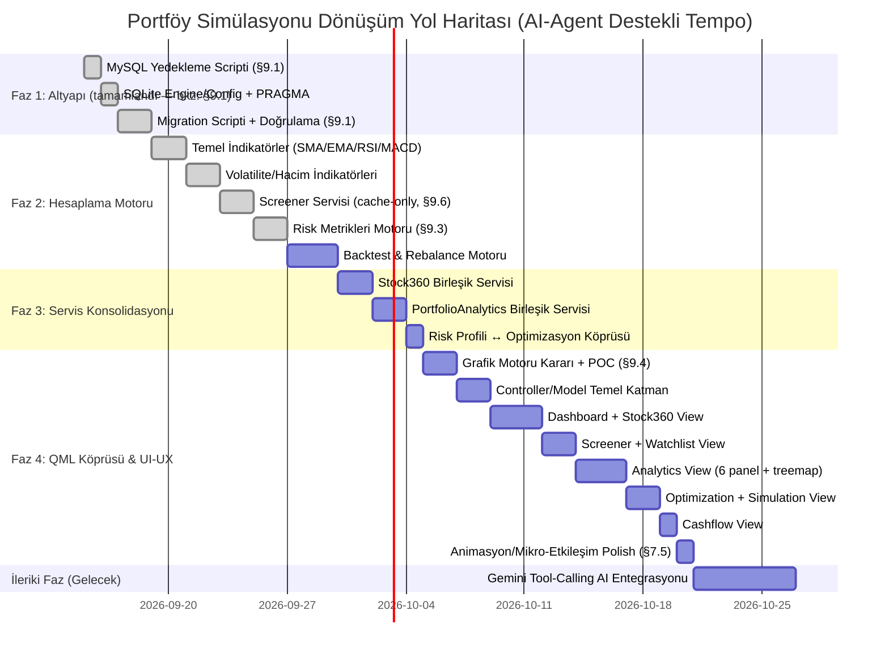

# Portföy Simülasyonu — Modernizasyon, Mimari Dönüşüm ve Güçlendirme Planı

> **Hedef:** Mevcut Clean Architecture backend emeğini koruyarak; veritabanı, hesaplama motorları, veri sağlayıcılar ve yapay zeka entegrasyonundaki pürüzleri gidermek, gereksiz şişkinlikleri budamak ve sıfırdan tasarlanacak **QML (Qt Quick)** arayüzü için sağlam, modern bir servis altyapısı hazırlamak.

---

## 📋 İÇİNDEKİLER

1. [Yönetici Özeti ve Temel İlkeler](#1-yönetici-özeti-ve-temel-ilkeler)
2. [Veritabanı Dönüşümü: MySQL 8.0 ➔ SQLite](#2-veritabanı-dönüşümü-mysql-80--sqlite)
3. [Finansal Hesaplama ve Analiz Motoru (Özel NumPy/Pandas İmplementasyonu)](#3-finansal-hesaplama-ve-analiz-motoru-özel-numpypandas-implementasyonu)
4. [Veri Sağlayıcıları ve Scraping Altyapısının Sağlamlaştırılması](#4-veri-sağlayıcıları-ve-scraping-altyapısının-sağlamlaştırılması)
5. [Modül Konsolidasyonu ve Sadeleştirme (De-bloating)](#5-modül-konsolidasyonu-ve-sadeleştirme-de-bloating)
6. [Yapay Zeka (Gemini AI) Karar Destek Mimarisi (İleriki Faz)](#6-yapay-zeka-gemini-ai-karar-destek-mimarisi-ileriki-faz--şimdilik-uygulanmayacak)
7. [QML (Qt Quick) UI-UX Sıfırdan Tasarım ve Entegrasyon Mimarisi](#7-qml-qt-quick-ui-ux-sıfırdan-tasarım-ve-entegrasyon-mimarisi)
8. [Fazlandırılmış Uygulama Yol Haritası (Milestones)](#8-fazlandırılmış-uygulama-yol-haritası-milestones)
9. [Tespit Edilen Boşluklar ve Riskler (Analiz)](#9-tespit-edilen-boşluklar-ve-riskler-analiz)

---

## 1. Yönetici Özeti ve Temel İlkeler

### 1.1 Temel Amaç
Mevcut projenin domain mantığı, event-sourcing portföy hesaplama mimarisi, kurumsal aksiyon yönetimi (temettü, bedelli/bedelsiz sermaye artırımı) ve test kurgusu korunacak; sistemi hantallaştıran MySQL bağımlılığı, dağınık sayfalar, kırılgan scraper'lar ve yetersiz kalan indikatör hesaplamaları modernize edilecektir.

### 1.2 Mimari İlkeler
* **Clean Architecture Korunacak:** Bağımlılıklar dıştan içe akmaya devam edecek (`Domain` ➔ `Application` ➔ `Infrastructure` ➔ `UI`).
* **Sıfır Kurulum & Taşınabilirlik:** Uygulama harici bir veritabanı sunucusu veya mikroservis gerektirmeden tek tıkla (`.exe`) çalışabilir olacak.
* **Vektörize & Hızlı Hesaplama:** Döngü bazlı hesaplamalar yerine özel NumPy/Pandas vektörize fonksiyonlarla (bkz. §9.2/§9.3) yüksek performanslı veri işleme.
* **QML Hazır Backend:** Tüm servis çıktıları, QML tarafında tüketilebilecek `QObject`, `Q_PROPERTY`, `QAbstractTableModel` ve temiz JSON/Dict yapılarına uygun sunulacak.

---

## 2. Veritabanı Dönüşümü: MySQL 8.0 ➔ SQLite

### 2.1 Gerekçe
* Mevcut yapıda MySQL 8.0 sunucu zorunluluğu (`localhost:3306`, root şifresi, arka plan daemon'ı), kişisel bir masaüstü portföy uygulaması için gereksiz sürtünme ve dağıtım zorluğu yaratmaktadır.
* SQLite, tek bir dosya (`data/portfolio.db`) üzerinden sıfır konfigürasyonla çalışır, tam ACID garantisi sunar ve taşınabilirdir.

### 2.2 Yapılacak Değişiklikler
1. **DB Yapılandırması (`src/infrastructure/db/db_config.py`):**
   * `MySQLConfig` yerine `SQLiteConfig` (veya çoklu veritabanı destekleyen `DatabaseConfig`) yapısı kurulacak.
   * Dosya yolu varsayılan olarak `data/portfolio.db` olacak.
2. **SQLAlchemy Engine & Session (`src/infrastructure/db/sqlalchemy/database_engine.py`):**
   * Connection URL: `sqlite:///{db_path}` olarak güncellenecek.
   * SQLite performans ve eşzamanlılık optimizasyonları eklenecek:
     - `PRAGMA journal_mode = WAL;` (Write-Ahead Logging ile hızlı okuma/yazma)
     - `PRAGMA synchronous = NORMAL;`
     - `PRAGMA foreign_keys = ON;` (İlişkisel bütünlük denetimi)
     - `check_same_thread = False` (Worker thread'lerde güvenli oturum kullanımı)
3. **Repository Uyumluluğu:**
   * Mevcut SQLAlchemy repository sınıfları ORM tabanlı olduğu için şema düzeyinde büyük bir değişiklik gerekmeyecek, dialect farkları (tarih/zaman fonksiyonları vb.) normalize edilecek.

---

## 3. Finansal Hesaplama ve Analiz Motoru (Özel NumPy/Pandas İmplementasyonu)

> **Not (2026-09-11, bkz. §9.2 / §9.3):** `pandas-ta`, `ta`, `quantstats`, `empyrical` gibi harici kütüphaneler bakımsızlık/bağımlılık riski nedeniyle kullanılmayacak. Aşağıdaki tüm indikatör ve metrikler `src/application/services/analysis/` altında özel, test edilebilir NumPy/Pandas fonksiyonları olarak yazılacak.

### 3.1 Teknik Analiz & Piyasa Tarayıcısı (Screener) — ✅ v1 indikatör seti tamamlandı
* **Mevcut Durum (2026-09-11 öncesi):** Yalnızca SMA50 ve SMA200 (Golden/Death Cross) hesaplayan elle yazılmış bir döngü var.
* **Tamamlandı:** `src/application/services/analysis/technical/indicators.py` altında özel vektörize fonksiyonlarla BIST hisseleri için analiz motoru kuruldu (v1 kapsamı):
  * **Trend Göstergeleri:** EMA (20, 50, 200), SMA. ✅
  * **Momentum & Osilatörler:** RSI (14) ✅, MACD (12, 26, 9) ✅, Stochastic ✅, CCI ✅.
  * **Volatilite & Kanal:** Bollinger Bantları (20, 2) ✅, ATR (Average True Range) ✅.
  * **Hacim Analizi:** VWAP (Hacim Ağırlıklı Ortalama Fiyat) ✅, OBV (On-Balance Volume) ✅.
  * *v1 kapsamı dışı (ayrı alt-faz, bkz. §9.2):* Supertrend, ADX, Ichimoku Cloud, Keltner Kanalları — çok adımlı/karmaşık hesaplama gerektirdiklerinden temel set stabilize olduktan sonra değerlendirilecek.
  * **Önemli not (bkz. §9.10):** ATR/Stochastic/CCI/VWAP/OBV için gereken High/Low/Volume verisi DB'de yoktu — `daily_prices` şeması genişletildi (`open_price`/`high_price`/`low_price`/`volume`, nullable) ve 120 hisse için tarihsel OHLCV verisi backfill edildi. Detay için bkz. §9.10.
* **BIST Çoklu Sinyal Tarayıcısı (Screener Service) — ✅ Tamamlandı:**
  * `src/application/services/analysis/technical/screener.py` (saf filtre/snapshot mantığı) + `screener_service.py` (DB orkestrasyonu, `container.screener_service` olarak DI'ya bağlı):
    - *Filtre 1:* `RSI < 30` (Aşırı Satım) + `Fiyat > EMA200` ✅
    - *Filtre 2:* `MACD Kesişimi (Bullish)` + `Hacim > 20 Günlük Ortalama` ✅
    - *Filtre 3:* `Bollinger Alt Bandına Değenler` ✅
  * **Zorunlu bağımlılık (bkz. §9.6):** Screener yalnızca yerel DB (`price_repo`) üzerinden çalışır; canlı YFinance çağrısı yapmaz. **Gerçek veriyle doğrulandı:** 164 hisse, 1.55 saniyede tarandı, 8 eşleşme bulundu — "saniyeler içinde tarama" hedefi karşılandı.

### 3.2 Profesyonel Portföy & Risk Metrikleri — ✅ Tamamlandı
* **Bulgu (2026-09-11):** `src/application/services/analysis/risk_metrics.py` zaten mevcuttu — `Sharpe`, `Beta`, `Alpha`, `Max Drawdown`, `Volatilite` özel (saf Python, `Dict[date, Decimal]` seri girdili) fonksiyonlarla önceden yazılmıştı; ancak **hiç test kapsamı yoktu**. Bu turda hem eksik metrikler eklendi hem de dosyanın tamamı için ilk kez test dosyası açıldı.
* **Tamamlandı:** Aynı dosyada, aynı çağrı sözleşmesiyle (Dict[date, Decimal] seri, Optional[float] dönüş) eklenenler:
  * **Risk/Getiri Oranları:** Sharpe ✅ (mevcuttu), Sortino ✅, Calmar ✅, Omega ✅.
  * **Risk Metrikleri:** Max Drawdown ✅ (mevcuttu), Volatilite ✅ (mevcuttu), VaR (%95/%99, parametrik confidence) ✅, CVaR/Expected Shortfall ✅.
  * **Piyasa Korelasyonu:** Beta ✅ (mevcuttu), Alpha ✅ (mevcuttu), R-Squared ✅, Tracking Error ✅.
  * **Dönemsellik Analizi:** `compute_monthly_returns_matrix` — Yıl→Ay→getiri% haritası (ham veri, çizim QML tarafında) ✅.
  * *Kapsam dışı bırakıldı:* Drawdown Süresi (Recovery Period) — ayrı bir zaman-serisi analizi gerektiriyor, AnalyticsView (§7.3) geliştirilirken ihtiyaç netleşince eklenecek.
* 29 yeni test (`tests/application/services/analysis/test_risk_metrics.py`) — hem yeni fonksiyonlar hem mevcut `compute_max_drawdown_pct`/`compute_daily_return_vector` için ilk kez kapsam sağlandı.

### 3.3 Gelişmiş Backtest ve Simülasyon Motoru
* Portföy için *"Geçmişte her ay X TL ekleseydim"*, *"Her çeyrekte Markowitz ile yeniden dengeleseydim (rebalancing)"*, *"Stop-loss / Take-profit uygulasaydım"* senaryolarını çalıştıran hızlı simülasyon motoru.

---

## 4. Veri Sağlayıcıları ve Scraping Altyapısının Sağlamlaştırılması

### 4.1 Çok Katmanlı Piyasa Verisi (Market Data Pipeline)
* **Birincil Kaynak:** YFinance & TradingView Datafeed.
* **Yedek / Tamamlayıcı Kaynaklar:** İş Yatırım, TCMB EVDS (TÜFE / Enflasyon, Politika Faizi, Dolar/TL kurları).
* **Hata Toleransı (Resilience):**
  - Rate-limit ve timeout durumlarında otomatik retry ve exponential backoff.
  - Seans saatleri kontrolü (`bist_market_session_service.py`): Seans kapalıyken veya tatillerde gereksiz API sorgularını durdurma.

### 4.2 Kalıcı Yerel Önbellekleme (Structured SQLite Caching)
* KAP Ortaklık Yapısı ve İş Yatırım Mali Tablo verileri dosya bazlı JSON yerine doğrudan SQLite içindeki `cached_financial_statements` ve `cached_shareholders` tablolarında saklanacak.
* Veri güncelliği TTL (Time-to-Live) ile yönetilecek (örn. Bilanço dönemleri için 30 gün, fiyatlar için günlük). Ağ bağlantısı olmadığında tamamen offline çalışabilecek.

---

## 5. Modül Konsolidasyonu ve Sadeleştirme (De-bloating)

Arayüzdeki karmaşayı gidermek ve backend servislerini sadeleştirmek için 4 ana birleştirme yapılacaktır:

```
┌─────────────────────────────────────────────────────────────────────────┐
│                       MODÜL KONSOLİDASYONU                              │
├───────────────────────────────┬─────────────────────────────────────────┤
│ ESKİ AYRIK YAPI               │ YENİ BİRLEŞİK SERVİS / DOMAIN           │
├───────────────────────────────┼─────────────────────────────────────────┤
│ • FinancialsPage              │                                         │
│ • ShareholdersPage            │ ──► Stock360Service                     │
│ • StockDetailPage             │     (Fiyat, Bilanço, KAP, Oranlar, TA)  │
├───────────────────────────────┼─────────────────────────────────────────┤
│ • AnalysisPage                │ ──► PortfolioAnalyticsService           │
│ • ComparisonPage              │     (6 Grafik Paneli + Risk Metrikleri) │
├───────────────────────────────┼─────────────────────────────────────────┤
│ • RiskProfilePage (İzole)     │ ──► OptimizationService Entegrasyonu    │
│ • OptimizationPage            │     (Anket puanı ➔ Max Ağırlık Sınırı)  │
├───────────────────────────────┼─────────────────────────────────────────┤
│ • Budget & Kişisel Faturalar  │ ──► Portföy Nakit Akış Servisi          │
│                               │     (Temettü, Sermaye Ekleme/Çekme)     │
└───────────────────────────────┴─────────────────────────────────────────┘
```

### 5.1 "Stock 360" (Hisse 360) Birleşik Servisi
* `Stock360Service` tek bir hisse kodu (`ticker`) için tüm boyutları tek bir veri paketinde sunacak:
  1. **Genel Bakış:** Son fiyat, günlük değişim, piyasa değeri, 52 haftalık aralık, hacim.
  2. **Temel Finansallar:** Bilanço, Gelir Tablosu, Nakit Akımı, Çarpanlar (F/K, PD/DD, FD/FAVÖK, Net Borç/FAVÖK).
  3. **Ortaklık Yapısı:** KAP doğrudan pay sahipliği ve tarihsel değişimler.
  4. **Teknik Seviyeler:** Destek/Direnç, RSI, MACD, Hareketli Ortalamalar (SMA/EMA).

### 5.2 "Portföy Analiz ve Kıyaslama Laboratuvarı" Birleşik Servisi
* İki ayrı analiz servisi (`AnalysisService` ve `ComparisonService`) tek bir güçlü `PortfolioAnalyticsService` altında birleştirilecek; **Karşılaştırma Laboratuvarı'ndaki 6 temel grafik panelinin tamamı eksiksiz korunacaktır**:
  1. **Ana Performans & Kümülatif Getiri Grafiği:** Çoklu varlık kıyaslama (Normal % Getiri, Normalize Baz 100 ve Rasyo Modları: XU100, Gram Altın, USD/TRY, Politika Faizi/Mevduat, TÜFE Enflasyon).
  2. **Dönem Sonu Getiri Özeti Tablosu:** Seçilen tarih aralığında başlangıç değeri, dönem sonu değeri ve net getiri tablosu.
  3. **Maksimum Değer Kaybı (Drawdown & Underwater) Grafiği:** Varlıkların tarihsel zirvelerden düşüş derinlikleri ve toparlanma periyotları.
  4. **Dönemsel (Aylık/Çeyreklik) Getiri Karşılaştırma Grafiği:** Varlıkların aylık bazda yan yana bar karşılaştırması.
  5. **Risk / Getiri Dağılımı (Saçılım / Scatter) Grafiği:** Yıllıklandırılmış oynaklık (volatilite) ile yıllık getiri ilişkisi matrisi.
  6. **Treemap Getiri Katkı & Büyüklük Haritası:** Varlık ağırlıkları ve getiri katkısının alan bazlı renkli ısı haritası.
  7. **Ek Risk/Performans Metrikleri (özel `risk_metrics.py`):** Sharpe, Sortino, Calmar, Beta, Alpha, VaR (%95), Aylık Getiri Isı Haritası.

### 5.3 Risk Profili ve Markowitz Optimizasyon Köprüsü
* Risk Anketi çıktısı (`Muhafazakar`, `Dengeli`, `Büyüme Odaklı`, `Agresif`), Markowitz MPT kısıtlarına doğrudan bağlanacak:
  - *Muhafazakar:* Tek hisse max ağırlığı %10, min nakit/tahvil %30, volatilite cezası yüksek.
  - *Agresif:* Tek hisse max ağırlığı %35, hisse oranı %100'e kadar, getiri maksimizasyonu öncelikli.

---

## 6. Yapay Zeka (Gemini AI) Karar Destek Mimarisi [İLERİKİ FAZ — ŞİMDİLİK UYGULANMAYACAK]

> ⚠️ **Durum Notu:** Bu bölüm genel vizyon ve yol haritası dahilinde tasarlanmıştır ancak **ilk dönüşüm fazlarında uygulanmayacaktır.** İlk etapta projedeki sahte/mock AI kodları ve harici mikroservis bağımlılıkları temizlenip sistem hafifletilecek; Gemini tabanlı karar destek asistanı çekirdek sistem ve QML UI oturduktan sonra ileriki bir fazda ele alınacaktır.

### 6.1 İlk Etapta Yapılacak Temizlik
* `MockAIAnalysisProvider` içindeki `random.uniform()` ile rastgele hedef fiyat, RMSE ve SHAP üreten sahte kodlar ile harici `localhost:8000` bağımlılığı devreden çıkarılacak ve kod tabanından temizlenecektir.
* **Karar (2026-09-11, revize — bkz. §9.5):** İlk karar `ai_page`'in tamamen silinmesiydi, ancak kod incelemesinde `ai_page`'in **iki ayrı, birbirinden bağımsız parçadan** oluştuğu görüldü:
  * **Sol panel (`ModelPanel`)** → `MockAIAnalysisProvider` (sahte rastgele veri) + `AICoreFastAPIClient` (`localhost:8000`) — bu gerçekten "mock/sahte" kısım, temizlik hedefi buydu.
  * **Sağ panel (`ChatbotPanel`)** → `GeminiChatProvider` — **gerçek, çalışan** Gemini SDK entegrasyonu (google-genai, gerçek API key ile canlı sohbet). Mock değil, `localhost:8000`'e bağımlı değil.
  * Bu ayrım fark edilmeden `ai_page` tamamen silinirse, çalışan Gemini chatbot özelliği de kaybedilirdi — bu, temizlik hedefinin kapsamı dışında bir kayıp olurdu.
  * **Güncel karar (2026-09-11):** Faz 1 kapsamı **sadece veritabanı** ile sınırlı tutulacak; `ai_page`/mock/Gemini chatbot konusuna **hiç dokunulmayacak** — mevcut haliyle (mock sol panel + gerçek sağ panel) çalışır kalacak. Bu konudaki nihai karar (sol paneli izole edip silme mi, tamamen §6.2 Gemini faz'ına mı devretme) Faz 1 (Aşama 1) kapsamından çıkarıldı; Faz 2/3 ilerledikçe veya §6.2 başlarken yeniden ele alınacak.

### 6.2 İleride Uygulanacak Gemini Tool-Calling (Function Calling) Mimarisi (Gelecek Planı)
* Gemini API, doğrudan projedeki matematiksel servislere erişebilen bir **Yatırım & Portföy Danışmanı** olarak kurgulanacaktır:
  ```
  [Kullanıcı Sorusu]
         │
         ▼
  [Gemini LLM] ──(Fonksiyon Çağrısı)──► [PortfolioAnalyticsService]
         ▲                               [OptimizationService]
         │                               [Stock360Service]
         └────────(Hesaplama Sonucu)──────────────┘
  ```
* **Örnek Gelecek Senaryosu:** Kullanıcı *"Portföyümün riskini düşürmek için hangi hisseyi ne kadar satmalıyım?"* dediğinde; LLM arka plandaki `OptimizationService`'i çalıştıracak, çıkan ağırlıkları yorumlayacak ve kullanıcıya Türkçe, rasyonel bir rapor sunacaktır.

---

## 7. QML (Qt Quick) UI-UX Sıfırdan Tasarım ve Entegrasyon Mimarisi

Mevcut PySide6 QtWidgets arayüzü yerine, modern fintech standartlarında (Robinhood, TradingView benzeri), GPU hızlandırmalı ve akıcı bir **QML (Qt Quick)** arayüzü sıfırdan inşa edilecektir.

### 7.1 Dizin ve Dosya Mimarisi (`src/ui_qml/`)

PySide6 ile QML'in en performanslı ve temiz çalıştığı **"Thin QML + Python Controller/Model"** mimarisi uygulanacaktır:

```
src/ui_qml/
├── main.py                          # QQmlApplicationEngine başlatıcı & rootContext binding
├── controllers/                     # Python QObject arayüz denetleyicileri (Signals, Slots, Properties)
│   ├── portfolio_controller.py      # Portföy özet verileri, canlı değer, P&L akışı
│   ├── stock_360_controller.py      # Hisse detay, temel analiz & KAP verileri
│   ├── screener_controller.py       # Özel indikatör motoruyla BIST sinyal tarayıcı
│   ├── analytics_controller.py      # Benchmark, drawdown & risk metrikleri
│   ├── optimization_controller.py   # Markowitz optimizasyonu & risk profili
│   ├── simulation_controller.py     # Backtest ve yeniden dengeleme (rebalance)
│   ├── watchlist_controller.py      # İzleme listesi ekle/çıkar, canlı fiyat akışı (bkz. §9.5)
│   └── cashflow_controller.py       # Nakit akış / bütçe servisi köprüsü (bkz. §9.5)
├── models/                          # QAbstractTableModel (C++ hızında sanallaştırılmış veri tabloları)
│   ├── portfolio_table_model.py     # Portföy hisse listesi & pozisyonlar
│   ├── trade_history_table_model.py # İşlem geçmişi tablosu
│   ├── screener_table_model.py      # Tarama sonuçları tablosu
│   ├── financial_table_model.py     # Bilanço & Gelir tablosu ızgarası
│   └── watchlist_table_model.py     # İzleme listesi tablosu
└── qml/                             # Saf QML Tasarım Katmanı
    ├── Main.qml                     # Ana pencere kabuğu, responsive sidebar, dinamik sayfa yükleyici
    ├── theme/
    │   ├── Theme.qml                # Renk paleti, tipografi, boşluklar (spacing), gölgeler
    │   └── StyleConstants.qml       # Animasyon süreleri, köşe yuvarlama (radius) sabitleri
    ├── components/                  # Yeniden kullanılabilir atomik bileşenler
    │   ├── Card.qml                 # Modern yuvarlak köşeli, kenarlıklı yüzey kartı
    │   ├── KpiCard.qml              # Metrik kartı (Büyük değer, etiket, yüzde rozeti)
    │   ├── MetricBadge.qml          # Kazanç/Kayıp durumuna göre yeşil/kırmızı rozet
    │   ├── SearchBar.qml            # Otomatik tamamlamalı hızlı hisse arama kutusu
    │   ├── CustomButton.qml         # Primary, Secondary, Ghost buton varyantları
    │   ├── CustomTabGroup.qml       # Yumuşak animasyonlu sekme çubuğu
    │   ├── CustomTableView.qml      # Sıralanabilir, zebra çizgili, modern tablo
    │   └── ChartViewWrapper.qml     # Mum ve çizgi grafik konteyneri
    └── views/                       # 8 Ana Görünüm (Sayfa) — bkz. §9.5
        ├── DashboardView.qml        # Portföy özeti, KPI'lar, varlık dağılımı, son işlemler
        ├── Stock360View.qml         # Hisse grafiği, bilanço/rasyolar, ortaklık yapısı
        ├── ScreenerView.qml         # Özel indikatör motoruyla BIST tarayıcı ve hazır filtre çipleri
        ├── AnalyticsView.qml        # Benchmark kıyaslama (6 panel), drawdown, scatter, treemap
        ├── OptimizationView.qml     # Markowitz etkin sınır grafiği, ağırlık slider'ları
        ├── SimulationView.qml       # Tarihsel backtest ve strateji simülatörü
        ├── WatchlistView.qml        # İzleme listesi (mevcut watchlist_page'in QML karşılığı)
        ├── CashflowView.qml         # Bütçe/kişisel fatura + Portföy Nakit Akış Servisi (mevcut planning_page'in karşılığı)
        └── SettingsView.qml         # Veri güncelleme, yedekleme ve tema ayarları
```

> **Not (2026-09-11, revize — bkz. §9.5):** `ai_page`'in kaderi henüz kesinleşmedi — sayfa hem mock sol panel hem **gerçek çalışan Gemini chatbot** sağ paneli içeriyor. Bu view listesi bilinçli olarak `ai_page`'i içermiyor (8 view Dashboard/Stock360/Screener/Analytics/Optimization/Simulation/Watchlist/Cashflow), ancak bu "ai_page siliniyor" anlamına gelmiyor — karar §6.2 Gemini faz'ı başında netleştirilecek.

### 7.2 Tasarım Dili (Design System) & Renk Paleti

QML'de `Theme.qml` üzerinden tüm arayüze hükmedecek **"Modern Fintech Dark"** renk sistemi:

| Katman | HEX / Renk | Kullanım Yeri |
| :--- | :--- | :--- |
| **Background** | `#0B0F19` | Ana pencere arka planı |
| **Surface (Card)** | `#151D2C` | Kartlar, paneller ve sidebar |
| **Surface Highlight**| `#1F2B3E` | Hover durumları, seçili satırlar |
| **Border** | `#26354A` | Kart kenarlıkları, tablo çizgileri |
| **Primary Accent** | `#3B82F6` | Butonlar, aktif sekmeler, vurgular |
| **Profit (Green)** | `#10B981` | Kazanç, yukarı oklar, pozitif P&L (`rgba(16,185,129,0.15)` badge) |
| **Loss (Red)** | `#EF4444` | Kayıp, aşağı oklar, negatif P&L (`rgba(239,68,68,0.15)` badge) |
| **Text Primary** | `#F8FAFC` | Ana başlıklar ve metrik değerleri |
| **Text Secondary** | `#94A3B8` | Açıklamalar ve tablo başlıkları |
| **Text Muted** | `#64748B` | Pasif metinler ve birimler (TL vb.) |

### 7.3 6 Ana Görünümün (View) UI/UX Mimarisi

#### 📱 1. DashboardView (Ana Gösterge Paneli)
* **Üst KPI Paneli (4 Kart):**
  * `[ Toplam Portföy Değeri ]` *(Örn: 540.850 ₺ | Günlük: +%2.34)*
  * `[ Toplam Kâr / Zarar ]` *(Örn: +124.300 ₺ | Toplam: +%29.8)*
  * `[ Portföy Sharpe Oranı ]` *(Örn: 1.92 | Düşük Risk)*
  * `[ XU100 Relatif Getiri ]` *(Örn: +%8.4 Alfa)*
* **Orta Bölüm (2 Kolon):**
  * **Sol (Geniş):** `CustomTableView` ile portföydeki hisseler (Ticker, Lot, Maliyet, Son Fiyat, Günlük %, Toplam K/Z, Ağırlık %).
  * **Sağ (Kompakt):** Varlık ve sektör dağılımı (Donut grafik + interaktif pasta dilimleri).
* **Alt Bölüm:** Son işlemler ve yaklaşan kurumsal aksiyonlar (temettü günleri).

#### 🔍 2. Stock360View (Hisse 360)
Tek arama kutusuyla (`THYAO`) hisseye dair her şeyi sunan 3 sekmeli zengin görünüm:
* **Sekme 1: Fiyat Grafiği & Canlı İndikatörler:**
  * İnteraktif Mum Grafik (Candlestick) + Alt panelde RSI ve MACD.
  * Zaman aralıkları: `1G`, `1H`, `1A`, `3A`, `1Y`, `5Y`.
* **Sekme 2: Bilanço & Rasyolar:**
  * Çeyreklik Bilanço ve Gelir tablosu karşılaştırması.
  * Rasyo rozetleri: `F/K: 4.8`, `PD/DD: 1.1`, `FD/FAVÖK: 3.9`, `Özsermaye Kârlılığı (ROE): %32`.
* **Sekme 3: Ortaklık Yapısı (KAP):**
  * Doğrudan pay sahipleri listesi, halka açıklık oranı ve tarihsel pay değişimleri.

#### ⚡ 3. ScreenerView (BIST Çoklu Sinyal Tarayıcısı)
Özel indikatör motoru gücüyle çalışan piyasa tarayıcısı:
* **Üst Çubuk (Hazır Filtre Çipleri):**
  * `[ 🟢 Aşırı Satım (RSI < 30) ]` `[ 🚀 MACD Bullish Kesişimi ]` `[ 🛡️ 200 EMA Üzerindekiler ]` `[ 📈 Hacim Patlaması ]`
* **Sonuç Tablosu:**
  * Eşleşen hisseler, son fiyat, RSI değeri, trend yönü rozeti (`Boğa` / `Ayı`).
  * Satıra tıklandığında anında sağ panelde mini grafik ve özet kartı açılır.

#### 📊 4. AnalyticsView (Analiz & Kıyaslama Laboratuvarı)
Karşılaştırma Laboratuvarı'ndaki 6 görsel panel ve gelişmiş risk metrikleri tek bir akışta sunulacaktır:
* 📈 **1. Kümülatif Getiri & Performans Grafiği:** Çoklu varlık kıyaslama (Normal %, Normalize Baz 100 ve Rasyo Modları: Portföy vs. BIST 100, Gram Altın, USD/TRY, Politika Faizi, TÜFE).
* 📋 **2. Dönem Sonu Getiri Özeti Tablosu:** Seçili periyottaki Başlangıç Değeri, Dönem Sonu Değeri ve Net Toplam Getiri (%) tablosu.
* 📉 **3. Maksimum Drawdown (Değer Kaybı & Underwater) Grafiği:** Zirveden düşüşler, çukurlar ve toparlanma süreleri analizi.
* 📊 **4. Dönemsel Getiri Karşılaştırma Grafiği:** Varlıkların aylık ve çeyreklik bazda yan yana bar karşılaştırması.
* 🎯 **5. Risk / Getiri Dağılımı (Saçılım / Scatter) Grafiği:** Yıllıklandırılmış Oynaklık (X ekseni) vs. Yıllık Getiri (Y ekseni) risk matrisi.
* 🗺️ **6. Treemap Getiri Katkı Haritası:** Varlık büyüklükleri ve getiri katkısının alan bazlı renkli ısı haritası.
* 🧮 **7. Gelişmiş Risk/Performans Paneli (özel `risk_metrics.py`):** `Sharpe`, `Sortino`, `Calmar`, `Beta`, `Alfa`, `VaR (%95)`, `Aylık Getiri Isı Haritası (Heatmap)`.

#### 🎯 5. OptimizationView (Optimizasyon & Risk)
* Sol panelde **Risk Profili Belirteci** (Muhafazakar ➔ Agresif slider'ı).
* Hisse bazında min/max ağırlık kısıtları (%5 - %25).
* **Verimli Sınır (Efficient Frontier) Grafiği:** Mevcut portföy noktası vs. Maksimum Sharpe noktası vs. Minimum Risk noktası.
* **Önerilen Değişiklik Tablosu:** Hangi hisseden ne kadar satılıp hangisinden ne kadar alınacağı (rebalancing emri).

#### 🧪 6. SimulationView (Strateji Simülatörü & Backtest)
* Düzenli katkı simülasyonu ("Her ay X TL hisse alımı").
* Periyodik yeniden dengeleme (Rebalance) karşılaştırması.

#### 👁️ 7. WatchlistView (İzleme Listesi) — bkz. §9.5
* Mevcut `watchlist_page`'in QML karşılığı; birden fazla liste, hızlı ekle/çıkar, canlı fiyat/günlük % kolonu.
* Satıra tıklandığında Stock360View'a yönlendirme.

#### 💰 8. CashflowView (Nakit Akış & Bütçe) — bkz. §9.5
* Mevcut `planning_page` (bütçe/kişisel fatura) + §5.4 "Portföy Nakit Akış Servisi" birleşik karşılığı.
* Aylık birikim hedefleri, temettü/sermaye giriş-çıkış akışı, kişisel fatura takibi tek panelde.

### 7.4 QML Finansal Grafik Çözümü (High Performance Rendering) — ✅ KARARLAŞTIRILDI (bkz. §9.4)
* **Karar (2026-09-11):** Özel `QQuickPaintedItem` tabanlı, saf QML-native çizim motoru kullanılacak. Gerekçe:
  * `lightweight-charts-python`/Chromium WebEngine: bellek yükü hedefle çelişiyor.
  * Qt Charts (`CandlestickSeries`/`ChartView`): add-on modülü **GPLv3** lisanslı — proje `LICENSE` dosyası taşımıyor (kapalı kaynak varsayılıyor), Nuitka ile derlenen `.exe` kapalı kaynak dağıtılacaksa ticari Qt lisansı gerekir; risk kabul edilmedi.
  * `pyqtgraph` (QQuickWidget ile gömülü): lisans sorunu yok ama "sıfırdan QML" mimari hedefini kısmen bozuyor, widget-in-QML layering/input karmaşıklığı getiriyor.
* **Aksiyon:** `src/ui_qml/qml/components/` altına `CandlestickChart.qml`/`LineChart.qml` gibi C++ tarafında `QQuickPaintedItem` alt sınıfına (Python `QPainter` ile) bağlanan bileşenler yazılır:
  * v1 kapsamı: line/area chart (kümülatif getiri, drawdown), basit bar chart (dönemsel getiri), scatter (risk/getiri), candlestick (Stock360 fiyat grafiği).
  * Zoom/pan/crosshair etkileşimleri `MouseArea` + `QPainter` ile elle yazılır — hazır kütüphane davranışı yoktur, bu nedenle ayrı bir alt-görev olarak test edilir (görsel regresyon değil, veri-doğruluğu testleri: doğru nokta/koordinat eşlemesi).
  * Treemap (§5.2 madde 6) için ayrı bir `TreemapChart.qml` — alan bazlı dikdörtgen bölme (squarified treemap algoritması) Python tarafında hesaplanıp QML'e koordinat listesi olarak geçirilir.
* 60 FPS hedefi korunur; büyük veri setlerinde (uzun tarih aralığı) performans için Python tarafında örnekleme/downsampling yapılır (örn. görünür pencere dışı noktalar çizime gönderilmez).

### 7.5 QML Animasyonları ve Mikro-Etkileşimler (UX Polish)
* **Sayfa Geçişleri:** Sayfa değişimlerinde `NumberAnimation` ile hafif fade & slide geçişi (Opacity: `0.0 ➔ 1.0`, Y: `10px ➔ 0px`, 180ms `Easing.OutCubic`).
* **Değer Sayaçları (Rolling Numbers):** Portföy toplamı değiştikçe rakamların animasyonla artıp azalması.
* **Akıllı Tablo Hover'ı:** Tablo satırlarının üzerine gelindiğinde yumuşak parlaması (`#1F2B3E`) ve satır sonuna tek tıkla "Detay" aksiyon butonunun belirmesi.

---

## 8. Fazlandırılmış Uygulama Yol Haritası (Milestones)

> **Not (2026-09-11, bkz. §9.8):** Süreler AI-agent destekli (Claude Code) çalışma temposuna göre yeniden ölçeklendirildi. Darboğaz ham kod üretimi değil, `ARCHITECTURE_GATES.md` test/gate döngüsü olduğundan, büyük çok-günlük bloklar yerine daha küçük, tek-oturumluk, ayrı test edilebilir adımlara bölündü.



### Aşama Kontrol Listesi:
- [x] **Aşama 1 (Veritabanı):** MySQL verisinin yedeklenip SQLite'a taşınması tamamlandı (bkz. §9.1 — `scripts/backup_mysql.py` + `scripts/migrate_mysql_to_sqlite.py`, idempotent doğrulandı, 756 test yeşil). **Not:** Mock AI/`ai_page` temizliği Faz 1 kapsamından çıkarıldı (bkz. §9.5 revizyonu — `ai_page` gerçek çalışan bir Gemini chatbot da içeriyor, karara §6.2'de yeniden bakılacak).
- [ ] **Aşama 2 (Hesaplama & Motor):** Özel NumPy/Pandas indikatör motoru (`indicators.py`) ve risk metrikleri motorunun (`risk_metrics.py`) yazılması (bkz. §9.2/§9.3 — harici lib yok), Teknik Tarayıcı (Screener) ve Risk Analiz servislerinin yazılması.
- [ ] **Aşama 3 (Servis Birleştirme):** `Stock360Service` ve `PortfolioAnalyticsService` sınıflarının oluşturulması, Risk Profili ile Optimizasyon motorunun bağlanması.
- [ ] **Aşama 4 (QML Köprüsü & UI-UX Tasarımı):** QML controller ve table model arayüzlerinin kodlanması, **8 view** (Dashboard, Stock360, Screener, Analytics, Optimization, Simulation, Watchlist, Cashflow — bkz. §9.5) için QML UI/UX ekran tasarımlarının yapılması.
- [ ] **Aşama 5 (İleriki Faz - AI Entegrasyonu):** Çekirdek sistem ve QML UI oturduktan sonra Gemini API Tool-Calling karar destek asistanının geliştirilmesi (yeni `AIAdvisorView.qml` dahil).

---

## 9. Tespit Edilen Boşluklar ve Riskler (Analiz)

> Bu bölüm, plan üzerinde yapılan mimari inceleme sonucu bulunan boşlukları, riskleri ve çelişkileri listeler. Plan revizyonu bu maddeler üzerinden yapılacaktır.

### 9.1 Veri Taşıma (Migration) Boşluğu — ✅ KARARLAŞTIRILDI
* **Karar (2026-09-11):** MySQL'de korunması gereken gerçek/canlı veri (trades, portföy geçmişi) **mevcut** — migration script zorunlu, sıfırdan başlanamaz.
* §2 yalnızca DB config/engine değişimini (`SQLiteConfig`, connection URL) kapsıyordu; bu **yetersiz** — mevcut MySQL verisinin (trades, daily_prices, stocks, model_portfolios, risk_profiles, corporate_actions, budgets, watchlists) SQLite'a taşınması gerekiyor.
* `ARCHITECTURE_GATES.md §3.2`: "ALTER TABLE veya DROP içeren script'ler yedek alınmadan çalıştırılmaz" ve migration script'leri `scripts/` altında tutulur kuralı bu faz için zorunlu.
* **Aksiyon (Faz 1'e eklendi):**
  1. `scripts/backup_mysql.py` — migration öncesi tam MySQL dump (`mysqldump` veya SQLAlchemy tabanlı) alınır, `backups/` altına yazılır.
  2. `scripts/migrate_mysql_to_sqlite.py` — her tabloyu ORM üzerinden okuyup SQLite'a yazan script; tip/precision farkları (Decimal, datetime) normalize edilir.
  3. Doğrulama adımı: her tablo için MySQL ve SQLite satır sayıları + kritik alan checksum karşılaştırması (özellikle `trades`, `daily_prices`).
  4. Migration script'i tekil, tekrar çalıştırılabilir (idempotent) olmalı — ikinci çalıştırmada veri çiftlenmemeli.
  5. Migration sonrası eski MySQL bağlantısı bir süre (rollback penceresi) yapılandırmada devre dışı bırakılmış halde saklanır, hemen silinmez.

### 9.2 `pandas-ta` Bağımlılık Riski — ✅ KARARLAŞTIRILDI
* Kütüphane 2021'den beri aktif maintain edilmiyor; yeni NumPy sürümlerinde (`np.NaN` kaldırıldı) import hatası veriyor, çoğu zaman patch/monkeypatch gerekiyor.
* §5 başlığındaki "sadeleştirme / de-bloating" ilkesiyle çelişiyor: bakımsız + kırılgan bir bağımlılık eklemek.
* **Karar (2026-09-11):** `pandas-ta` ve `ta` kütüphaneleri kullanılmayacak — **özel NumPy/Pandas implementasyonu** tercih edildi.
* **Aksiyon (§3.1 revizyonu):**
  * `src/application/services/analysis/technical/indicators.py` içinde v1 kapsamı: `SMA`, `EMA`, `RSI(14)`, `MACD(12,26,9)`, `Bollinger Bantları(20,2)`, `ATR`, `Stochastic`, `CCI`, `VWAP`, `OBV` — her biri ~20-30 satırlık, saf NumPy/Pandas vektörize fonksiyon, ayrı ayrı test edilir (`tests/application/services/analysis/`).
  * `Supertrend`, `ADX`, `Ichimoku Cloud`, `Keltner Kanalları` **v1 kapsamından çıkarıldı** — karmaşık/çok adımlı hesaplama gerektirdiklerinden, temel indikatör seti stabilize olduktan sonra ayrı bir alt-faz olarak değerlendirilecek (v1'de Screener bu 4 indikatöre bağlı filtre sunmayacak).
  * `requirements.txt`'e `pandas-ta` ve `ta` **eklenmeyecek**.

### 9.3 `quantstats` / `empyrical` Bağımlılık Riski — ✅ KARARLAŞTIRILDI
* Her ikisi de aktif maintain edilmiyor (empyrical arşivlendi); `quantstats` ağır görsel bağımlılıklar (matplotlib/seaborn) sürüklüyor — bu proje QML'e geçerken gereksiz.
* **Karar (2026-09-11):** `quantstats`/`empyrical` kullanılmayacak — **özel NumPy implementasyonu** tercih edildi. Grafik/heatmap çizimi zaten QML tarafının işi; Python tarafı yalnızca sayısal veri üretecek.
* **Aksiyon (§3.2 revizyonu):**
  * `src/application/services/analysis/risk_metrics.py` içinde: `sharpe_ratio`, `sortino_ratio`, `calmar_ratio`, `omega_ratio`, `max_drawdown`, `annualized_volatility`, `value_at_risk(%95, %99)`, `conditional_var`, `beta`, `alpha`, `r_squared`, `tracking_error`, `monthly_returns_matrix` — her biri ayrı, tek sorumluluklu, test edilebilir fonksiyon (ARCHITECTURE_GATES §1 fonksiyon boyutu/parametre kısıtına uyumlu).
  * `requirements.txt`'e `quantstats`, `empyrical`/`empyrical-reloaded` **eklenmeyecek**; mevcut `matplotlib`/`seaborn` bağımlılığı sadece bu iş için gerekiyorsa kaldırılabilir (kontrol edilecek — başka yerde kullanılıyorsa kalır).

### 9.4 QML Grafik Motoru Kararı — ✅ KARARLAŞTIRILDI
* Eski §7.4 içinde çelişki vardı: önce "Chromium WebEngine'in devasa bellek yükü olmadan" hedefi konuyor, sonra öneri olarak `lightweight-charts-python` veriliyordu — bu kütüphane de içeride `QWebEngineView`/Chromium kullanıyor.
* **Karar (2026-09-11):** Özel `QQuickPaintedItem` tabanlı saf QML-native çizim motoru seçildi. Elenen alternatifler: `lightweight-charts-python`/WebEngine (bellek), Qt Charts (GPLv3 lisans riski — proje kapalı kaynak, `LICENSE` dosyası yok), `pyqtgraph`/`QQuickWidget` hibrit (mimari saflık hedefiyle çelişki). Detay ve v1 kapsamı için bkz. §7.4 (güncellendi).

### 9.5 QML View Listesinde Kayıp Sayfalar — ✅ KARARLAŞTIRILDI (ai_page kısmı revize edildi)
* §7.1 / §7.3'teki 6 view (`Dashboard`, `Stock360`, `Screener`, `Analytics`, `Optimization`, `Simulation`) mevcut `src/ui/pages/` içindeki bazı sayfaları karşılamıyordu. **Kararlar (2026-09-11):**
  * **`ai_page` → KARAR ASKIDA (2026-09-11 revizyonu).** İlk karar "tamamen kaldırılıyor" idi, ancak Faz 1 uygulaması sırasında `ai_page`'in **sol panel (mock `ModelPanel`/`localhost:8000`) + sağ panel (gerçek çalışan `GeminiChatProvider` chatbot)** olmak üzere iki bağımsız parçadan oluştuğu görüldü. Sağ panel mock değil — silinmesi gerçek bir özelliğin kaybı olurdu. Karar geri alındı: `ai_page`'e **Faz 1'de hiç dokunulmadı**, mevcut haliyle çalışır kalıyor. Nihai karar (sol paneli izole edip silme / tamamen §6.2 Gemini faz'ına devretme / başka bir yaklaşım) §6.2 başında yeniden ele alınacak.
  * **`watchlist_page` → 7. QML view olarak korunuyor.** `WatchlistView.qml` + `watchlist_controller.py` + `watchlist_table_model.py` plana eklendi (bkz. §7.1 ve §7.3 güncellemeleri).
  * **`planning_page` (bütçe) → Nakit Akış Servisi ile birlikte 8. QML view olarak korunuyor.** `CashflowView.qml` + `cashflow_controller.py` plana eklendi; §5'teki "Portföy Nakit Akış Servisi" karşılığı artık somut bir view'a bağlanmış oluyor.
* **Not:** View sayısı 6'dan 8'e çıktı (AIAdvisorView henüz bu sayıya dahil değil, §6.2'de netleşecek) — bu değişiklik §8 Gantt'ına (Faz 4 süre tahminlerine) yansıtıldı (bkz. §9.8).

### 9.6 Screener Performans Varsayımı Belirtilmemiş Bağımlılık — ✅ GİDERİLDİ
* §3.1 "BIST hisselerini saniyeler içinde tarama" iddiası, ancak §4.2'deki yerel SQLite fiyat cache'i üzerinden çalışırsa gerçekçi. Canlı YFinance çağrısıyla ~500 hisse saniyeler içinde taranamaz.
* **Not (2026-09-11):** §3.1'e açık bağımlılık notu eklendi — Screener yalnızca yerel SQLite cache üzerinden çalışır, canlı API çağrısı yapmaz.
* **Aksiyon:** §3.1'e açık not eklenmeli: "Screener sadece `cached_prices`/local SQLite üzerinden çalışır, canlı API çağrısı yapmaz."

### 9.7 Test Stratejisi Geçiş Boşluğu — ✅ KARARLAŞTIRILDI
* Mevcut `tests/ui` PySide6 widget testlerine yazılı. QML'e "sıfırdan" geçişte bu testlerin nasıl korunacağı / QML controller+model testleriyle nasıl değiştirileceği plana yazılmamıştı.
* **Karar 1 — Cutover stratejisi (2026-09-11):** Her view için **paralel çalıştır, parity sonrası sil** modeli uygulanır:
  1. Eski widget sayfa (`src/ui/pages/...`) ve `tests/ui/...` testi QML karşılığı bitene kadar **canlı ve yeşil** kalır — silinmez, dokunulmaz.
  2. Yeni QML view + controller/model + testleri **ayrı bir dalda/commit setinde** yazılır; eski sayfayla aynı anda kod tabanında bulunur (ikisi de derlenir, ikisi de teste girer).
  3. QML view fonksiyonel parity'e ulaşıp kendi testleri yeşil olduğunda, eski widget sayfa + `tests/ui/...` testi **ayrı, tek bir commit'te** silinir (GOVERNANCE §2.3 "tek mantıksal değişiklik" kuralına uyar: "ekle: X QML view" ve "sil: eski X widget sayfası" iki farklı commit).
  4. Bu süreçte `ARCHITECTURE_GATES.md §2` ihlal edilmez — hiçbir zaman kırmızı test kabul edilmez, çünkü eski ve yeni taraf birbirinden bağımsız, aynı anda yeşil tutulabilir.
* **Karar 2 — QML test kapsamı (2026-09-11):** `.qml` dosyalarının kendisi pytest ile test edilmez (düşük getiri/yüksek bakım riski). Kapsam:
  * Controller'lar (`QObject` alt sınıfları, Python) ve `QAbstractTableModel` alt sınıfları saf pytest ile test edilir (Qt sinyal/slot mantığı, veri dönüşümü, hata durumları) — `tests/ui_qml/controllers/`, `tests/ui_qml/models/` altında, mevcut mirror yapı kuralına (ARCHITECTURE_GATES §3.3) uygun.
  * `pytest-qt` **kullanılmaz** — QML property binding testi kırılgan/bakım yükü yüksek kabul edildi.
  * Her view'ın görsel/etkileşim doğrulaması **manuel** yapılır: `/run` skill ile uygulama gerçekten çalıştırılıp golden path + kenar durumlar (CLAUDE.md "UI/frontend değişikliklerinde tarayıcıda/uygulamada test et" ilkesinin QML karşılığı) kontrol edilir.
* **Aksiyon:** Faz 4 başlarken `tests/ui_qml/` dizin iskeleti açılır; her view'ın "parity checklist"i (eski sayfadaki hangi davranışların QML'de karşılandığı) o view'ın PR açıklamasında (GOVERNANCE §2.4 şablonu, "Test" bölümü) listelenir.

### 9.8 Gantt Süre Tahminleri Optimistik — ✅ KARARLAŞTIRILDI
* §8 Faz 4 (QML Controller+Model: 5 gün, QML UI-UX: 7 gün) — 6 view + 6 controller + 4 model + animasyon + chart motoru için ARCHITECTURE_GATES boyut limitleriyle (dosya 400 satır, fonksiyon 50 satır) uyumlu, test edilmiş kod üretmek için düşüktü. §9.5 kararıyla view sayısı 8'e çıkınca sorun büyüdü.
* **Karar (2026-09-11):** Süre baz alma yöntemi **AI-agent destekli (Claude Code) tempo** olarak belirlendi — darboğaz ham kod üretimi değil, `ARCHITECTURE_GATES.md` test/gate döngüsü. §8'deki Gantt bu mantıkla yeniden yazıldı:
  * Faz 1: 4 alt-adıma bölündü (yedek → engine/config → migration+doğrulama → temizlik).
  * Faz 2: 5 alt-adıma bölündü (temel indikatörler → volatilite/hacim indikatörleri → screener → risk metrikleri → backtest/rebalance).
  * Faz 3: 3 alt-adıma bölündü (Stock360 → PortfolioAnalytics → Risk↔Optimization köprüsü).
  * Faz 4: 8 alt-adıma bölündü, **grafik motoru kararı+POC (§9.4) ilk adım olarak eklendi** (bu karar netleşmeden view geliştirmeye başlanamaz), view'lar gruplanarak sırayla ilerliyor (Dashboard+Stock360 → Screener+Watchlist → Analytics → Optimization+Simulation → Cashflow → polish).
* Güncel Gantt ve alt-adımlar için bkz. §8.

### 9.9 Dokümantasyon Tutarsızlığı — ✅ GİDERİLDİ
* `CLAUDE.md` ve `ARCHITECTURE_GATES.md §3.3` hâlâ `src/ui/` için "PyQt5" yazıyordu; ancak `requirements.txt` ve bu planın §7 başlığı `PySide6` kullanıyor. Proje dokümantasyonu güncel değildi.
* **Düzeltildi (2026-09-11):** `CLAUDE.md` (Proje Özeti, teknoloji tablosu, Mimari, Event Bus bölümleri — 4 satır) ve `ARCHITECTURE_GATES.md` (§1 QApplication notu, §3.3 dizin tablosu — 2 satır) içindeki tüm "PyQt5" referansları "PySide6" olarak düzeltildi. Bu iki dosya `.gitignore`'da (GOVERNANCE §3.4) olduğundan commit gerekmiyor, sadece yerel dosya güncellendi.

### 9.10 OHLCV Şema Boşluğu (Faz 2 uygulaması sırasında bulundu) — ✅ GİDERİLDİ
* `daily_prices` tablosunda **sadece `close_price`** vardı — Open/High/Low/Volume hiç saklanmıyordu. `scripts/import_bist_ohlcv_to_db.py` kaynak CSV'lerinde bu veri mevcuttu (`Tarih,Açılış,Yüksek,Düşük,Kapanış,Düzeltilmiş_Kapanış,Hacim`) ama import script sadece düzeltilmiş kapanışı alıp gerisini atıyordu.
* Sonuç: ATR, Stochastic, CCI, VWAP, OBV **hesaplanamıyordu** (Bollinger etkilenmedi, sadece close gerektirir).
* **Karar (2026-09-11):** Şema genişletildi + yeniden import edildi. Yapılanlar:
  1. `src/domain/models/daily_price.py`, `src/infrastructure/db/sqlalchemy/orm_models.py`, `src/infrastructure/db/sqlalchemy/repositories/sa_price_repository.py` — `open_price`/`high_price`/`low_price`/`volume` (nullable) eklendi. Upsert'lerde bu 4 kolon `COALESCE(yeni, eski)` ile güncellenir — close-only bir güncelleme akışı (örn. günlük yfinance fiyat refresh'i) daha önce backfill edilmiş OHLCV'yi silmez.
  2. `scripts/apply_ohlcv_columns_schema.py` — idempotent `ALTER TABLE` (kolon varlığı önce kontrol edilir). Yedek alındı (`scripts/backup_mysql.py`), sonra uygulandı, tekrar çalıştırılıp idempotency doğrulandı.
  3. `scripts/import_bist_ohlcv_to_db.py` — Açılış/Yüksek/Düşük/Hacim de okunup yazılıyor artık. **Yeni `--only-existing-stocks` flag'i eklendi** — tracked olmayan 585-164=421 ticker için istemeden yeni `stocks` satırı açılmasın diye.
  4. Backfill çalıştırıldı: 120 hisse (164 tracked hisseden CSV karşılığı bulunanlar) için OHLCV geçmişi yüklendi — **362.124 → toplam `daily_prices` satırı** (önceki 74.063 satırın hiçbiri değişmedi, +288.061 tamamen yeni tarih; doğrulama: eski/yeni `close_price`+`source` karşılaştırması 0 fark verdi).
  5. `scripts/migrate_mysql_to_sqlite.py` yeniden çalıştırıldı — SQLite kopyası (`data/portfolio.db`) yeni şema+veriyle güncellendi, checksum doğrulandı.
* **Not:** 44 tracked hissenin (164-120) `bist/` klasöründe CSV karşılığı yok (muhtemelen farklı ticker formatı veya delisted) — bu hisseler OHLCV'siz kaldı, sadece close_price ile devam ediyor. ATR/Stochastic/CCI/VWAP/OBV bu hisseler için `NaN` döner (fonksiyonlar bunu güvenle handle eder, hata vermez).

### 9.11 MySQL'e Özel Upsert Dialect'i (Faz 2 uygulaması sırasında bulundu) — ⚠️ AÇIK, İZLENİYOR
* `sa_price_repository.py`, `sa_golden_cross_repository.py`, `sa_latest_price_repository.py` — üçü de `sqlalchemy.dialects.mysql.insert(...).on_duplicate_key_update(...)` kullanıyor. Bu **MySQL'e özel** bir API; SQLite'ta `on_duplicate_key_update` metodu yok — bu üç repository, `DB_ENGINE=sqlite` ile çalıştırıldığında `AttributeError` ile patlar.
* Bu, orijinal §2.2.3'teki "dialect farkları normalize edilecek" notunun kapsamadığı somut bir örnek — repository'lerin SQLAlchemy'nin dialect-agnostic `insert(...).on_conflict_do_update(...)` (SQLite) API'sine veya her iki dialect'i de destekleyen bir yardımcı fonksiyona geçmesi gerekiyor.
* **Durum:** Şu an `DB_ENGINE` varsayılanı `mysql` olduğu için canlı sistemi etkilemiyor — sorun yalnızca gerçek cutover (`DB_ENGINE=sqlite` varsayılan yapıldığında) anında ortaya çıkar. **Aksiyon ertelendi:** Faz 3/4 sırasında ya da cutover kararı verilmeden hemen önce bu 3 repository dialect-agnostic upsert'e geçirilmeli. Şimdilik bilgi amaçlı işaretlendi, bloklamıyor.

---

## §9 Durumu: 9.1–9.10 kararlaştırıldı/giderildi, 9.11 açık/izleniyor (bloklamıyor) — son güncelleme 2026-09-11.

---
*Doküman Oluşturulma Tarihi: 2026-09-11 | PortfoySimulasyonu Mimari Dönüşüm Projesi*
*Bölüm 9 (Boşluk/Risk Analizi) Eklenme Tarihi: 2026-09-11*
