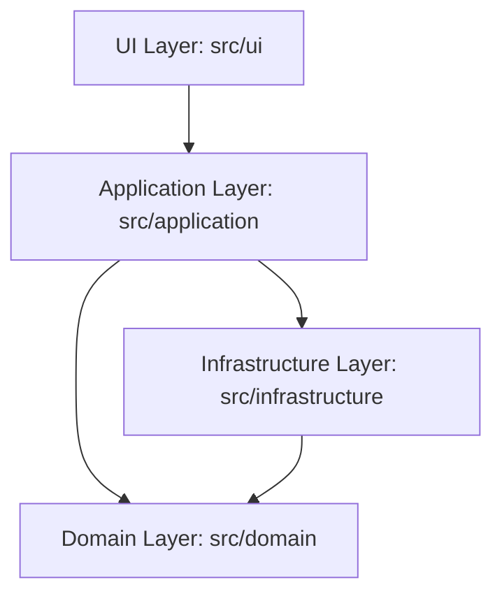

# Mimari Belgesi (Architecture)

> Ana sayfa: [index.md](index.md) | Değişiklik günlüğü: [log.md](log.md)

Proje **Temiz Mimari (Clean Architecture)** ilkelerine göre yapılandırılmıştır. Bağımlılıklar yalnızca dıştan içe doğru akar. Dış katmanlar iç katmanları çağırabilir ancak iç katmanlar dış katmanlar hakkında bilgi sahibi değildir.

---

## 🏛️ Katmanlar ve Bileşen Detayları

Modüler LLM Wiki prensibi gereği, detaylı teknik dokümantasyonlar alt belgelere ayrılmıştır:

| Mimari Alan | Detay Belgesi | Özet İşlev |
| :--- | :--- | :--- |
| **Kullanıcı Arayüzü (UI)** | [ui_architecture_and_events.md](ui_architecture_and_events.md) | PyQt5, QThread Worker asenkron yapısı, Global Event Bus ve QSS Tasarım Sistemleri. |
| **Piyasa ve Portföy** | [service_portfolio_and_market.md](service_portfolio_and_market.md) | Event-sourcing ile portföy hesaplanması, Trade mantığı ve YFinance fiyat sağlığı. |
| **Kurumsal Aksiyonlar** | [service_corporate_actions.md](service_corporate_actions.md) | Temettü, Bedelli/Bedelsiz sermaye artırımı hesapları ve maliyet güncellemeleri. |
| **İzleme Listesi** | [service_watchlist.md](service_watchlist.md) | Ana portföy dışında izlenen hisseler ve hedef fiyat takibi. |
| **Analiz ve Benchmark** | [service_analysis.md](service_analysis.md) | Rasyolar, risk metrikleri hesaplamaları, getiri karşılaştırmaları ve fallback kaynaklar. |
| **Planlama ve Optimizasyon**| [service_planning_optimization.md](service_planning_optimization.md)| Markowitz MPT, SciPy Optimizasyonu, Ledoit-Wolf stabilizasyonu ve Risk Profilleme. |
| **Tarihsel Simülasyon** | [service_simulation.md](service_simulation.md) | Geçmiş portföy işlemlerinin (Backtest) gün gün baştan oynatılması ve snapshot üretimi. |
| **Raporlama (Excel)** | [service_reporting_and_export.md](service_reporting_and_export.md) | OpenPyXL tabanlı tarih normalizasyonlu Excel dışa aktarım motoru. |
| **Veritabanı (DB) ve ORM** | [database_schema_and_orm.md](database_schema_and_orm.md) | SQLAlchemy modelleri, repository pattern'i, veritabanı şeması ve migration stratejisi. |
| **Yapay Zeka (AI)** | [ai_integration.md](ai_integration.md) | Gemini API bağlantısı, bağlam (context) aktarımı ve Açıklanabilir AI (XAI) prompt kurgusu. |
| **Karşılaştırma Laboratuvarı**| [comparison_lab.md](comparison_lab.md) | Plotly tabanlı gelişmiş kıyaslama motoru, matematiksel altyapı ve grafik üretim aşamaları. |
| **Veritabanı Bakımı** | [database_maintenance_and_scripts.md](database_maintenance_and_scripts.md) | DB bütünlük servisleri, geçersiz trade temizliği ve maintenance scriptleri. |
| **Test Stratejisi** | [testing_strategy.md](testing_strategy.md) | Pytest kurgusu, Repository mocklama yaklaşımı ve UI pytest-qt testleri. |
| **Derleme ve Dağıtım** | [project_build_and_deployment.md](project_build_and_deployment.md) | Nuitka (.exe) paketleme, pinli bağımlılıklar ve auto-commit süreçleri. |

### Sistem Omurgası Notu

`AppContainer`, repository, market/client ve servis wiring sorumluluklarını `src/application/container_parts/` altındaki küçük factory modüllerine devreden ince bir facade olarak çalışır. Ortam değişkenleri `config/settings_loader.py` içindeki `AppSettings`, `AISettings` ve `MarketSettings` yapılarıyla merkezi olarak doğrulanır. Gerçek `.env` dosyası dağıtım çıktısına gömülmez; runtime sırasında uygulamanın bulunduğu dizinden okunur.

---

## 🛠️ Kalite Standartları ve Kalite Kapıları
Kod tabanının bütünlüğünü korumak adına tüm refaktör, özellik ekleme veya bug-fix süreçlerinde [RULES.md](../../RULES.md) içinde tanımlı kalite kuralları zorunlu olarak uygulanır. Geliştirmeler sonrası test komutları düzenli çalıştırılmalıdır.
