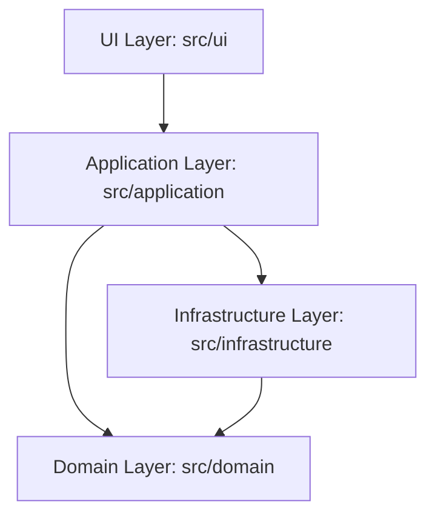
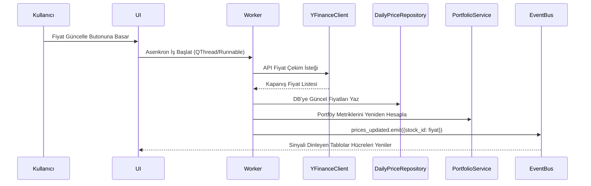

# Mimari Belgesi (Architecture)

> Ana sayfa: [index.md](index.md) | Değişiklik günlüğü: [log.md](log.md)

Proje **Temiz Mimari (Clean Architecture)** ilkelerine göre yapılandırılmıştır. Bağımlılıklar yalnızca dıştan içe doğru akar. Dış katmanlar iç katmanları çağırabilir ancak iç katmanlar dış katmanlar hakkında bilgi sahibi değildir.

---

## 🏛️ Katmanlar ve Bileşen Yapısı

### 1. Domain Katmanı ([src/domain/](file:///d:/1KodCalismalari/Projeler/VIBE_CODING_UYGULAMA_DENEMELERI/Merge_PortfoySim/PortfoySimulasyonu/src/domain))

Hiçbir dış kütüphaneye veya framework'e bağımlı olmayan saf iş mantığı katmanıdır.

#### İş Modelleri ([src/domain/models/](file:///d:/1KodCalismalari/Projeler/VIBE_CODING_UYGULAMA_DENEMELERI/Merge_PortfoySim/PortfoySimulasyonu/src/domain/models))

| Sınıf / Modül | Dosya Yolu | Sorumluluk ve İşlev |
|:---|:---|:---|
| `Portfolio` | [portfolio.py](file:///d:/1KodCalismalari/Projeler/VIBE_CODING_UYGULAMA_DENEMELERI/Merge_PortfoySim/PortfoySimulasyonu/src/domain/models/portfolio.py) | İşlem geçmişinden pozisyonları ve anlık P&L (Kar/Zarar) durumunu hesaplar. |
| `Position` | [position.py](file:///d:/1KodCalismalari/Projeler/VIBE_CODING_UYGULAMA_DENEMELERI/Merge_PortfoySim/PortfoySimulasyonu/src/domain/models/position.py) | Tek bir varlığın miktar, maliyet, güncel fiyat ve piyasa değerini tutar. |
| `Trade` | [trade.py](file:///d:/1KodCalismalari/Projeler/VIBE_CODING_UYGULAMA_DENEMELERI/Merge_PortfoySim/PortfoySimulasyonu/src/domain/models/trade.py) | Varlık alım-satım işlem kaydı (fiyat, miktar, işlem türü). |
| `Stock` | [stock.py](file:///d:/1KodCalismalari/Projeler/VIBE_CODING_UYGULAMA_DENEMELERI/Merge_PortfoySim/PortfoySimulasyonu/src/domain/models/stock.py) | Hisse senedi veya varlık kimlik kartı (ticker, unvan, döviz türü). |
| `DailyPrice` | [daily_price.py](file:///d:/1KodCalismalari/Projeler/VIBE_CODING_UYGULAMA_DENEMELERI/Merge_PortfoySim/PortfoySimulasyonu/src/domain/models/daily_price.py) | Varlığın belirli bir tarihteki güncel kapanış fiyatı. |
| `CorporateAction` | [corporate_action.py](file:///d:/1KodCalismalari/Projeler/VIBE_CODING_UYGULAMA_DENEMELERI/Merge_PortfoySim/PortfoySimulasyonu/src/domain/models/corporate_action.py) | Temettü dağıtımı, bedelli/bedelsiz sermaye artırımı gibi kurumsal aksiyonlar. |
| `ModelPortfolio` | [model_portfolio.py](file:///d:/1KodCalismalari/Projeler/VIBE_CODING_UYGULAMA_DENEMELERI/Merge_PortfoySim/PortfoySimulasyonu/src/domain/models/model_portfolio.py) | Sanal veya hedef portföy ağırlık hedefleri ve kuralları. |
| `OptimizationResult` | [optimization_result.py](file:///d:/1KodCalismalari/Projeler/VIBE_CODING_UYGULAMA_DENEMELERI/Merge_PortfoySim/PortfoySimulasyonu/src/domain/models/optimization_result.py) | Markowitz model çıktısı (ağırlıklar, beklenen getiri, volatilite). |
| `RiskProfile` | [risk_profile.py](file:///d:/1KodCalismalari/Projeler/VIBE_CODING_UYGULAMA_DENEMELERI/Merge_PortfoySim/PortfoySimulasyonu/src/domain/models/risk_profile.py) | Kullanıcı risk anketi yanıtları ve sonuç risk skoru. |
| `Budget` | [budget.py](file:///d:/1KodCalismalari/Projeler/VIBE_CODING_UYGULAMA_DENEMELERI/Merge_PortfoySim/PortfoySimulasyonu/src/domain/models/budget.py) | Finansal hedeflere ulaşmak için belirlenen aylık tasarruf limitleri. |
| `Watchlist` | [watchlist.py](file:///d:/1KodCalismalari/Projeler/VIBE_CODING_UYGULAMA_DENEMELERI/Merge_PortfoySim/PortfoySimulasyonu/src/domain/models/watchlist.py) | Takip listesi veri modeli. |

#### Port Arayüzleri ([src/domain/ports/](file:///d:/1KodCalismalari/Projeler/VIBE_CODING_UYGULAMA_DENEMELERI/Merge_PortfoySim/PortfoySimulasyonu/src/domain/ports))

Infrastructure katmanının uyması gereken soyut repository ve servis arayüzleri (interface):
* **Repository Arayüzleri**: [src/domain/ports/repositories/](file:///d:/1KodCalismalari/Projeler/VIBE_CODING_UYGULAMA_DENEMELERI/Merge_PortfoySim/PortfoySimulasyonu/src/domain/ports/repositories) altında listelenir (örn. [i_portfolio_repo.py](file:///d:/1KodCalismalari/Projeler/VIBE_CODING_UYGULAMA_DENEMELERI/Merge_PortfoySim/PortfoySimulasyonu/src/domain/ports/repositories/i_portfolio_repo.py)).

---

### 2. Application Katmanı ([src/application/](file:///d:/1KodCalismalari/Projeler/VIBE_CODING_UYGULAMA_DENEMELERI/Merge_PortfoySim/PortfoySimulasyonu/src/application))

Domain modellerini ve veri saklama katmanını bir araya getiren use-case koordinasyon katmanıdır.

* **DI Container ([container.py](file:///d:/1KodCalismalari/Projeler/VIBE_CODING_UYGULAMA_DENEMELERI/Merge_PortfoySim/PortfoySimulasyonu/src/application/container.py))**: Tüm bağımlılıkları tek merkezde ilklendirir ve bağlar. UI katmanı servis bağımlılıklarını bu container üzerinden alır.
* **Global Event Bus ([event_bus.py](file:///d:/1KodCalismalari/Projeler/VIBE_CODING_UYGULAMA_DENEMELERI/Merge_PortfoySim/PortfoySimulasyonu/src/application/events/event_bus.py))**: PyQt5 `QObject` sinyalleri üzerine kurulu Pub/Sub asenkron veri haberleşme sistemidir. Arka plan thread'lerindeki fiyat güncellemelerinin UI bileşenlerini kilitlemeden aktarılmasını sağlar.

#### Servis Modülleri ([src/application/services/](file:///d:/1KodCalismalari/Projeler/VIBE_CODING_UYGULAMA_DENEMELERI/Merge_PortfoySim/PortfoySimulasyonu/src/application/services))

| Servis Alanı | Klasör Yolu | Temel Sorumluluklar |
|:---|:---|:---|
| `analysis` | [analysis/](file:///d:/1KodCalismalari/Projeler/VIBE_CODING_UYGULAMA_DENEMELERI/Merge_PortfoySim/PortfoySimulasyonu/src/application/services/analysis) | Portföy analizi, karşılaştırmalı getiri grafikleri ve [ComparisonService](file:///d:/1KodCalismalari/Projeler/VIBE_CODING_UYGULAMA_DENEMELERI/Merge_PortfoySim/PortfoySimulasyonu/src/application/services/analysis/comparison_service.py) veri motorunu barındırır. |
| `portfolio` | [portfolio/](file:///d:/1KodCalismalari/Projeler/VIBE_CODING_UYGULAMA_DENEMELERI/Merge_PortfoySim/PortfoySimulasyonu/src/application/services/portfolio) | İşlem kayıtlarının yönetimi, maliyet hesapları ve portföy koordinasyon zinciri. |
| `planning` | [planning/](file:///d:/1KodCalismalari/Projeler/VIBE_CODING_UYGULAMA_DENEMELERI/Merge_PortfoySim/PortfoySimulasyonu/src/application/services/planning) | Markowitz optimizasyonu ([optimization_service.py](file:///d:/1KodCalismalari/Projeler/VIBE_CODING_UYGULAMA_DENEMELERI/Merge_PortfoySim/PortfoySimulasyonu/src/application/services/planning/optimization_service.py)) ve risk profili oluşturma. |
| `market` | [market/](file:///d:/1KodCalismalari/Projeler/VIBE_CODING_UYGULAMA_DENEMELERI/Merge_PortfoySim/PortfoySimulasyonu/src/application/services/market) | Canlı fiyat sorgulama servisleri ve BIST seans takvimi kontrolleri. |
| `simulation` | [simulation/](file:///d:/1KodCalismalari/Projeler/VIBE_CODING_UYGULAMA_DENEMELERI/Merge_PortfoySim/PortfoySimulasyonu/src/application/services/simulation) | Portföy geçmiş değerlerini oluşturma ve backtest simülasyonu. |
| `reporting` | [reporting/](file:///d:/1KodCalismalari/Projeler/VIBE_CODING_UYGULAMA_DENEMELERI/Merge_PortfoySim/PortfoySimulasyonu/src/application/services/reporting) | Excel formatında detaylı finansal durum raporu hazırlama. |

---

### 3. Infrastructure Katmanı ([src/infrastructure/](file:///d:/1KodCalismalari/Projeler/VIBE_CODING_UYGULAMA_DENEMELERI/Merge_PortfoySim/PortfoySimulasyonu/src/infrastructure))

Uygulamanın dış dünya (veritabanı, internet API'leri vb.) ile haberleşen kısmıdır.

* **SQLAlchemy Veritabanı Motoru**:
  - Şema Tanımları: [orm_models.py](file:///d:/1KodCalismalari/Projeler/VIBE_CODING_UYGULAMA_DENEMELERI/Merge_PortfoySim/PortfoySimulasyonu/src/infrastructure/db/sqlalchemy/orm_models.py) dosyası veritabanındaki tabloları temsil eder.
  - Veritabanı Bağlantısı: [database_engine.py](file:///d:/1KodCalismalari/Projeler/VIBE_CODING_UYGULAMA_DENEMELERI/Merge_PortfoySim/PortfoySimulasyonu/src/infrastructure/db/sqlalchemy/database_engine.py).
  - SQLAlchemy Repository Sınıfları: [src/infrastructure/db/sqlalchemy/repositories/](file:///d:/1KodCalismalari/Projeler/VIBE_CODING_UYGULAMA_DENEMELERI/Merge_PortfoySim/PortfoySimulasyonu/src/infrastructure/db/sqlalchemy/repositories) klasöründeki implementasyonlar, domain portlarını SQLAlchemy ORM kullanarak somutlaştırır.
* **YFinance Veri Sağlayıcı**: [yfinance_client.py](file:///d:/1KodCalismalari/Projeler/VIBE_CODING_UYGULAMA_DENEMELERI/Merge_PortfoySim/PortfoySimulasyonu/src/infrastructure/market_data/yfinance_client.py) üzerinden YFinance API ile entegrasyon kurularak piyasa fiyatları çekilir.
* **Log Yönetimi**: [logger_setup.py](file:///d:/1KodCalismalari/Projeler/VIBE_CODING_UYGULAMA_DENEMELERI/Merge_PortfoySim/PortfoySimulasyonu/src/infrastructure/logging/logger_setup.py) dosyası döngülü loglama (rotating logger) kurallarını uygular.

---

### 4. UI Katmanı ([src/ui/](file:///d:/1KodCalismalari/Projeler/VIBE_CODING_UYGULAMA_DENEMELERI/Merge_PortfoySim/PortfoySimulasyonu/src/ui))

PyQt5 tabanlı masaüstü grafiksel kullanıcı arayüzü katmanıdır.

* **Pencere Yönetimi ([main_window.py](file:///d:/1KodCalismalari/Projeler/VIBE_CODING_UYGULAMA_DENEMELERI/Merge_PortfoySim/PortfoySimulasyonu/src/ui/main_window.py))**: Ana ekran çerçevesini ve sayfa yönlendirmelerini (navigation) yönetir. Sayfa oluşturma yetkisi [page_factory.py](file:///d:/1KodCalismalari/Projeler/VIBE_CODING_UYGULAMA_DENEMELERI/Merge_PortfoySim/PortfoySimulasyonu/src/ui/navigation/page_factory.py) dosyasındadır.
* **Arka Plan İş Parçacıkları ([worker.py](file:///d:/1KodCalismalari/Projeler/VIBE_CODING_UYGULAMA_DENEMELERI/Merge_PortfoySim/PortfoySimulasyonu/src/ui/worker.py))**: Grafik hesaplamaları, API istekleri ve uzun süren işlemleri `QRunnable` ve `QThreadPool` kullanarak asenkron olarak arka planda çalıştırır, UI kilitlemelerini önler.
* **Tema ve Tasarım Tokens Sistemi**:
  - Tema Yöneticisi: [theme_manager.py](file:///d:/1KodCalismalari/Projeler/VIBE_CODING_UYGULAMA_DENEMELERI/Merge_PortfoySim/PortfoySimulasyonu/src/ui/theme_manager.py) QSS dark/light temalarını yükler.
  - Tasarım Değişkenleri: [tokens.py](file:///d:/1KodCalismalari/Projeler/VIBE_CODING_UYGULAMA_DENEMELERI/Merge_PortfoySim/PortfoySimulasyonu/src/ui/styles/tokens.py) tüm QSS dosyalarında kullanılan renk, kenarlık ve font değişkenlerini merkezi olarak yönetir.
  * Modüler QSS Dosyaları: [src/ui/styles/](file:///d:/1KodCalismalari/Projeler/VIBE_CODING_UYGULAMA_DENEMELERI/Merge_PortfoySim/PortfoySimulasyonu/src/ui/styles) altında primitives, shared ve feature bazında organize edilmiştir.

#### Sayfalar Dizin Yapısı ([src/ui/pages/](file:///d:/1KodCalismalari/Projeler/VIBE_CODING_UYGULAMA_DENEMELERI/Merge_PortfoySim/PortfoySimulasyonu/src/ui/pages))

| Sayfa Klasörü | İşlev |
|:---|:---|
| [dashboard/](file:///d:/1KodCalismalari/Projeler/VIBE_CODING_UYGULAMA_DENEMELERI/Merge_PortfoySim/PortfoySimulasyonu/src/ui/pages/dashboard) | Portföy P&L durumları, pozisyon detayları ve genel dağılım. |
| [analysis/](file:///d:/1KodCalismalari/Projeler/VIBE_CODING_UYGULAMA_DENEMELERI/Merge_PortfoySim/PortfoySimulasyonu/src/ui/pages/analysis) | Portföy kokpiti, hisse analizi ve benchmark grafikleri. |
| [comparison/](file:///d:/1KodCalismalari/Projeler/VIBE_CODING_UYGULAMA_DENEMELERI/Merge_PortfoySim/PortfoySimulasyonu/src/ui/pages/comparison) | Çoklu varlık kıyaslama, rasyo, drawdown ve risk-getiri saçılım grafikleri (Detay: [comparison_lab.md](comparison_lab.md)). |
| [ai_page/](file:///d:/1KodCalismalari/Projeler/VIBE_CODING_UYGULAMA_DENEMELERI/Merge_PortfoySim/PortfoySimulasyonu/src/ui/pages/ai_page) | Gemini asistan paneli ve teknik/temel analiz raporlama. |
| [stock_detail/](file:///d:/1KodCalismalari/Projeler/VIBE_CODING_UYGULAMA_DENEMELERI/Merge_PortfoySim/PortfoySimulasyonu/src/ui/pages/stock_detail) | Tek bir hisse senedinin fiyat geçmişi ve istatistikleri. |

---

## 🔄 Veri Akışı Örneği: Canlı Fiyat Güncellemesi

Aşağıdaki şema, kullanıcının fiyat güncelleme talebinden arayüzün yenilenmesine kadar olan süreci asenkron olarak özetlemektedir:

---

## 📈 Portföy Hesaplama Metolojisi

Portföy verileri, performansı korumak ve veri tutarlılığını sağlamak için veritabanında türetilmiş P&L veya getiri şeklinde saklanmaz. Bunun yerine **her sorguda geçmiş işlemler listesinden dinamik olarak yeniden üretilir (event-sourced)**:

1. [sa_portfolio_repository.py](file:///d:/1KodCalismalari/Projeler/VIBE_CODING_UYGULAMA_DENEMELERI/Merge_PortfoySim/PortfoySimulasyonu/src/infrastructure/db/sqlalchemy/repositories/sa_portfolio_repository.py) üzerinden geçmişteki tüm işlemler (`trades`) çekilir.
2. `Portfolio.from_trades(trades)` çağrılarak domain seviyesinde miktar ve maliyet pozisyonları ilklendirilir.
3. [sa_price_repository.py](file:///d:/1KodCalismalari/Projeler/VIBE_CODING_UYGULAMA_DENEMELERI/Merge_PortfoySim/PortfoySimulasyonu/src/infrastructure/db/sqlalchemy/repositories/sa_price_repository.py) üzerinden en son güncel fiyatlar çekilerek anlık piyasa değeri, realize olmamış kar/zarar ve varlık ağırlıkları anlık hesaplanır.

---

## 🛠️ Kalite Standartları ve Kalite Kapıları
Kod tabanının bütünlüğünü korumak adına tüm refaktör, özellik ekleme veya bug-fix süreçlerinde [RULES.md](../../RULES.md) içinde tanımlı kalite kuralları zorunlu olarak uygulanır. Geliştirmeler sonrası `pytest` komutu çalıştırılmalıdır.
