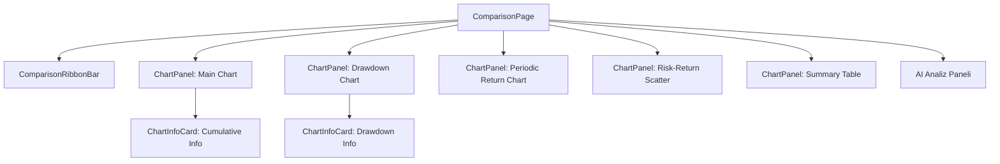
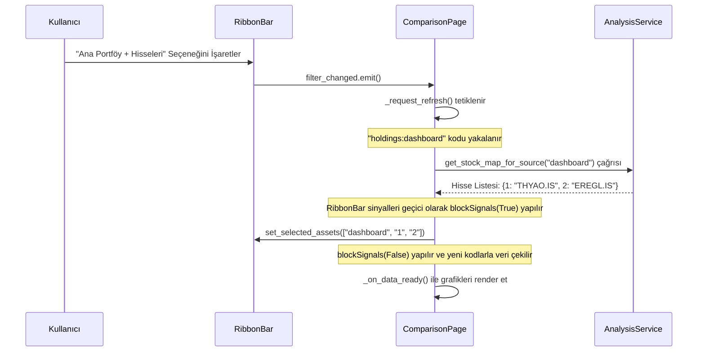
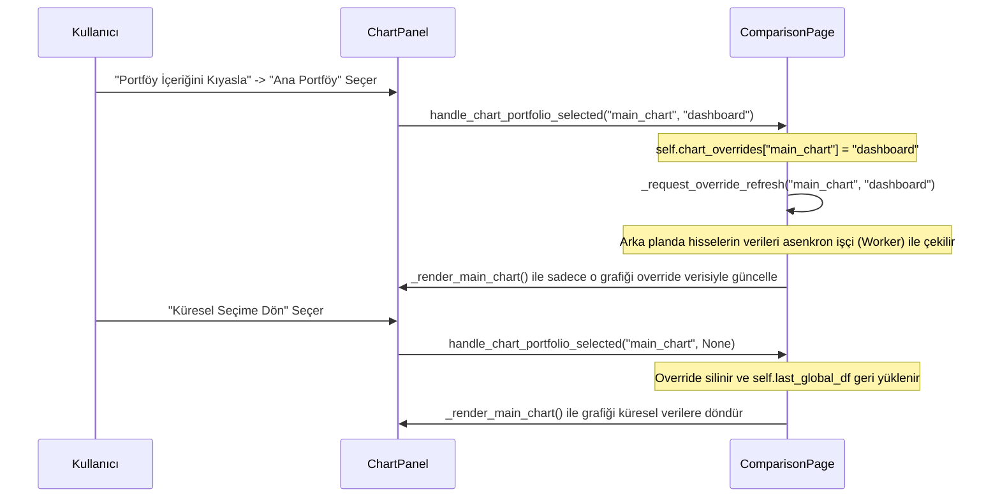

> Ana sayfa: [index.md](index.md) | Mimari: [architecture.md](architecture.md) | Değişiklik günlüğü: [log.md](log.md)

# Karşılaştırma Laboratuvarı (Comparison Lab)

Karşılaştırma Laboratuvarı, kullanıcıların aktif portföylerini, model portföylerini, piyasa endekslerini (BIST100, Altın, Gümüş, Dolar vb.) ve hisse senetlerini rasyo, drawdown (değer kaybı), dönemsel getiri ve risk-getiri saçılımı bazında detaylıca kıyaslayıp analiz edebilecekleri gelişmiş bir görselleştirme ve yapay zeka analiz merkezidir.

---

## 🏗️ Modüler Bileşen Yapısı

Sayfa, [comparison_page.py](file:///d:/1KodCalismalari/Projeler/VIBE_CODING_UYGULAMA_DENEMELERI/Merge_PortfoySim/PortfoySimulasyonu/src/ui/pages/comparison/comparison_page.py) içinde tanımlanan `ComparisonPage` sınıfı etrafında şekillenmiştir:

### 1. Ribbon Bar Filtre Paneli ([widgets/ribbon_bar.py](file:///d:/1KodCalismalari/Projeler/VIBE_CODING_UYGULAMA_DENEMELERI/Merge_PortfoySim/PortfoySimulasyonu/src/ui/pages/comparison/widgets/ribbon_bar.py))
* **Çoklu Varlık Seçimi**: `CheckableComboBox` ile aktif portföyler, endeksler ve hisseler çoklu olarak seçilir.
* **Sanal "Portföy + Hisseleri" Akışı**: Arayüzde listelenen `"{Portföy} + Hisseleri"` (kod: `holdings:<portföy_kodu>`) sanal seçeneği işaretlendiğinde, portföyün kendisi ve içindeki tüm hisseler reaktif olarak çözümlenip seçilir.
* **Tarih & Aralık**: Başlangıç/bitiş tarihleri ile 1A, 3A, 6A, 1Y, YBB ve Tümü (5Y) hızlı aralık butonları yer alır.

### 2. Grafik Panelleri ([ChartPanel](file:///d:/1KodCalismalari/Projeler/VIBE_CODING_UYGULAMA_DENEMELERI/Merge_PortfoySim/PortfoySimulasyonu/src/ui/pages/comparison/comparison_page.py#L90))
* **Vektör İkonlar**: Başlıkların solunda Lucide SVG ikonları kullanılır. Emojiler tamamen kaldırılmıştır.
* **Grafik-Özelinde Override (`inspect_btn`)**: Sağ üst köşedeki menüden bir portföy seçildiğinde, sayfanın genel filtreleri bozulmadan sadece o grafik özelinde hisse bazında kıyaslama yapılır.
* **Küresel Seçime Dön (Geri Alma)**: Override menüsünün en üstünde yer alan checkable **"Küresel Seçime Dön"** (`refresh-cw` ikonlu) aksiyon ile grafik tekrar küresel Ribbon Bar filtrelerine geri döndürülür.
* **Kontrast QMenu Tasarımı**: Koyu mod ile uyumlu, koyu arka plan üstünde okunabilir gri/beyaz metinler ve neon cyan (`#00ffff`) seçili öğe göstergeleri eklenmiştir.

### 3. Bilgilendirme ve Finansal Okuryazarlık Kartları ([ChartInfoCard](file:///d:/1KodCalismalari/Projeler/VIBE_CODING_UYGULAMA_DENEMELERI/Merge_PortfoySim/PortfoySimulasyonu/src/ui/pages/comparison/comparison_page.py#L30))
* **Neon Renk Şeması**: Başlıklar neon mavi (`#00ffff`), etiketler neon sarı (`#fbbf24`), açıklamalar parlak beyaz (`#ffffff`) olarak tasarlanmıştır.
* **Büyütülmüş Fontlar**: Okunabilirliği maksimize etmek adına başlıklar `26px`, açıklamalar ise `24px` boyutuna getirilmiştir. Sol tarafta `info` Lucide SVG ikonu inline HTML ile render edilir.

### 4. QWebEngineView Kaydırma Çakışması Filtresi (`WheelRedirectFilter`)
* Plotly grafiklerini render eden `QWebEngineView` bileşenlerinde fare tekerleği (wheel) olaylarının kaybolmasını ve dikey sayfa scrollunun kilitlenmesini engeller. Yakalanan olayları `QCoreApplication.sendEvent` ile ana dikey `QScrollArea` bileşenine yönlendirir.

---

## 🔄 Veri ve Sinyal Akış Senaryoları

### Senaryo A: Sanal "Portföy + Hisseleri" Seçimi

### Senaryo B: Grafik-Özelinde Portföy İnceleme ve Geri Alma

---

## 🧮 Analitik ve Matematiksel Motor ([ComparisonService](file:///d:/1KodCalismalari/Projeler/VIBE_CODING_UYGULAMA_DENEMELERI/Merge_PortfoySim/PortfoySimulasyonu/src/application/services/analysis/comparison_service.py))

Tüm finansal hesaplamalar backend katmanındaki saf veri servisleri tarafından yürütülür:
1. **Veri Hizalama (`align_financial_series`)**: Farklı tatil günlerine sahip varlıkların serilerini ortak bir tarih indeksinde `outer join` ve forward-fill (`ffill()`) ile birleştirir.
2. **Rasyo Motoru (`calculate_asset_ratio`)**: Hizalanmış serilerde $Rasyo = Seri_A / Seri_B$ oranını sıfıra bölünme ve tanımsızlık (`NaN`, `inf`) kontrolleriyle hesaplar.
3. **Maksimum Drawdown (`calculate_drawdowns`)**: Tarihsel zirve zirve noktalarından yaşanan düşüş yüzdesini hesaplar:
   $$DD = \frac{Fiyat - Tarihsel Zirve}{Tarihsel Zirve} \times 100$$
4. **Risk-Getiri Volatilitesi (`calculate_risk_return_metrics`)**: Günlük getirilerin standart sapmasından yıllıklandırılmış volatiliteyi (risk) bulur:
   $$\sigma_{annual} = \sigma_{daily} \times \sqrt{252} \times 100$$

---

## 🧪 Birim Testleri ve Senaryolar ([test_comparison_page.py](file:///d:/1KodCalismalari/Projeler/VIBE_CODING_UYGULAMA_DENEMELERI/Merge_PortfoySim/PortfoySimulasyonu/tests/ui/pages/test_comparison_page.py))

* **`test_chart_panel_init_and_update`**: `ChartPanel` başlatılmasını, menü aksiyonlarının (Küresel Dönüş + Seçenekler) oluşturulmasını ve tetiklenme callback'lerini test eder.
* **`test_compare_portfolio_holdings`**: "Portföy + Hisseleri" sanal tetikleyicisinin `_request_refresh` içindeki reaktif hisse çözümleme ve seçim akışını doğrular.
* **`test_chart_specific_override`**: Grafik bazlı bağımsız filtrelerin `self.chart_overrides` sözlüğüne yazılmasını ve sıfırlanma (None) akışını denetler.

---

## 🔗 Tarihsel Tasarım Belgeleri ve Şartnameler
Geliştirme aşamasındaki orijinal tasarım spec dosyalarına buradan ulaşabilirsiniz:
* [Aşama 1: Matematiksel Altyapı ve Veri Motoru](../../analizSayfasi/1_COMPARISON_SERVICE.md)
* [Aşama 2: Plotly Grafik Üreticisi ve Şablon Yapısı](../../analizSayfasi/2_COMPARISON_CHART_FACTORY.md)
* [Aşama 3: PyQt5 UI Bileşenleri ve Sinyal Ağı](../../analizSayfasi/3_UI_LAYERS_AND_SIGNALS.md)
* [Aşama 4: Navigasyon ve Entegrasyon Aşamaları](../../analizSayfasi/4_NAVIGATION_AND_INTEGRATION.md)
