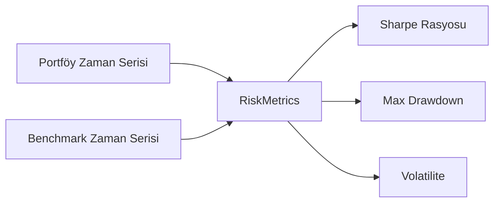

# Analiz ve Benchmark Servisleri

> Ana sayfa: [index.md](index.md) | Mimari: [architecture.md](architecture.md)

Bu belge, `src/application/services/analysis` dizinindeki özellikleri detaylandırır.

## 1. Analiz Servisi (`AnalysisService`)

Bu servis, tek bir varlığın veya tüm portföyün risk, getiri ve benchmark'a göre performansını analiz eden genel merkezdir.
Bileşenleri:
- `ComparisonService`: Çoklu varlıkların ve rasyoların karşılaştırılmasını üstlenir. 
- `ReturnCalcService`: Zaman serisi bazında mutlak ve oransal getiri hesaplamalarını yapar.
- `RiskMetrics`: Sharpe rasyosu, volatilite, maksimum düşüş (Max Drawdown) gibi gelişmiş finansal metrikleri hesaplar.

## 2. Benchmark Mantığı ve Fallback

Kullanıcının portföy performansının iyi olup olmadığını anlaması için bir kıyaslama (benchmark) gerekir.
Desteklenen benchmark türleri:
- **Döviz / Altın:** Piyasa verisi (YFinance vb.) kullanılarak `BenchmarkService` üzerinden hesaplanır.
- **Mevduat (Risk-Free Rate):** Sabit getiri hesaplaması gerektirir. 

### Fallback Kaynaklar (TCMB)
Analiz motoru, internet kesintisi veya YFinance verisinin geç gelmesi durumunda bir fallback mekanizmasına sahiptir. Mevduat ve faiz verisi için çevresel değişkenlerden (örneğin `.env` dosyasındaki `TCMB_DEPOSIT_RATE_FALLBACK=45.0`) veri çekilir ve kullanılır.

## 3. Comparison Lab (Karşılaştırma Laboratuvarı)

Gelişmiş bir veri motoru olarak çalışan `ComparisonService`, UI katmanındaki Plotly grafikleriyle doğrudan haberleşir. Detaylı teknik özellikleri için `docs/wiki/comparison_lab.md` ve `analizSayfasi` belgelerine başvurulabilir.

## Faz 2 Notu (2026-06-02)

- `AnalysisBenchmarkService` EVDS concrete client yerine `EvdsSeriesProvider` protocol'üne bağlıdır; production `EvdsClient` container üzerinden structural provider olarak verilir.
- `AnalysisService` artık domain `Position` nesnelerine `_analysis_current_value` runtime attribute'u eklemez; current value bilgisi bundle içindeki `position_values_end` snapshot map'iyle taşınır.
- Currency conversion ve benchmark fallback davranışı mevcut public DTO sözleşmesi korunarak test edilmiştir.

## Faz 2D Notu (2026-06-02)

- `AnalysisService` orchestration servisi olarak kalır; bundle kurma `AnalysisBundleBuilder`, TL/USD/REAL dönüşümü `CurrencyConversionService`, karşılaştırma portföy serileri `ComparisonPortfolioSeriesBuilder` tarafından yapılır.
- Benchmark EVDS parsing yardımcı metodlara ayrıldı; veri akışı hatalarında broad exception noktaları log + empty series fallback contract olarak korunur.
- Public DTO shape ve UI-facing payload anahtarları değişmedi.
