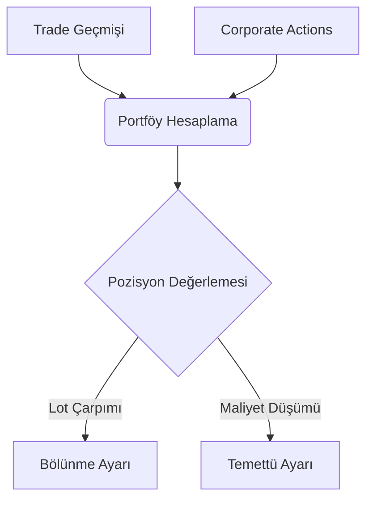

# Kurumsal Aksiyonlar (Corporate Actions) Servisi

## KAP/MKK Aday Otomasyonu Notu (2026-06-02)

- Bedelli ve bedelsiz sermaye artirimlari once `CorporateActionCandidate` olarak kaydedilir; portfoy ve fiyat gecmisi kullanici onayi olmadan degismez.
- `CorporateActionDiscoveryService` KAP/MKK provider'ini calistirir, portfoy/watchlist/model portfoy ticker'larini hedefler ve uygulanmis action ile cakisan adaylari kaydetmez.
- `CorporateActionCandidateReviewService` sadece `READY`/`APPROVED` adaylari mevcut `CorporateActionService` uzerinden uygular; sentetik trade ve fiyat duzeltme idempotency ayni hattan korunur.
- Ayarlar > Kurumsal Aksiyonlar sekmesi aday listeleme, KAP/MKK yenileme, kaynak acma, duzenleme, yoksayma ve onayla-uygula akisini sunar.
- Mevcut DB'ler icin `scripts/apply_corporate_action_candidate_schema.py` calistirilerek `corporate_action_candidates` tablosu eklenir.
- Public KAP taramasi resmi API aboneligi gerektirmeden best-effort calisir; kaynak 404/timeout verirse discovery result `source_unavailable=True` ve `errors` ile doner, startup worker stack trace veya toast uretmez.
- Manuel `KAP/MKK Yenile` butonu kaynak okunamadiginda kullaniciya kisa uyari gosterir; default test suite canli KAP agina bagli degildir.

> Ana sayfa: [index.md](index.md) | Mimari: [architecture.md](architecture.md)

Bu belge, `src/application/services/corporate_actions` dizini altındaki temettü (dividend), bedelli ve bedelsiz sermaye artırımı gibi varlık tabanlı şirket olaylarını açıklar.

## 1. Temel İşlev

Kurumsal aksiyonlar, bir hissenin portföydeki lot miktarını veya maliyetini doğrudan etkiler. Event-Sourcing (işlem geçmişi) tabanlı portföy modelinde, bu aksiyonların portföy hesaplanırken dikkate alınması hayati önem taşır. Eğer dikkate alınmazsa kullanıcının Kâr/Zarar metrikleri devasa oranda hatalı gözükür (Örn: Hissenin %500 bedelsiz bölünüp fiyatının 6'ya düşmesi).

## 2. Türler ve Hesaplama Mantığı

| Aksiyon Türü | Veritabanı (Type) | Sisteme Etkisi |
| --- | --- | --- |
| **Bedelsiz Sermaye Artırımı** | `STOCK_SPLIT` / `BONUS` | Yatırımcının portföyündeki hisse adedi çarpılır, yeni bir "0 maliyetli" alım (veya ayarlama) gibi sisteme yansıtılır. Toplam maliyet değişmez ama birim ortalama maliyet düşer. |
| **Temettü (Dividend)** | `DIVIDEND` | Hisse başına verilen net nakit temettü, yatırımcının elindeki lot sayısıyla çarpılır ve sisteme "Nakit Girişi" (Cash Inflow) olarak yansıtılır. İstenirse hisse maliyetinden düşülerek de hesaplanabilir. |
| **Bedelli Sermaye Artırımı** | `RIGHTS_ISSUE` | Hisse sayısını artırırken sistemde rüçhan hakkı kullanımı nedeniyle bir "Nakit Çıkışı" (Cash Outflow) üretir. Toplam maliyete eklenir. |

## 3. Mimari Entegrasyon

Kurumsal aksiyonlar doğrudan `CorporateActionService` vasıtasıyla veritabanına (`corporate_actions` tablosuna) kaydedilir. Portföy simülasyonu çalıştırılırken (veya `Portfolio.from_trades` anında), işlemlerin yapıldığı günlerde kurumsal aksiyon olup olmadığı kontrol edilir. Varsa bu matematiksel ayarlamalar pozisyon nesnesinin (`Position`) adet ve maliyet hesaplamalarına "Event" olarak dahil edilir.

## Faz 2 Notu (2026-06-02)

- `CorporateActionService.apply_action` failure-safe sıraya alındı: action okunur, pozisyon etkisi hesaplanır, sentetik trade insert edilir ve sadece insert başarılı olursa action `applied` işaretlenir.
- Trade insert exception durumunda action applied kalmaması regression testiyle sabitlendi.

## Faz 2D Notu (2026-06-02)

- Bedelli/bedelsiz description ve `CorporateActionResult` üretimi pure helper function'lara taşındı.
- `CorporateActionService` kayıt, sorgu ve action application orchestration sorumluluğunda kalır; public API değişmedi.

## MERKO ve Geçmiş Fiyat Düzeltme Notu (2026-06-02)

- Sermaye artırımı uygulandıktan sonra `daily_prices` geçmişi in-place düzeltilir; sadece `price_date < ex_date` kayıtları etkilenir.
- Bedelsiz katsayısı `1 / (1 + ratio)`, bedelli katsayısı `(P0 + ratio * K) / ((1 + ratio) * P0)` olarak hesaplanır.
- `corporate_actions` tablosunda `prices_adjusted`, `prices_adjusted_at`, `price_adjustment_factor` ve `price_adjustment_count` alanları idempotency için tutulur.
- Backfill ve fiyat sağlığı güncelleme akışları, uygulanmış fiyat düzeltme action'larını dikkate alarak ham market fiyatlarını DB'ye normalize edilmiş yazar.
- MERKO onarımı için `scripts/merko_bedelsiz_artirimi.py --dry-run` ön kontrol, ardından scriptin normal çalıştırılması kullanılır.
 
