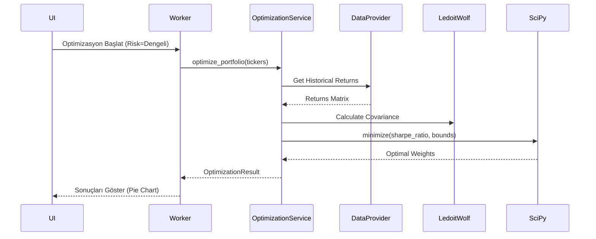

# Planlama ve Optimizasyon Servisleri

> Ana sayfa: [index.md](index.md) | Mimari: [architecture.md](architecture.md)

Bu belge, `src/application/services/planning` dizini altındaki **Markowitz Portföy Optimizasyonu** ve **Risk Profilleme** sistemlerini detaylandırır.

## 1. Optimizasyon Motoru (`OptimizationService`)

Portföy Simülasyonu, SciPy kütüphanesini ve scikit-learn kullanarak modern portföy teorisi (Modern Portfolio Theory - MPT) tabanlı ağırlık hesaplaması yapar. 

### Temel Tasarım Kuralları
- `OptimizationService` doğrudan dış API veya canlı veri çekmez. Tüm veriler dışarıdan (veya `OptimizationMarketDataProvider` arayüzünden) beslenir.
- Canlı veri bağımlılığının izole edilmesi, servisin tamamen mock provider'lar ile test edilebilir olmasını sağlar.

### SciPy ve Ledoit-Wolf Kovaryans Stabilizasyonu
Standart kovaryans matrisi hesaplamaları büyük varlık havuzlarında kararsız (unstable) sonuçlar verebilir. Bunu engellemek için scikit-learn'ün `Ledoit-Wolf` shrinkage metodu kullanılır.
```python
# Örnek Kullanım Akışı
from sklearn.covariance import LedoitWolf
cov_matrix = LedoitWolf().fit(returns_data).covariance_
```
Bu yaklaşım, özellikle BIST ve küresel hisselerin karışık olduğu senaryolarda algoritmanın uç değerlere savrulmasını engeller.

### Kısıtlar (Constraints)
- **Ağırlık Limiti:** Hiçbir hisseye portföyün belli bir yüzdesinden (örn. %30 veya %40) fazla ağırlık verilemez. Bu kısıt (bounds) SciPy `minimize` fonksiyonuna parametre olarak verilir.
- **Toplam Ağırlık:** Ağırlıkların toplamı her zaman 1.0 (yani %100) olmalıdır.

## 2. Risk Profili (`RiskProfile`)

Risk profilleme modülü kullanıcının davranışsal ve finansal tercihlerini puanlayarak yatırım profili üretir (örn. Muhafazakar, Dengeli, Agresif).

- Modeller: `src/domain/models/risk_profile.py`
- Finansal planlama modülü bütçe, hedef ve tasarruf odağında çalışır. Bu ekranlar, portföy yönetimini yalnız performans takibinden çıkarıp kişisel veya ekip bazlı planlama sürecine bağlar.

## 3. Optimizasyon İşlem Akışı


## Faz 2 Notu (2026-06-02)

- `OptimizationService` artık varsayılan olarak YFinance provider üretmez; `OptimizationMarketDataProvider` zorunlu DI dependency'dir.
- YFinance tabanlı optimization provider `src/infrastructure/market_data/yfinance_optimization_market_data_provider.py` altına taşındı.
- Zero volatility, NaN/inf metrikleri, kısa fiyat geçmişi ve SLSQP başarısızlığı testlerle sabitlendi.
- `PlanningService.analyze_feasibility` ve `ModelPortfolioTradeService.add_trade` küçük helper'lara ayrıldı; Decimal domain değerleri ve float DTO çıktıları korunur.

## Faz 2D Notu (2026-06-02)

- Model portföy trade replay/simulation mantığı `ModelPortfolioTradeSimulator` sınıfına taşındı.
- `ModelPortfolioTradeService` validasyon, trade üretimi, timeline kontrol ve repository orchestration sorumluluklarına indirildi.
- Optimization tarafındaki callback fiyat lookup `except Exception` noktası bilinçli fallback contract'tır: callback bozulursa provider son fiyatına, o da yoksa varsayılan fiyata düşer.
