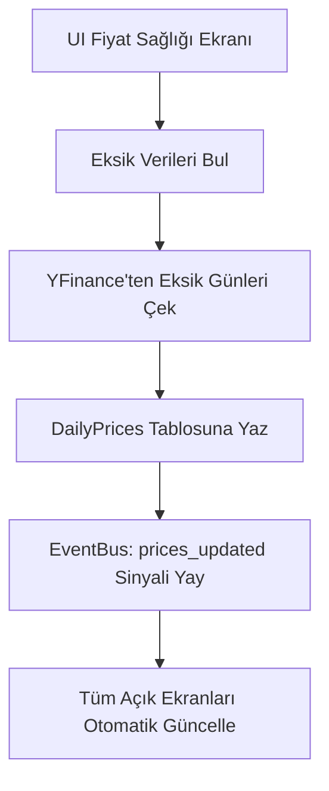

# Portföy ve Piyasa Verisi (Market Data) Servisleri

> Ana sayfa: [index.md](index.md) | Mimari: [architecture.md](architecture.md)

Bu belge, işlem geçmişinin tutulmasını (`Trade`) ve piyasa verilerinin (`Market Data`) nasıl çekilip işlendiğini açıklar.

## 1. Event-Sourcing ile Portföy Hesaplaması

Geleneksel sistemler, portföyün P&L değerini (realize edilmemiş kâr/zarar) veri tabanında tutmaya meyillidir. Ancak `Portföy Simülasyonu` projesinde veri bütünlüğünü korumak için Event-Sourcing (Olay Kaynağı) mantığı benimsenmiştir:

- Türev değerler (P&L, maliyet) **veritabanında saklanmaz.**
- Kullanıcının "Alış" (BUY) ve "Satış" (SELL) işlemleri (`Trade` objeleri) kronolojik olarak veritabanında tutulur.
- Uygulama açıldığında veya yeni bir işlem eklendiğinde, `Portfolio.from_trades()` çağrılarak tüm işlemler baştan sona işlenir ve portföyün güncel hali sıfırdan hesaplanır.

### Avantajları:
- Bölünme, temettü (Corporate Actions) veya geçmişe dönük işlem düzenlemelerinde veri tutarsızlığı yaşanmaz.
- Tüm hesaplamalar tek bir "Truth" (Gerçek) kaynağına dayanır: İşlem geçmişi.

## 2. Piyasa Verisi (Market Data) ve `YFinanceClient`

Gerçek zamanlı piyasa fiyatları ve geçmiş fiyat (historical prices) verileri `src/infrastructure/market_data/yfinance_client.py` üzerinden YFinance kütüphanesi ile çekilir.

### Eksik Veri ve Tatil Sağlığı
Bir piyasa takip uygulamasında en büyük sorunlardan biri tatil günleri ve fiyat dönmeyen (eksik veri) günleridir.
`MarketDataService` şu sorumlulukları üstlenir:
1. **Tatil Takvimi:** BIST (Borsa İstanbul) takvimi göz önüne alınarak, Cumartesi ve Pazar günleri haricinde veri dönmeyen günleri "Tatil Adayı" olarak sınıflandırır.
2. **Eksik Veri Tespiti:** Seçili hisseler arasında eksik günleri saptar ve arayüze eksik veri sağlığı raporu sunar.
3. **Kapanış Düzeltmeleri:** Bölünme veya temettü sonrası fiyat düzeltmelerini (Adjusted Close) yFinance'ten alır ve veritabanındaki `daily_prices` tablosunu asenkron olarak günceller.

## Faz 2 Notu (2026-06-02)

- `PriceLookupService` application katmanında yalnız ticker normalize eder ve `PriceLookupProvider` sonucunu DTO'ya çevirir; YFinance erişimi `YFinancePriceLookupProvider` adapter'ındadır.
- `BackfillService` doğrudan YFinance kullanmaz; fiyat serilerini `IMarketDataClient.get_price_series` portundan alır.
- `PriceDataHealthService` BIST tatil bilgisini `MarketHolidayProvider` üzerinden alır; production adapter `BistHolidayProvider` olarak infrastructure altında konumlanır.
- `PriceUpdateService` ve BIST seans servisi trading-day kararlarını `MarketTradingCalendar` portu ile alır; BIST takvimi container'dan enjekte edilir.

## Faz 2D Notu (2026-06-02)

- `PriceDataHealthService` facade olarak kalır; analiz `PriceHealthAnalyzer`, update/fetch-save `PriceHealthUpdater`, portföy/model trade kapsamı `PriceScopeResolver` ile yürütülür.
- `PriceUpdateService` kapanış fiyatı çekme ve `DailyPrice` üretimini helper'lara ayırır; public result contract değişmedi.
- `PortfolioTimelineValidator` timeline event hazırlama ve event uygulama adımlarını ayırır; retroaktif trade güvenlik davranışı korunur.

## Faz 3 Notu (2026-06-02)

- Infrastructure market adapter'larında fallback hata ailesi `MARKET_DATA_FALLBACK_ERRORS` ile merkezileştirildi; yfinance, urllib, JSON parse ve `MarketDataUnavailableError` kaynaklı beklenen hatalar deterministik fallback'e düşer.
- Repository ve market-data adapter taramasında kontrolsüz `except Exception` kalmadı; beklenmeyen programlama hataları artık sessizce yutulmaz.
- `ScrapedBenchmarkProvider._request_json` invalid JSON durumunu `MarketDataUnavailableError` olarak sarar; TCMB mevduat oranı akışı EVDS erişim hatasında manuel fallback sözleşmesini korur.
- YFinance fiyat lookup ve optimizasyon adapter'ları network/veri hatalarında sırasıyla `None` veya anlamlı hata sonucu üretir; canlı network testleri default pytest koşumuna bağımlı değildir.

## Aktif Fiyat Kapsami Notu (2026-06-02)

- Dashboard fiyat guncelleme ve Ayarlar > Fiyat Verisi Yonetimi varsayilan kapsami yalniz net acik pozisyonlardir.
- Gecmiste alinip tamamen satilmis hisseler fiyat guncelleme, veri sagligi ve otomatik eksik fiyat tamamlama kapsamindan cikarilir; eski fiyat kayitlari silinmez.
- Model portfoy fiyat sagligi da ayni event-sourced net pozisyon kuralini kullanir; manuel `update_stock_range(stock_id, ...)` belirli hisse icin calismaya devam eder.

## Portfoy Bazli Fiyat Kapsami Notu (2026-06-03)

- Ayarlar > Fiyat Verisi Yonetimi ekrani portfoy kapsam secimi destekler: `Tüm aktif portföyler`, `Ana Portföy` ve her model portfoy icin `Model Portföy: <ad>`.
- Secili kapsam `PriceDataHealthService` public metodlarina opsiyonel scope olarak tasinir; parametre verilmezse eski `all_active` davranisi korunur.
- Baslangic tarihi secili kapsamda acik pozisyonu bulunan hisselerin ilk islem tarihine set edilir; eksik veri hesabi her hisse icin kendi ilk islem tarihinden itibaren yapilir.
- Fiyat kayitlari `daily_prices` tablosunda ortak kalir; kapsam secimi yalniz analiz, toplu eksik tamamlama ve son gunden bugune guncelleme taramasini daraltir.

## Otomatik Canli Fiyat Yenileme Notu (2026-06-03)

- Uygulamada iki fiyat akisi ayridir: `PriceDataHealthService` kapanis/backfill verisini `daily_prices` tablosuna yazar, `LivePriceRefreshService` intraday/guncel fiyatlari yalniz EventBus payload'u olarak yayar.
- `LivePriceRefreshService` varsayilan `all_active` kapsaminda ana portfoy + model portfoy acik pozisyon hisselerini `PriceDataHealthService.active_stock_ids(...)` yardimcisiyla cozer; kapsam kuralini duplicate etmez.
- Intraday yenileme `PriceLookupService.lookup_price_for_ticker(...)` kullanir, tekil ticker hatalarini result `errors` listesinde toplar ve diger hisselerin yenilenmesini engellemez.
- Model portfoy manuel fiyat yenileme de `daily_prices` yazmaz; guncel fiyatlar bellek `current_price_map` ve `prices_updated` eventi uzerinden ekranlara yansir.

## Toplam Deger Kapsami Notu (2026-06-03)

- Dashboard ve analiz toplam portfoy degeri kullanici varligini temsil eder: nakit bakiye + acik pozisyon piyasa degeri.
- Pozisyon tablolari acik pozisyonlardan uretilir; tamamen kapanmis hisseler tablo, otomatik fiyat guncelleme ve analiz filtre kapsaminda tekrar gosterilmez.
- Gecmis trade kayitlari ve fiyatlar korunur; satis nakdi toplam deger serisine yansimaya devam eder.
