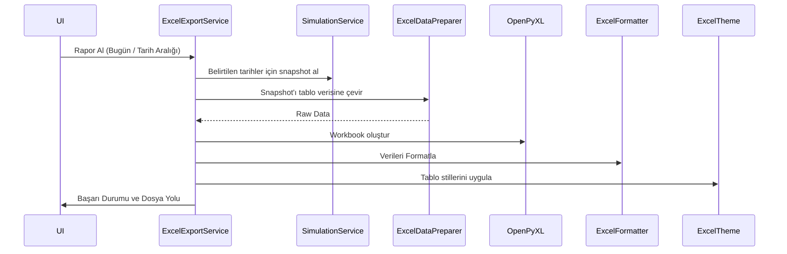

# Excel Raporlama ve Dışa Aktarım (Export) Servisleri

> Ana sayfa: [index.md](index.md) | Mimari: [architecture.md](architecture.md)

Bu belge, `src/application/services/reporting` dizinindeki Excel üretim ve raporlama süreçlerini detaylandırır. Uygulama, geçmiş portföy verisini ve model portföy analizlerini `openpyxl` kütüphanesi kullanarak Excel (.xlsx) formatında dışa aktarır.

## 1. Raporlama Mimarisi

Raporlama sistemi, birbirine sıkı sıkıya bağlı olmayan, tek sorumluluk prensibine (SRP) uyan bileşenlere ayrılmıştır:

| Sınıf / Modül | Sorumluluk |
| --- | --- |
| `ExcelExportService` | İşlemi başlatan ana servistir. Raporun hazırlanmasını koordine eder. |
| `ExcelDataPreparer` | Portföy ve model portföy verilerini (Snapshot) alır, Excel'e yazılabilecek listeler / tuple'lar haline getirir. |
| `ExcelFormatter` | Hücrelerin veri tiplerini (sayı, yüzde, tarih) ayarlar ve biçimlendirme yapar. |
| `ExcelTheme` | Başlık renkleri, fontlar ve tablo kenarlık (border) ayarlarını (QSS Tokens mantığına benzer şekilde) uygular. |
| `ExcelLayoutManager` | Excel sayfasındaki kolon genişliklerini ve freeze panes (sabit dondurulmuş satırlar) ayarlarını yönetir. |

## 2. Duplicate Günlük Veri Engelleme (Append Mode)

Tarihsel verilerin sürekli olarak Excel dosyasına eklenmesi durumunda aynı tarih satırlarının tekrar etmesini engellemek için "Tarih Normalizasyonu ve Dedup" mantığı uygulanır. 

- Yeni veriler eklendiğinde `Timestamp` ve düz `Date` formatları birbirine karışabilir. 
- Ortak helper fonksiyonlar vasıtasıyla Excel dosyası append (üzerine ekleme) modunda açılır, verilerdeki aynı tarihe ait eski satırlar varsa yenileriyle ezilir ve tek bir temiz tarih listesi oluşturulur.

## 3. Akış Şeması

## Faz 2 Notu (2026-06-02)

- `ExcelReportBuilder._append_to_existing_excel` içindeki silent `except Exception: pass` kaldırıldı.
- Dosya yoksa fresh write yapılır; permission hataları kullanıcıya açık mesajla yükseltilir; corrupt workbook okuma hatasında mevcut backup + yeniden oluşturma davranışı korunur.
- Büyük reporting sınıfları için daha ileri parçalara ayırma adayı devam eder: append/dedup mantığı `ExcelAppendMerger`, dashboard stats ayrı calculator, chart construction helper'ları.

## Faz 2D Notu (2026-06-02)

- Append/dedup/backup davranışı `ExcelAppendMerger` sınıfına taşındı; `ExcelReportBuilder` writer orchestration ve formatting akışını yönetir.
- Dashboard KPI metinleri ve top holding hesapları `ExcelDashboardStatsCalculator` içinde tutulur.
- Chart construction `ExcelChartFactory` tarafından yapılır; `ExcelChartBuilder` sheet layout, başlıklar ve chart yerleşimiyle sınırlıdır.
- Excel sheet kolonları ve dışa aktarım public davranışı değişmedi.
