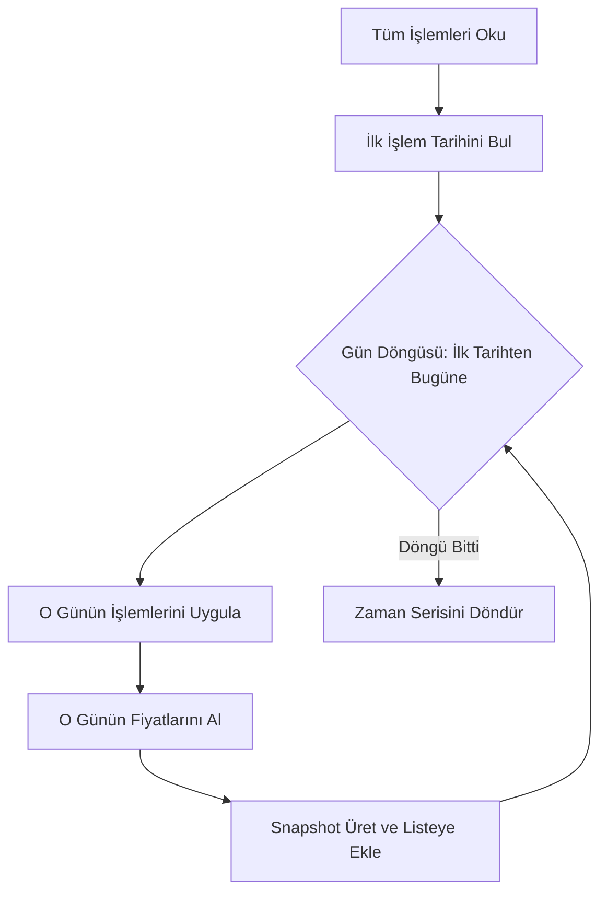

# Simülasyon Servisi (Tarihsel Backtest)

> Ana sayfa: [index.md](index.md) | Mimari: [architecture.md](architecture.md)

Bu belge, `src/application/services/simulation` altındaki **Tarihsel Simülasyon** (Backtest) mimarisini açıklar.

## 1. Temel İşlev

Simülasyon servisi, kullanıcının işlem geçmişini (Trade) en baştan itibaren gün gün yeniden oynatarak geçmişteki her gün için bir portföy snapshot'ı (P&L ve Getiri metrikleri) üretir. Bu özellik, portföyün zaman içindeki gelişimini izlemek için kullanılır.

## 2. Mimari Parçalar

Gelişmiş mimari, karmaşıklığı yönetmek için işlemi 3 ana parçaya böler:

| Bileşen | Sorumluluk |
| --- | --- |
| `SimulationState` | Portföy durumunu, trade cursor'ını (hangi işlemde kalındığını), son kapanış fiyatlarını ve baz değerleri taşıyan durum nesnesidir. |
| `HistoryPositionBuilder` | Her gün için açık pozisyon satırlarını üretir. |
| `HistorySnapshotBuilder` | Günlük/kümülatif Kar-Zarar (P&L) ve getiri metriklerini hesaplar. |
| `HistorySimulationService` | Dış dünyaya açılan API. Diğer parçaları koordine eder. |

## 3. Zorlu Edge Case'ler (Köşe Durumlar)

Simülasyon motoru aşağıdaki senaryoları desteklemek zorundadır ve testlerle güvence altındadır:

1. **Hafta Sonu ve Tatiller:** Borsa kapalıyken portföy değeri sabit kalmalıdır. Cuma kapanış fiyatı, Cumartesi ve Pazar için **carry-forward** (ileriye taşıma) mantığıyla uygulanır.
2. **Aynı Gün Çoklu İşlem:** Kullanıcı aynı gün içinde aynı hisseyi birden fazla kez alıp satmışsa, gün sonu kapanış değeri üzerinden nihai portföy durumu hesaplanır.
3. **Eksik Veri:** YFinance bazen bazı günler fiyat dönmeyebilir. Bu durumda bir önceki geçerli günün fiyatı kullanılır.

## 4. Zaman Karmaşıklığı (Time Complexity)

Simülasyon motoru büyük O(N*M) - N gün sayısı, M açık pozisyon sayısı - karmaşıklığına sahiptir. Optimizasyon için, `SimulationState` önceki günün portföy kopyasını (deep copy yerine incremental update) kullanarak ilerler, her işlemde portföyü sıfırdan kurmaz.

## Faz 2 Notu (2026-06-02)

- `HistorySimulationService` ve `ModelPortfolioHistorySimulationService` BIST takvimi concrete import'u yerine `MarketTradingCalendar` portunu kullanır.
- Production akışında `BistTradingCalendarProvider` container üzerinden enjekte edilir; hafta sonu, tatil carry-forward ve aynı gün çoklu işlem testleri korunur.
- `BackfillService` dış veri kaynağına doğrudan bağlanmaz; `IMarketDataClient` portundan gelen fiyat serilerini `DailyPrice` kayıtlarına çevirir.

## Faz 2D Notu (2026-06-02)

- Dashboard ve model portföy history simulation servislerinde günlük döngü `_simulate_day` helper'ına ayrıldı.
- `HistoryPositionBuilder` pozisyon metriklerini helper üzerinden üretir; `HistorySnapshotBuilder` daily/cumulative return ve status seçimini ayrı pure helper'larla hesaplar.
- Hafta sonu carry-forward, BIST kapalı gün, aynı gün çoklu işlem, eksik fiyat ve invalid sell edge-case testleri korunur.
